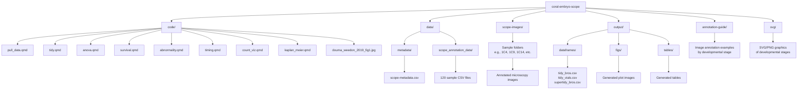
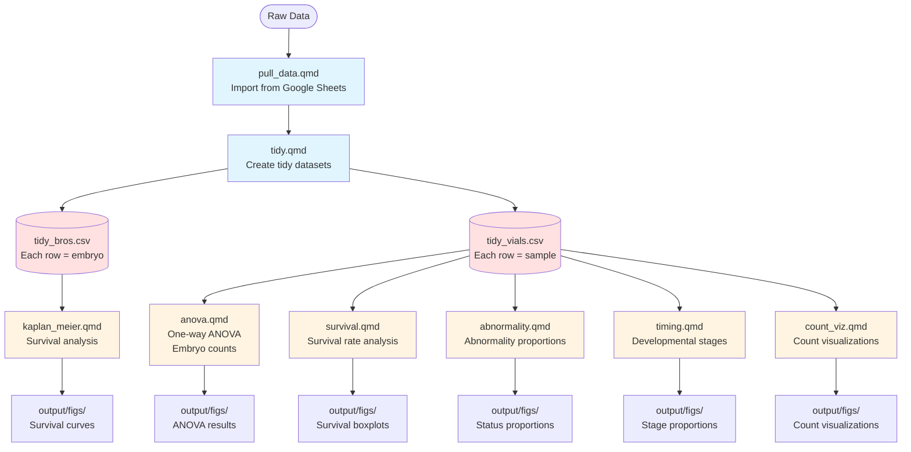

# coral-embryo-scope

> The egg–sperm bundles released by *M. capitata* measured approximately 1 mm and contained around 15 ± 5.1 oocytes (mean ± SD, n = 214, from 26 colonies), surrounding a central mass of spermatozoa (Fig. 4). — Padilla-Gamino et al., 2011

A repo for the microscopy imaging annotations and survival analysis of *Montipora capitata* embryos exposed to increasing levels of PVC leachate pollution.

This repository contains code and output for a **survival** analysis of coral embryos exposed to 3 increasing levels of polyvinyl chloride (PVC) leachate. *Montipora capitata* rice coral embryos were subjected to a single-stressor ecotoxicology assay designed to test the impact of PVC leachate on their early development. You can check out the complimentary repositories for a **gene expression** [coral-embryo-RNAseq](https://github.com/sarahtanja/coral-embryo-RNAseq) and **microbiome** (coral-embryo-microbiome) [coral-embryo-microbiome](https://github.com/sarahtanja/coral-embryo-microbiome) analysis from the same ecotoxicological assay.

## Repository Structure

## Analysis Workflow

The analysis follows a structured pipeline where data is pulled, tidied, and then analyzed through multiple complementary approaches:

## Folder Descriptions

### `/code`
Contains all R Quarto (`.qmd`) documents for data processing, analysis, and visualization:

- **`pull_data.qmd`**: Imports annotation data from Google Sheets and copies microscopy images from local desktop to the repository
- **`tidy.qmd`**: Creates tidy dataframes from raw annotation data. Outputs `tidy_bros.csv` (each row is an embryo) and `tidy_vials.csv` (each row is a sample)
- **`anova.qmd`**: Performs one-way ANOVA on embryo counts, tests for normality, and compares viable embryo counts across treatments
- **`survival.qmd`**: Analyzes survival rates of embryos across different treatments and time points using boxplots, violin plots, GLM, and ANOVA
- **`abnormality.qmd`**: Analyzes abnormality proportions (typical, uncertain, malformed) using Dirichlet regression
- **`timing.qmd`**: Analyzes developmental stage proportions (egg, cleavage, morula, prawnchip, gastrula) using Dirichlet and beta regression
- **`count_viz.qmd`**: Visualizes embryo count data
- **`kaplan_meier.qmd`**: Performs Kaplan-Meier survival analysis
- **`douma_weedon_2019_fig1.jpg`**: Reference figure for regression analysis methods

### `/data`
Contains raw data files organized into two subdirectories:

#### `/data/metadata`
- **`scope-metadata.csv`**: Metadata for microscopy samples including cross IDs, parent information, treatments, and time points

#### `/data/scope_annotation_data`
Contains 120 CSV files (one per sample) with individual embryo annotations. Each file is named using the convention:
- Cross ID (1-10)
- Treatment (C=control, L=low, M=mid, H=high)
- Hours post-fertilization (4, 9, 14)
- Example: `1C4.csv`, `2L9.csv`, `10H14.csv`

### `/scope-images`
Contains 120 subdirectories (one per sample), each holding annotated microscopy images captured on a Nikon DS-Fi 3 camera and annotated using Nikon NIS Elements BR 4.6.00 64-bit software. Subdirectories follow the same naming convention as the data files (e.g., `1C4/`, `2L9/`, `10H14/`).

### `/output`
Contains all processed data and analysis outputs organized into three subdirectories:

#### `/output/dataframes`
Processed tidy datasets ready for analysis:
- **`tidy_bros.csv`**: Tidy dataframe where each row represents an individual embryo with its stage and status classifications
- **`tidy_vials.csv`**: Tidy dataframe where each row represents a sample (microscopy slide) with counts and proportions of embryos by stage and status
- **`supertidy_bros.csv`**: Additional processed embryo-level data
- **`tidy_status.csv`**: Status-level summary data
- **`tidy_timing.csv`**: Timing/stage-level summary data
- **`prop_summary.csv`**: Proportion summary statistics
- **`status_summary.csv`**: Status summary statistics

#### `/output/figs`
Contains generated visualization outputs from the analysis scripts:
- **`embryo_survival_box.png`**: Boxplot of embryo survival counts
- **`embryo_stage_stackedbar.png`**: Stacked bar chart of developmental stage proportions
- **`embryo_status_stackedbar.png`**: Stacked bar chart of embryo status proportions
- **`figure_survival_timing_morphology.png`**: Combined figure showing survival, timing, and morphology

#### `/output/tables`
Contains generated tables and statistical outputs:
- **`table_stage_composition.html`**: HTML table of stage composition
- **`table_survival_stargazer.html`**: HTML survival analysis table
- **`.doc`** files: Word-compatible table outputs

### `/annotation-guide`
Contains reference images and guides for annotating embryo microscopy images. Includes example images organized by developmental stage (egg, cleavage, morula, prawnchip, early gastrula) and status (typical, malformed). Also contains Quarto documents for annotation protocols and scope statistics.

### `/svg`
Contains graphical representations (SVG/PNG format) of coral embryo developmental stages:
- **`egg.png`**: Egg stage illustration
- **`cleavage.png`**: Cleavage stage illustration
- **`morula.png`**: Morula stage illustration
- **`prawnchip.png`**: Prawnchip stage illustration
- **`earlygastrula.png`**: Early gastrula stage illustration
