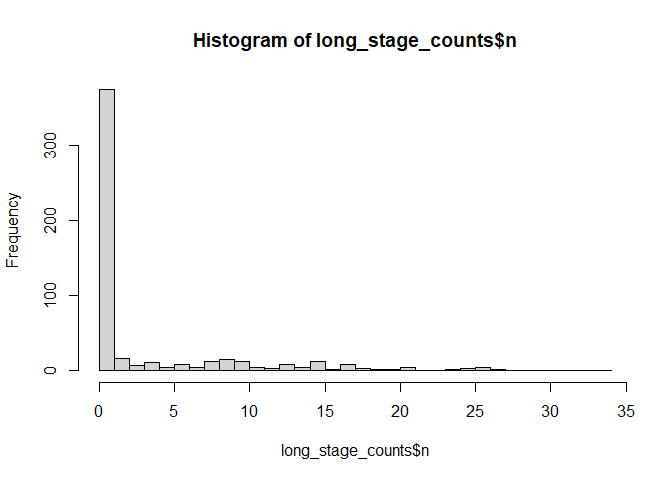
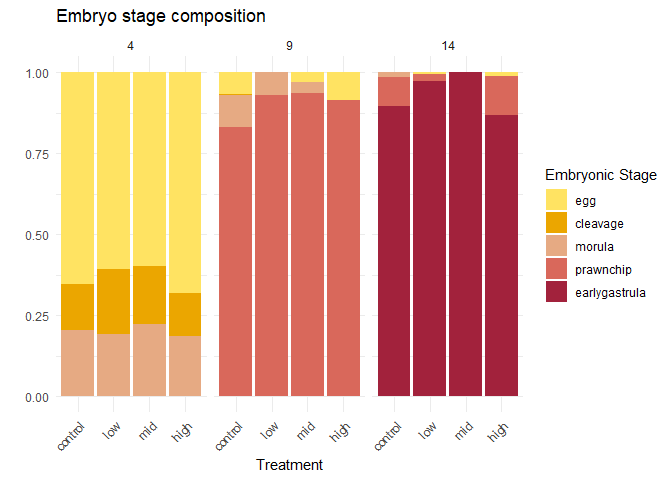
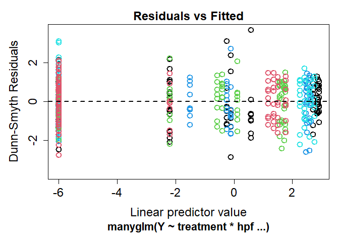
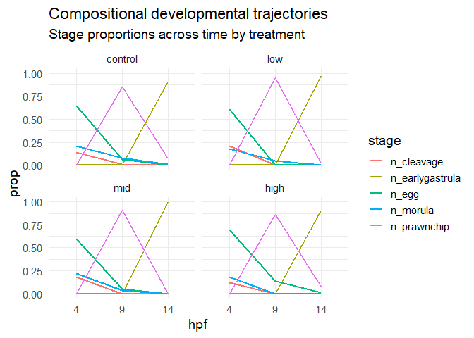

# Analyzing developmental stage composition (Timing)
Sarah Tanja
2025-08-27

- [<span class="toc-section-number">1</span> Background](#background)
- [<span class="toc-section-number">2</span> Setup](#setup)
  - [<span class="toc-section-number">2.1</span> Load
    libraries](#load-libraries)
  - [<span class="toc-section-number">2.2</span> Load data](#load-data)
  - [<span class="toc-section-number">2.3</span> Set
    colors](#set-colors)
- [<span class="toc-section-number">3</span> Explore the
  data](#explore-the-data)
- [<span class="toc-section-number">4</span> Visualize
  counts](#visualize-counts)
  - [<span class="toc-section-number">4.1</span> Mean stage composition
    counts table](#mean-stage-composition-counts-table)
- [<span class="toc-section-number">5</span> Visualize
  proportions](#visualize-proportions)
  - [<span class="toc-section-number">5.1</span> Mean stage proportions
    table](#mean-stage-proportions-table)
- [<span class="toc-section-number">6</span> Statistical
  approach](#statistical-approach)
- [<span class="toc-section-number">7</span> MVABUD/
  MANYGLM](#mvabud-manyglm)

# Background

# Setup

## Load libraries

``` r
library(tidyverse)
library(ggplot2)
#library(kableExtra)
#library(betareg)
#library(gamlss)
#library(MASS) # for multinomial or negative binomial GLM
#library(glmmTMB)
#library(performance)
library(DHARMa)
library(mvabund)
library(scales)
#library(AER) # for dispersiontest
```

## Load data

``` r
anyNA(tidy_vials)
```

    [1] FALSE

> [!IMPORTANT]
>
> The `NA`s from samples 3L9 and 7H9 represent vials where no embryos
> were present at the time of counting (all embryos died or were not
> fertilized). These samples NA values were replaced with `0`.

``` r
tidy_vials_stage_counts <- tidy_vials %>% 
  dplyr::select(sample_id, treatment, hpf, date, n_egg, n_cleavage, n_morula, n_prawnchip, n_earlygastrula) 

summary(tidy_vials_stage_counts) 
```

      sample_id           treatment  hpf         date               n_egg       
     Length:108         control:27   4 :36   Length:108         Min.   : 0.000  
     Class :character   low    :27   9 :36   Class :character   1st Qu.: 0.000  
     Mode  :character   mid    :27   14:36   Mode  :character   Median : 0.000  
                        high   :27                              Mean   : 5.981  
                                                                3rd Qu.:10.000  
                                                                Max.   :34.000  
       n_cleavage        n_morula       n_prawnchip     n_earlygastrula 
     Min.   : 0.000   Min.   : 0.000   Min.   : 0.000   Min.   : 0.000  
     1st Qu.: 0.000   1st Qu.: 0.000   1st Qu.: 0.000   1st Qu.: 0.000  
     Median : 0.000   Median : 0.000   Median : 0.000   Median : 0.000  
     Mean   : 1.463   Mean   : 1.972   Mean   : 4.389   Mean   : 4.102  
     3rd Qu.: 0.000   3rd Qu.: 2.000   3rd Qu.: 6.000   3rd Qu.: 7.250  
     Max.   :15.000   Max.   :17.000   Max.   :28.000   Max.   :26.000  

``` r
write_csv(tidy_vials_stage_counts, "../output/dataframes/tidy_vials_stage_counts.csv")
```

## Set colors

``` r
stage.5.colors <- c(egg = "#FFE362",
                    cleavage = "#EBA600", 
                    morula = "#E6AA83",
                    prawnchip = "#D9685B", 
                    earlygastrula = "#A2223C")
```

# Explore the data

Pivot to long format

``` r
# Pivot to long format
long_timing_counts <- tidy_vials_stage_counts %>%
  pivot_longer(
    cols = starts_with("n"),
    names_to = c(".value", "stage"),
    names_pattern = "(n)_(.*)"
  ) %>% 
  mutate(
    stage = factor(stage, 
                   levels = c("egg", "cleavage", "morula", 
                  "prawnchip", "earlygastrula"), ordered = TRUE))


str(long_timing_counts)
```

    tibble [540 × 6] (S3: tbl_df/tbl/data.frame)
     $ sample_id: chr [1:540] "10C14" "10C14" "10C14" "10C14" ...
     $ treatment: Ord.factor w/ 4 levels "control"<"low"<..: 1 1 1 1 1 1 1 1 1 1 ...
     $ hpf      : Ord.factor w/ 3 levels "4"<"9"<"14": 3 3 3 3 3 1 1 1 1 1 ...
     $ date     : chr [1:540] "2024-06-07" "2024-06-07" "2024-06-07" "2024-06-07" ...
     $ stage    : Ord.factor w/ 5 levels "egg"<"cleavage"<..: 1 2 3 4 5 1 2 3 4 5 ...
     $ n        : int [1:540] 0 0 0 0 23 9 12 8 0 0 ...

``` r
summary(long_timing_counts$n)
```

       Min. 1st Qu.  Median    Mean 3rd Qu.    Max. 
      0.000   0.000   0.000   3.581   4.000  34.000 

``` r
write_csv(long_timing_counts, "../output/dataframes/long_timing_counts.csv")
```

#### Overdispersion

``` r
mean(long_timing_counts$n)
```

    [1] 3.581481

``` r
var(long_timing_counts$n)
```

    [1] 45.05272

- The variance (45.0) is greater than the mean (3.5), indicating that
  our data has overdispersion.

#### Zero-inflation

``` r
hist(long_timing_counts$n, breaks = 30)
```



- Most of the values are 0! Visually, we can see there are lots of zeros
  in our data due to our experimental structure. The following code
  displays the proportion of total zeros for each stage (across
  treatment and hpf):

``` r
long_timing_counts %>%
  group_by(stage) %>%
  summarize(prop_zero = mean(n == 0))
```

    # A tibble: 5 × 2
      stage         prop_zero
      <ord>             <dbl>
    1 egg               0.593
    2 cleavage          0.759
    3 morula            0.630
    4 prawnchip         0.602
    5 earlygastrula     0.667

More than 50% of the counts for each stage are zeros….That’s a lot of
zeros!… Our data is zero-inflated.

# Visualize counts

``` r
ggplot(long_timing_counts, aes(x = treatment, y = n, fill = stage)) +
  geom_bar(stat = "identity", position = "stack") +
  facet_wrap(~ hpf) +
  labs(title = "Embryo stage counts by treatment over time",
       x = "Treatment",
       y = "Embryo count") +
  theme_minimal() +
  scale_fill_manual(values = stage.5.colors)
```


> At 4 hpf, the majority of embryos are indeed in the egg or early
> cleavage stages, and very few or none are in advanced stages like
> prawnchip or early gastrula. As time progresses to 9 and then 14 hpf,
> the embryo counts in the earlier stages (egg, cleavage) decrease,
> reflecting development progression, while counts in the later stages
> (prawnchip, early gastrula) increase correspondingly. You can see that
> total counts across treatments appear similar, as well as the stage
> breakdown within each treatment.

Calculate count means

``` r
# Step 2: Calculate mean proportions for each stage within each treatment
counts_summary <- long_timing_counts %>%
  group_by(treatment, stage, hpf) %>%
  summarize(mean_counts = mean(n), .groups = "drop") %>% 
  mutate(mean_counts = round(mean_counts, 2)) %>% 
  filter(stage %in% 
         c("egg", 
         "cleavage", 
         "morula", 
         "prawnchip", 
         "earlygastrula")) %>% 
  mutate(stage = factor(stage, levels = c("egg", "cleavage", "morula", "prawnchip", "earlygastrula"))) %>% 
  mutate(hpf = factor(hpf, levels = c("4", "9", "14"))) %>% 
  mutate(treatment = factor(treatment, 
                        levels = c("control", "low", "mid", "high")))

head(counts_summary)
```

    # A tibble: 6 × 4
      treatment stage    hpf   mean_counts
      <ord>     <ord>    <ord>       <dbl>
    1 control   egg      4           17.8 
    2 control   egg      9            0.89
    3 control   egg      14           0   
    4 control   cleavage 4            3.89
    5 control   cleavage 9            0.11
    6 control   cleavage 14           0   

## Mean stage composition counts table

``` r
stage_levels <- c("egg", "cleavage", "morula", "prawnchip", "earlygastrula")
treat_levels <- c("control", "low", "mid", "high")
hpf_levels   <- c(4, 9, 14)

table_stage_count <- counts_summary %>%
  filter(stage %in% stage_levels) %>%
  mutate(
    stage     = factor(stage,     levels = stage_levels),
    treatment = factor(treatment, levels = treat_levels),
    hpf       = factor(hpf,       levels = hpf_levels)
  ) %>%
  dplyr::select(stage, hpf, treatment, mean_counts) %>%
  pivot_wider(
    names_from  = c(treatment, hpf),
    values_from = mean_counts,
    values_fill = 0,
    # column names like "4 hpf - control"
    names_glue  = "{hpf} hpf - {treatment}"
  ) %>%
  dplyr::select(stage, 
                `4 hpf - control`, `4 hpf - low`, `4 hpf - mid`, `4 hpf - high`,
                `9 hpf - control`, `9 hpf - low`, `9 hpf - mid`, `9 hpf - high`,
                `14 hpf - control`, `14 hpf - low`, `14 hpf - mid`, `14 hpf - high`) %>%
  arrange(stage) %>%
  # turn to % (numeric) for nice formatting
  mutate(across(-stage, ~ round(.x, 1))) %>%
  rename(Stage = stage) 


table_stage_count
```

    # A tibble: 5 × 13
      Stage         `4 hpf - control` `4 hpf - low` `4 hpf - mid` `4 hpf - high`
      <ord>                     <dbl>         <dbl>         <dbl>          <dbl>
    1 egg                        17.8          17.2          14.9           18.2
    2 cleavage                    3.9           5.9           4.4            3.2
    3 morula                      5.8           5.1           5.6            4.8
    4 prawnchip                   0             0             0              0  
    5 earlygastrula               0             0             0              0  
    # ℹ 8 more variables: `9 hpf - control` <dbl>, `9 hpf - low` <dbl>,
    #   `9 hpf - mid` <dbl>, `9 hpf - high` <dbl>, `14 hpf - control` <dbl>,
    #   `14 hpf - low` <dbl>, `14 hpf - mid` <dbl>, `14 hpf - high` <dbl>

``` r
library(sjPlot)

sjPlot::tab_df(
  table_stage_count,
  title         = "Mean stage composition (counts of embryos) by treatment and developmental time (hpf)",
  show.rownames = FALSE,
  digits        = 1
)
```

|  |  |  |  |  |  |  |  |  |  |  |  |  |
|:--:|:--:|:--:|:--:|:--:|:--:|----|----|----|----|----|----|----|
| Stage | X4.hpf...control | X4.hpf...low | X4.hpf...mid | X4.hpf...high | X9.hpf...control | X9.hpf...low | X9.hpf...mid | X9.hpf...high | X14.hpf...control | X14.hpf...low | X14.hpf...mid | X14.hpf...high |
| egg | 17.8 | 17.2 | 14.9 | 18.2 | 0.9 | 0.0 | 0.8 | 1.8 | 0.0 | 0.1 | 0.0 | 0.1 |
| cleavage | 3.9 | 5.9 | 4.4 | 3.2 | 0.1 | 0.0 | 0.0 | 0.0 | 0.0 | 0.0 | 0.0 | 0.0 |
| morula | 5.8 | 5.1 | 5.6 | 4.8 | 1.1 | 0.7 | 0.6 | 0.0 | 0.1 | 0.0 | 0.0 | 0.0 |
| prawnchip | 0.0 | 0.0 | 0.0 | 0.0 | 12.1 | 13.1 | 13.9 | 11.7 | 0.9 | 0.2 | 0.0 | 0.8 |
| earlygastrula | 0.0 | 0.0 | 0.0 | 0.0 | 0.0 | 0.0 | 0.0 | 0.0 | 11.1 | 13.1 | 15.6 | 9.4 |

Mean stage composition (counts of embryos) by treatment and
developmental time (hpf)

``` r
library(stargazer)

stargazer::stargazer(
  table_stage_count,
  type      = "html",  # or "latex" if knitting to PDF
  summary   = FALSE,
  rownames  = FALSE,
  digits    = 1,
  title     = "Mean stage composition (counts of embryos) by treatment and developmental time (hpf)",
  out       = "../output/tables/table_stage_composition_counts.doc"  # optional
)
```


    <table style="text-align:center"><caption><strong>Mean stage composition (counts of embryos) by treatment and developmental time (hpf)</strong></caption>
    <tr><td colspan="13" style="border-bottom: 1px solid black"></td></tr><tr><td style="text-align:left">Stage</td><td>4 hpf - control</td><td>4 hpf - low</td><td>4 hpf - mid</td><td>4 hpf - high</td><td>9 hpf - control</td><td>9 hpf - low</td><td>9 hpf - mid</td><td>9 hpf - high</td><td>14 hpf - control</td><td>14 hpf - low</td><td>14 hpf - mid</td><td>14 hpf - high</td></tr>
    <tr><td colspan="13" style="border-bottom: 1px solid black"></td></tr><tr><td style="text-align:left">1</td><td>17.8</td><td>17.2</td><td>14.9</td><td>18.2</td><td>0.9</td><td>0</td><td>0.8</td><td>1.8</td><td>0</td><td>0.1</td><td>0</td><td>0.1</td></tr>
    <tr><td style="text-align:left">2</td><td>3.9</td><td>5.9</td><td>4.4</td><td>3.2</td><td>0.1</td><td>0</td><td>0</td><td>0</td><td>0</td><td>0</td><td>0</td><td>0</td></tr>
    <tr><td style="text-align:left">3</td><td>5.8</td><td>5.1</td><td>5.6</td><td>4.8</td><td>1.1</td><td>0.7</td><td>0.6</td><td>0</td><td>0.1</td><td>0</td><td>0</td><td>0</td></tr>
    <tr><td style="text-align:left">4</td><td>0</td><td>0</td><td>0</td><td>0</td><td>12.1</td><td>13.1</td><td>13.9</td><td>11.7</td><td>0.9</td><td>0.2</td><td>0</td><td>0.8</td></tr>
    <tr><td style="text-align:left">5</td><td>0</td><td>0</td><td>0</td><td>0</td><td>0</td><td>0</td><td>0</td><td>0</td><td>11.1</td><td>13.1</td><td>15.6</td><td>9.4</td></tr>
    <tr><td colspan="13" style="border-bottom: 1px solid black"></td></tr></table>

# Visualize proportions

Drop the samples with zero embryos (drop zeros)

``` r
tidy_vials_dropz <- tidy_vials %>% 
  filter(sample_id != c("3L9", "7H9"))
```

Calculate proportion means

``` r
# Step 1: Pivot to long format
long_timing_proportions <- tidy_vials_dropz %>%
  pivot_longer(
    cols = starts_with("prop"),
    names_to = c(".value", "stage"),
    names_pattern = "(prop)_(.*)"
  ) %>% 
  filter(stage != "embryos") # embryos indicated total number, not the breakdown by stage

anyNA(long_timing_proportions)
```

    [1] FALSE

``` r
# Step 2: Calculate mean proportions for each stage within each treatment
prop_summary <- long_timing_proportions %>%
  group_by(treatment, stage, hpf) %>%
  summarize(mean_prop = mean(prop), .groups = "drop") %>% 
  filter(stage %in% 
         c("egg", 
         "cleavage", 
         "morula", 
         "prawnchip", 
         "earlygastrula")) %>% 
  mutate(stage = factor(stage, levels = c("egg", "cleavage", "morula", "prawnchip", "earlygastrula"))) %>% 
  mutate(hpf = factor(hpf, levels = c("4", "9", "14"))) %>% 
  mutate(treatment = factor(treatment, 
                        levels = c("control", "low", "mid", "high")))

head(prop_summary)
```

    # A tibble: 6 × 4
      treatment stage         hpf   mean_prop
      <ord>     <fct>         <ord>     <dbl>
    1 control   cleavage      4       0.143  
    2 control   cleavage      9       0.00585
    3 control   cleavage      14      0      
    4 control   earlygastrula 4       0      
    5 control   earlygastrula 9       0      
    6 control   earlygastrula 14      0.895  

Save proportion summary as a csv

``` r
write_csv(prop_summary, "../output/dataframes/prop_summary.csv")
```

``` r
prop_summary %>% 
ggplot(., aes(x = treatment, y = mean_prop, fill = stage)) +
  geom_bar(stat = "identity") +
  scale_fill_manual(values = stage.5.colors) +
  ggtitle("Embryo stage composition")+
  labs(y = "", x = "Treatment", fill = "Embryonic Stage") +
  facet_wrap(~ hpf)+
  theme_minimal()+
  theme(axis.text.x = element_text(
      angle = 45,      # rotate 45°
      hjust = 1,       # horizontal justification
      vjust = 1        # tweak if you want
    ))
```



> [!NOTE]
>
> Visually we can see there is little/no difference in proportion of
> embryos at each stage across treatments at each end-point (4,9,14 hpf)
> when looking at counts OR proportions… since we do our stats on counts
> and since to calculate proportions we had to drop our samples with
> zero embryos, this counts data is a better more accurate
> representation of the underlying data we used for the analysis so that
> is what we will use for our manuscript.

## Mean stage proportions table

``` r
stage_levels <- c("egg", "cleavage", "morula", "prawnchip", "earlygastrula")
treat_levels <- c("control", "low", "mid", "high")
hpf_levels   <- c(4, 9, 14)

table_stage_pct <- prop_summary %>%
  filter(stage %in% stage_levels) %>%
  mutate(
    stage     = factor(stage,     levels = stage_levels),
    treatment = factor(treatment, levels = treat_levels),
    hpf       = factor(hpf,       levels = hpf_levels)
  ) %>%
  dplyr::select(stage, hpf, treatment, mean_prop) %>%
  pivot_wider(
    names_from  = c(treatment, hpf),
    values_from = mean_prop,
    values_fill = 0,
    # column names like "4 hpf - control"
    names_glue  = "{hpf} hpf - {treatment}"
  ) %>%
  dplyr::select(stage, 
                `4 hpf - control`, `4 hpf - low`, `4 hpf - mid`, `4 hpf - high`,
                `9 hpf - control`, `9 hpf - low`, `9 hpf - mid`, `9 hpf - high`,
                `14 hpf - control`, `14 hpf - low`, `14 hpf - mid`, `14 hpf - high`) %>%
  arrange(stage) %>%
  # turn to % (numeric) for nice formatting
  mutate(across(-stage, ~ round(.x * 100, 1))) %>%
  rename(Stage = stage) 


table_stage_pct
```

    # A tibble: 5 × 13
      Stage         `4 hpf - control` `4 hpf - low` `4 hpf - mid` `4 hpf - high`
      <fct>                     <dbl>         <dbl>         <dbl>          <dbl>
    1 egg                        65.3          60.8          59.8           68.1
    2 cleavage                   14.3          20.2          18             13.3
    3 morula                     20.3          19            22.2           18.6
    4 prawnchip                   0             0             0              0  
    5 earlygastrula               0             0             0              0  
    # ℹ 8 more variables: `9 hpf - control` <dbl>, `9 hpf - low` <dbl>,
    #   `9 hpf - mid` <dbl>, `9 hpf - high` <dbl>, `14 hpf - control` <dbl>,
    #   `14 hpf - low` <dbl>, `14 hpf - mid` <dbl>, `14 hpf - high` <dbl>

``` r
library(sjPlot)

sjPlot::tab_df(
  table_stage_pct,
  title         = "Mean stage composition (% of embryos) by treatment and developmental time (hpf)",
  show.rownames = FALSE,
  digits        = 1
)
```

|  |  |  |  |  |  |  |  |  |  |  |  |  |
|:--:|:--:|:--:|:--:|:--:|:--:|----|----|----|----|----|----|----|
| Stage | X4.hpf...control | X4.hpf...low | X4.hpf...mid | X4.hpf...high | X9.hpf...control | X9.hpf...low | X9.hpf...mid | X9.hpf...high | X14.hpf...control | X14.hpf...low | X14.hpf...mid | X14.hpf...high |
| egg | 65.3 | 60.8 | 59.8 | 68.1 | 6.7 | 0.0 | 3.1 | 8.7 | 0.0 | 0.7 | 0 | 1.1 |
| cleavage | 14.3 | 20.2 | 18.0 | 13.3 | 0.6 | 0.0 | 0.0 | 0.0 | 0.0 | 0.0 | 0 | 0.0 |
| morula | 20.3 | 19.0 | 22.2 | 18.6 | 9.9 | 7.1 | 3.4 | 0.0 | 1.6 | 0.0 | 0 | 0.0 |
| prawnchip | 0.0 | 0.0 | 0.0 | 0.0 | 82.9 | 92.9 | 93.5 | 91.3 | 8.9 | 2.1 | 0 | 12.1 |
| earlygastrula | 0.0 | 0.0 | 0.0 | 0.0 | 0.0 | 0.0 | 0.0 | 0.0 | 89.5 | 97.1 | 100 | 86.8 |

Mean stage composition (% of embryos) by treatment and developmental
time (hpf)

``` r
library(stargazer)

stargazer::stargazer(
  table_stage_pct,
  type      = "html",  # or "latex" if knitting to PDF
  summary   = FALSE,
  rownames  = FALSE,
  digits    = 1,
  title     = "Mean stage composition (% of embryos) by treatment and developmental time (hpf)",
  out       = "../output/tables/table_stage_composition_prop.doc"  # optional
)
```

# Statistical approach

> > [!IMPORTANT]
> >
> > “Does the distribution of embryos across stages differ by treatment
> > at each developmental time point?”

Our data is one categorical response per embryo with 5 mutually
exclusive categories: egg, cleavage, morula, prawnchip, early gastrula.

Exactly one category per embryo (categories are mutually exclusive)

Counted per vial, grouped by treatment & hpf … So per vial we have a
composition of counts: n_egg, n_cleavage, n_morula, n_prawnchip,
n_early_gastrula

Counts represent developmental stage

Counts do not sum to a total per vial (since embryos can die, etc.)

We can either model **counts** , or **proportions** of stage
composition.

#### Should we use Dirichlet?

A Dirichlet or beta-multinomial regression on proportions asks “Does PVC
shift developmental stage composition?” HOWEVER, the Dirichlet
distribution requires strictly positive proportions (all \> 0 and
summing to 1). Zero counts violate that assumption because proportions
of zero imply complete absence of a category — and Dirichlet cannot
model that. We would need to subset our data by timepoint and run a
Dirichlet for each, only including the non-zero stages at each timepoint
(ex. at 4 hpf there are 0 embryos in the early gastrula stage, so we
would need to exclude that category from the model). We also considered
Dirichlet regression for stage composition analysis; however, several
stage categories were biologically absent at early time points (e.g., no
gastrula at 4 hpf), violating the requirement for strictly positive
proportions. Therefore, manyglm with a negative binomial distribution
was selected as a more appropriate method that accommodates structural
zeros and overdispersion while analyzing all time points concurrently.

#### Should we use Multinomial NB?

A Multinomial negative binomial on counts asks “Does PVC leachate shift
developmental stage counts, accounting for overdispersion and excess
zeros?” HOWEVER, Multinomial models (including beta-multinomial and
multinomial negative binomial) assume: - One response column, - Each
trial falls into one of several categories, - Total number of trials is
fixed or modeled separately, - Categories must sum to 1 (or N), -
Variance is usually fixed or only weakly overdispersed unless modeled
Bayes/anova style.

But our embryos do not meet those assumptions:

| Violation | Why |
|----|----|
| Counts do **not sum to a fixed total** | Viable embryos vary across vials |
| Some stages **do not exist at certain timepoints** | Multinomial cannot handle biologically impossible categories |
| Counts are **strongly overdispersed & zero-inflated** | Requires negative binomial + mvabund handling |
| We need **joint + stage-specific tests** | Multinomial only gives global odds ratios |

🌿 Biological implications Multinomial regression answers: \> “What is
the probability of each category relative to others?”

But our question is different: \> “Do counts in each developmental stage
change with treatment and time — and does PVC shift the overall
composition of development?”

Since development is sequential, not competitive (like elections or
consumer choice), multinomial structure is biologically misleading.

> We considered multinomial negative binomial models but rejected them
> because our data represent separate count variables rather than a
> single categorical response, and because developmental stages do not
> form a fixed-sum composition at all timepoints. Instead, we used a
> multivariate generalized linear model (manyglm, negative binomial),
> which accommodates overdispersion, structural zeros, and allows
> testing both overall shifts in developmental composition and
> stage-specific responses.

#### Should we use zero-inflated negative binomial (ZINB)?

…

#### Should we use Multivariate GLM?

✔ Handles overdispersed count data

✔ Allows structural zeros

✔ Models all stages simultaneously

✔ Provides multivariate AND univariate tests

✔ Allows interaction (treatment × hpf) without splitting data

✔ Allows rich residual diagnostics (e.g., via DHARMa)

# MVABUD/ MANYGLM

This tests whether the whole multivariate response vector `Y` is
affected by treatment, hpf, or their interaction.

``` r
Y <- mvabund(tidy_vials_stage_counts[, 
                                     c("n_egg", 
                                       "n_cleavage", 
                                       "n_morula", 
                                       "n_prawnchip", 
                                       "n_earlygastrula")])

mod_all <- manyglm(
  Y ~ treatment * hpf,
  family = "negative.binomial",
  data = tidy_vials_stage_counts
)

anova(mod_all, p.uni = "adjusted")
```

    Time elapsed: 0 hr 0 min 29 sec

    Analysis of Deviance Table

    Model: Y ~ treatment * hpf

    Multivariate test:
                  Res.Df Df.diff   Dev Pr(>Dev)    
    (Intercept)      107                           
    treatment        104       3   1.5    0.998    
    hpf              102       2 568.0    0.001 ***
    treatment:hpf     96       6  40.3    0.001 ***
    ---
    Signif. codes:  0 '***' 0.001 '**' 0.01 '*' 0.05 '.' 0.1 ' ' 1

    Univariate Tests:
                    n_egg          n_cleavage          n_morula         
                      Dev Pr(>Dev)        Dev Pr(>Dev)      Dev Pr(>Dev)
    (Intercept)                                                         
    treatment       0.141    0.999      0.518    0.999    0.365    0.999
    hpf           111.982    0.001     76.461    0.001   71.986    0.001
    treatment:hpf  16.532    0.104      2.763    0.138     9.42    0.104
                  n_prawnchip          n_earlygastrula         
                          Dev Pr(>Dev)             Dev Pr(>Dev)
    (Intercept)                                                
    treatment           0.027    0.999           0.461    0.999
    hpf               126.171    0.001         181.394    0.001
    treatment:hpf       11.59    0.104               0    0.805
    Arguments:
     Test statistics calculated assuming uncorrelated response (for faster computation) 
    P-value calculated using 999 iterations via PIT-trap resampling.

``` r
plot(mod_all)
```



``` r
# Get fitted values
fitted_vals <- as.data.frame(fitted(mod_all))
fitted_vals$sample_id <- tidy_vials_stage_counts$sample_id
fitted_vals$treatment <- tidy_vials_stage_counts$treatment
fitted_vals$hpf <- tidy_vials_stage_counts$hpf

# Long format for ggplot
fitted_long <- fitted_vals %>%
  pivot_longer(
    cols = starts_with("n_"),
    names_to = "stage",
    values_to = "fitted_count"
  )

# Plot
ggplot(fitted_long,
       aes(x = hpf, y = fitted_count, color = treatment, group = treatment)) +
  geom_line(linewidth = 1) +
  geom_point(size = 2) +
  facet_wrap(~ stage, scales = "free_y") +
  theme_minimal(base_size = 14) +
  labs(
    title = "Fitted developmental stage trajectories",
    subtitle = "Visualizing the treatment × hpf multivariate interaction",
    y = "Fitted count"
  )
```


- lines for different treatments **diverge more at some hpf than
  others**, that’s visualizing our **interaction**. Even small
  divergences across several stages sum into the significant
  multivariate effects found.

``` r
fitted_prop <- fitted_long %>%
  group_by(sample_id) %>%
  mutate(total = sum(fitted_count),
         prop = fitted_count / total)

ggplot(fitted_prop,
       aes(x = hpf, y = prop, color = stage)) +
  geom_line(aes(group = stage), linewidth = 1) +
  facet_wrap(~ treatment) +
  theme_minimal(base_size = 14) +
  labs(
    title = "Compositional developmental trajectories",
    subtitle = "Stage proportions across time by treatment"
  )
```



What I observed.. felt like there were more intact eggs lingering in the
14hpf high group, like PVC treatment was somehow preserving them, or
preventing their degradation.

#### Method

Developmental Stage Composition Analysis

To test whether PVC leachate altered early embryonic developmental
trajectories, we quantified the number of embryos in each of five
mutually exclusive developmental stages—egg, cleavage, morula,
prawnchip, and early gastrula—for each vial at each time point (4, 9,
and 14 hpf). Because these responses represent count-based multivariate
outcomes that are likely to be overdispersed and zero-inflated, we used
a multivariate generalized linear model (GLM) implemented in the mvabund
package (function manyglm; Wang et al. 2012). Counts of developmental
stages were modeled simultaneously as a multivariate response:

𝑌 ∼ treatment × hpf Y∼treatment×hpf

with a negative binomial error distribution, which provided a better fit
than Poisson based on dispersion statistics. The full dataset (all
stages × all treatments × hpf) was analyzed as a single multivariate
response matrix, allowing us to detect both overall shifts in
developmental composition and stage-specific responses. Model
significance was assessed using PIT-trap resampling with 999 iterations,
which robustly estimates p-values in the presence of non-normal residual
structure.

We report both multivariate test statistics (testing whether overall
developmental stage composition changed across treatments and/or time)
and univariate tests for each individual stage. Significance of main
effects and interaction terms was assessed using Analysis of Deviance
(Type I tests). All analyses were performed in R (R version 4.5.1
(2025-06-13 ucrt); R Core Team) using the mvabund package
(mvabund_4.2.1), with alpha set at 0.05.

> [!NOTE]
>
> ### Result
>
> Developmental stage had a strong effect on embryo-stage composition (p
> = 0.001). Treatment alone did not significantly alter stage counts (p
> = 0.995), but there was a significant **treatment × stage
> interaction** (p = 0.008), indicating that treatment effects differed
> across developmental time points. Univariate tests showed consistent
> but individually nonsignificant interaction trends across stages (p ≈
> 0.107), suggesting coordinated but subtle stage-specific responses
> detectable only in the multivariate framework.

We used a multivariate generalized linear model (manyglm, negative
binomial) to test whether PVC leachate altered the distribution of
developmental stages across time (egg, cleavage, morula, prawnchip,
early gastrula).

For all 5 responses Dev ~0–0.5,p = 0.997… No single stage count changes
**overall** with treatment. **No individual response hits significance
at 0.05**, but several are trending in the same direction (all p ≈
0.107), which is why the **multivariate interaction IS significant** (p
= 0.008).

This happens often in mvabund:

> *each variable alone is too weak to pass the threshold, but together
> their coordinated shifts generate a clear multivariate signal.*

This is exactly why manyglm is useful.

This suggests subtle perturbations in *transition timing…* slowing or
accelerating development in a stage-specific way… aka a **pattern-level
developmental distortion**

#### Discussion points

- Developmental stage (**hpf**) is by far the strongest driver of the
  embryo count by stage composition — expected.

- Treatment alone does **not** shift the by stage count composition.

- T**reatment effects depend on stage** → you get a **significant
  interaction** multivariately.
