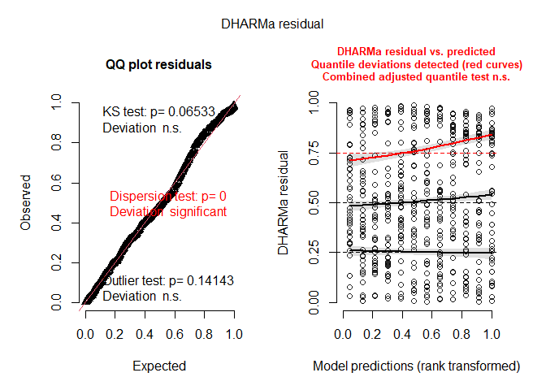
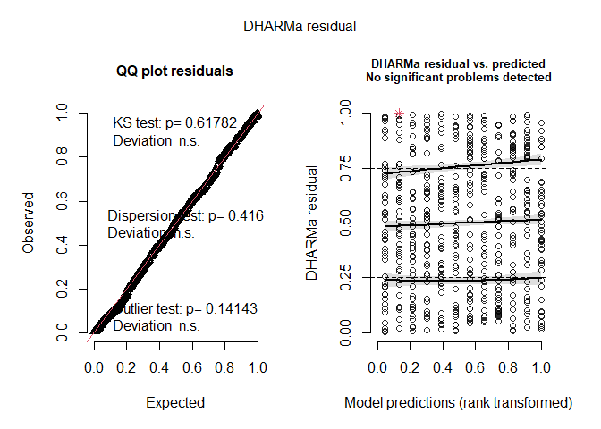
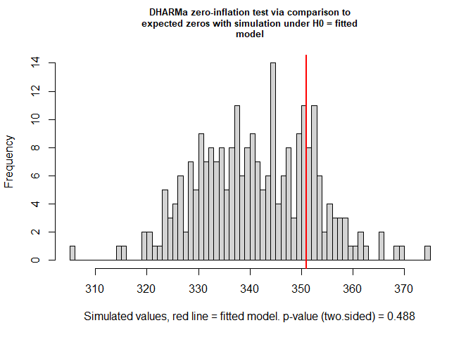
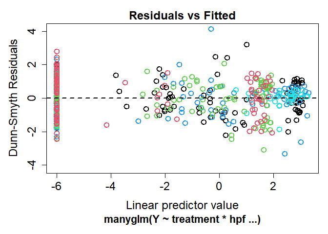
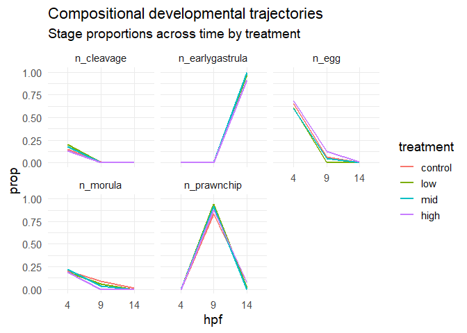
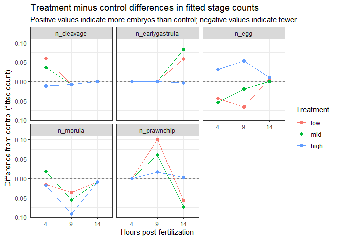
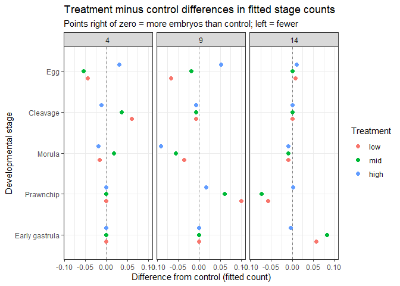

# Analyzing developmental stage composition (Timing)
Sarah Tanja
2025-08-27

- [<span class="toc-section-number">1</span> Background](#background)
- [<span class="toc-section-number">2</span> Setup](#setup)
  - [<span class="toc-section-number">2.1</span> Load
    libraries](#load-libraries)
  - [<span class="toc-section-number">2.2</span> Load data](#load-data)
  - [<span class="toc-section-number">2.3</span> Set
    colors](#set-colors)
- [<span class="toc-section-number">3</span> Explore the
  data](#explore-the-data)
- [<span class="toc-section-number">4</span> Counts](#counts)
- [<span class="toc-section-number">5</span> Proportions](#proportions)
- [<span class="toc-section-number">6</span> Statistical
  approach](#statistical-approach)
- [<span class="toc-section-number">7</span> MVABUND/
  MANYGLM](#mvabund-manyglm)
  - [<span class="toc-section-number">7.1</span> SE?](#se)
- [<span class="toc-section-number">8</span> 4. join and pivot fitted
  SEs](#4-join-and-pivot-fitted-ses)
- [<span class="toc-section-number">9</span> 5. combine fit + SE and
  build CIs](#5-combine-fit--se-and-build-cis)
- [<span class="toc-section-number">10</span> 6. extract control
  values](#6-extract-control-values)
- [<span class="toc-section-number">11</span> 7. compute treatment -
  control difference and
  CI](#7-compute-treatment---control-difference-and-ci)
  - [<span class="toc-section-number">11.1</span> emmeans?](#emmeans)
  - [<span class="toc-section-number">11.2</span> Forest
    plot](#forest-plot)
- [<span class="toc-section-number">12</span> Method](#method)
- [<span class="toc-section-number">13</span> Result](#result)
- [<span class="toc-section-number">14</span> Discussion
  points](#discussion-points)

# Background

# Setup

## Load libraries

``` r
library(tidyverse)
library(ggplot2)
library(kableExtra)
```

    systemfonts and textshaping have been compiled with different versions of Freetype. Because of this, textshaping will not use the font cache provided by systemfonts

``` r
#library(betareg)
#library(gamlss)
library(MASS) # for multinomial or negative binomial GLM
library(glmmTMB) # for zero-inflated negative binomial
#library(performance)
library(DHARMa)
library(mvabund)
library(scales)
#library(AER) # for dispersiontest
```

## Load data

``` r
anyNA(tidy_vials)
```

    [1] FALSE

> [!IMPORTANT]
>
> The `NA`s from samples 3L9 and 7H9 represent vials where no embryos
> were present at the time of counting (all embryos died or were not
> fertilized). These samples NA values were replaced with `0`.

``` r
tidy_vials_stage_counts <- tidy_vials %>% 
  dplyr::select(sample_id, treatment, hpf, date, n_egg, n_cleavage, n_morula, n_prawnchip, n_earlygastrula) 

summary(tidy_vials_stage_counts) 
```

      sample_id           treatment  hpf         date               n_egg       
     Length:108         control:27   4 :36   Length:108         Min.   : 0.000  
     Class :character   low    :27   9 :36   Class :character   1st Qu.: 0.000  
     Mode  :character   mid    :27   14:36   Mode  :character   Median : 0.000  
                        high   :27                              Mean   : 5.981  
                                                                3rd Qu.:10.000  
                                                                Max.   :34.000  
       n_cleavage        n_morula       n_prawnchip     n_earlygastrula 
     Min.   : 0.000   Min.   : 0.000   Min.   : 0.000   Min.   : 0.000  
     1st Qu.: 0.000   1st Qu.: 0.000   1st Qu.: 0.000   1st Qu.: 0.000  
     Median : 0.000   Median : 0.000   Median : 0.000   Median : 0.000  
     Mean   : 1.463   Mean   : 1.972   Mean   : 4.389   Mean   : 4.102  
     3rd Qu.: 0.000   3rd Qu.: 2.000   3rd Qu.: 6.000   3rd Qu.: 7.250  
     Max.   :15.000   Max.   :17.000   Max.   :28.000   Max.   :26.000  

``` r
write_csv(tidy_vials_stage_counts, "../../output/dataframes/tidy_vials_stage_counts.csv")
```

## Set colors

``` r
stage.5.colors <- c(egg = "#FFE362",
                    cleavage = "#EBA600", 
                    morula = "#E6AA83",
                    prawnchip = "#D9685B", 
                    earlygastrula = "#A2223C")
```

# Explore the data

Pivot to long format for data exploration and visualization *(note that
the data used for statistical analysis remains in wide format as
`tidy_vials_stage_counts`)*

``` r
# Pivot to long format
long_stage_counts <- tidy_vials_stage_counts %>%
  pivot_longer(
    cols = starts_with("n"),
    names_to = c(".value", "stage"),
    names_pattern = "(n)_(.*)"
  ) %>% 
  mutate(
    stage = factor(stage, 
                   levels = c("egg", "cleavage", "morula", 
                  "prawnchip", "earlygastrula"), ordered = TRUE))


str(long_stage_counts)
```

    tibble [540 × 6] (S3: tbl_df/tbl/data.frame)
     $ sample_id: chr [1:540] "10C14" "10C14" "10C14" "10C14" ...
     $ treatment: Factor w/ 4 levels "control","low",..: 1 1 1 1 1 1 1 1 1 1 ...
     $ hpf      : Factor w/ 3 levels "4","9","14": 3 3 3 3 3 1 1 1 1 1 ...
     $ date     : chr [1:540] "2024-06-07" "2024-06-07" "2024-06-07" "2024-06-07" ...
     $ stage    : Ord.factor w/ 5 levels "egg"<"cleavage"<..: 1 2 3 4 5 1 2 3 4 5 ...
     $ n        : int [1:540] 0 0 0 0 23 9 12 8 0 0 ...

``` r
summary(long_stage_counts$n)
```

       Min. 1st Qu.  Median    Mean 3rd Qu.    Max. 
      0.000   0.000   0.000   3.581   4.000  34.000 

``` r
write_csv(long_stage_counts, "../../output/dataframes/long_timing_counts.csv")
```

#### Overdispersion

``` r
mean(long_stage_counts$n)
```

    [1] 3.581481

``` r
var(long_stage_counts$n)
```

    [1] 45.05272

- The variance (45.0) is greater than the mean (3.5), indicating that
  our data has overdispersion.

#### Zero-inflation

``` r
hist(long_stage_counts$n, breaks = 30)
```


- Most of the values are 0! Visually, we can see there are lots of zeros
  in our data due to our experimental structure. The following code
  displays the proportion of total zeros for each stage (across
  treatment and hpf):

``` r
long_stage_counts %>%
  group_by(stage) %>%
  summarize(prop_zero = mean(n == 0))
```

    # A tibble: 5 × 2
      stage         prop_zero
      <ord>             <dbl>
    1 egg               0.593
    2 cleavage          0.759
    3 morula            0.630
    4 prawnchip         0.602
    5 earlygastrula     0.667

More than 50% of the counts for each stage are zeros….That’s a lot of
zeros!… Our data is proabably zero-inflated.

Formally check for Zero inflation by running a zero-inflated negative
binomial model and comparing it to a standard negative binomial model
using an anova to compare them … AIC?

``` r
# Fit standard negative binomial model
nb_model <- glmmTMB(n ~ treatment * hpf, 
                    family = nbinom2,
                    data = long_stage_counts)

# Fit zero-inflated negative binomial model
zinb_model <- glmmTMB(n ~ treatment * hpf, 
                      ziformula = ~1, 
                      family = nbinom2, 
                      data = long_stage_counts)

# compare with anova
anova(nb_model, zinb_model)
```

    Data: long_stage_counts
    Models:
    nb_model: n ~ treatment * hpf, zi=~0, disp=~1
    zinb_model: n ~ treatment * hpf, zi=~1, disp=~1
               Df    AIC    BIC  logLik deviance  Chisq Chi Df Pr(>Chisq)    
    nb_model   13 2012.9 2068.7 -993.46   1986.9                             
    zinb_model 14 1951.7 2011.8 -961.85   1923.7 63.205      1  1.862e-15 ***
    ---
    Signif. codes:  0 '***' 0.001 '**' 0.01 '*' 0.05 '.' 0.1 ' ' 1

> [!NOTE]
>
> Model fit AIC drops: 2012.9 → 1951.7 (ΔAIC ≈ 61) LogLik improves: −993
> → −962
>
> 👉 Statistically, that is very strong evidence that the zero-inflated
> model fits better.

Stuctural zeros vs statistical zeros… Zeros are expected because embryos
move between stages at any given timepoint, some stages will naturally
have zero counts. That is **structural biology**, not necessarily “zero
inflation” in the statistical sense…. So the ZINM model is capturing
stage absence at certain timepoints, aka the transition in development.

``` r
summary(zinb_model)
```

     Family: nbinom2  ( log )
    Formula:          n ~ treatment * hpf
    Zero inflation:     ~1
    Data: long_stage_counts

          AIC       BIC    logLik -2*log(L)  df.resid 
       1951.7    2011.8    -961.9    1923.7       526 


    Dispersion parameter for nbinom2 family (): 1.45 

    Conditional model:
                        Estimate Std. Error z value Pr(>|z|)    
    (Intercept)          2.43763    0.19326  12.614   <2e-16 ***
    treatmentlow        -0.01680    0.26995  -0.062   0.9504    
    treatmentmid        -0.14689    0.27101  -0.542   0.5878    
    treatmenthigh       -0.04722    0.27336  -0.173   0.8629    
    hpf9                -0.48808    0.29462  -1.657   0.0976 .  
    hpf14               -0.32556    0.32627  -0.998   0.3184    
    treatmentlow:hpf9    0.24372    0.43034   0.566   0.5712    
    treatmentmid:hpf9    0.34234    0.42122   0.813   0.4164    
    treatmenthigh:hpf9   0.50688    0.45167   1.122   0.2618    
    treatmentlow:hpf14   0.13302    0.45759   0.291   0.7713    
    treatmentmid:hpf14   0.71032    0.47788   1.486   0.1372    
    treatmenthigh:hpf14 -0.34723    0.44953  -0.772   0.4399    
    ---
    Signif. codes:  0 '***' 0.001 '**' 0.01 '*' 0.05 '.' 0.1 ' ' 1

    Zero-inflation model:
                Estimate Std. Error z value Pr(>|z|)    
    (Intercept)   0.5292     0.0974   5.433 5.54e-08 ***
    ---
    Signif. codes:  0 '***' 0.001 '**' 0.01 '*' 0.05 '.' 0.1 ' ' 1

``` r
sim_nb <- simulateResiduals(nb_model)
plot(sim_nb)
```



``` r
sim_zinb <- simulateResiduals(zinb_model)
plot(sim_zinb)
```



``` r
testZeroInflation(simulateResiduals(nb_model))
```




        DHARMa zero-inflation test via comparison to expected zeros with
        simulation under H0 = fitted model

    data:  simulationOutput
    ratioObsSim = 1.0278, p-value = 0.488
    alternative hypothesis: two.sided

> [!CAUTION]
>
> LRT (NB vs ZINB): highly significant DHARMa zero test: not significant
>
> That looks contradictory, but it’s actually common.
>
> What’s going on
>
> The ZINB model is improving fit by capturing something, but not
> necessarily true zero inflation.
>
> Most likely:
>
> 👉 It’s absorbing model misspecification, not excess zeros
>
> In your case, likely candidates: - stage structure (compositional
> counts) - treatment × time dynamics - overdispersion patterns not
> fully captured by NB - heterogeneity across stages
>
> “There was no evidence of excess zeros based on simulation-based
> diagnostics (DHARMa; p=0.49), despite improved fit of a zero-inflated
> model.”
>
> You do NOT need a zero-inflated model
>
> Your diagnostics say NB is adequate with respect to zeros.
>
> The ZINB model is just being more flexible—not more correct.
>
> *This is not random zero inflation. This is stage-structured counts
> with lots of natural zeros*

# Counts

``` r
ggplot(long_stage_counts, aes(x = treatment, y = n, fill = stage)) +
  geom_bar(stat = "identity", position = "stack") +
  facet_wrap(~ hpf) +
  labs(title = "Embryo stage counts by treatment over time",
       x = "Treatment",
       y = "Embryo count") +
  theme_minimal() +
  scale_fill_manual(values = stage.5.colors)
```


> At 4 hpf, the majority of embryos are indeed in the egg or early
> cleavage stages, and very few or none are in advanced stages like
> prawnchip or early gastrula. As time progresses to 9 and then 14 hpf,
> the embryo counts in the earlier stages (egg, cleavage) decrease,
> reflecting development progression, while counts in the later stages
> (prawnchip, early gastrula) increase correspondingly. You can see that
> total counts across treatments appear similar, as well as the stage
> breakdown within each treatment.

Calculate stage count means

``` r
# Step 2: Calculate mean proportions for each stage within each treatment
counts_summary <- long_stage_counts %>%
  group_by(treatment, stage, hpf) %>%
  summarize(mean_counts = mean(n), .groups = "drop") %>% 
  mutate(mean_counts = round(mean_counts, 2)) %>% 
  filter(stage %in% 
         c("egg", 
         "cleavage", 
         "morula", 
         "prawnchip", 
         "earlygastrula")) %>% 
  mutate(stage = factor(stage, levels = c("egg", "cleavage", "morula", "prawnchip", "earlygastrula"))) %>% 
  mutate(hpf = factor(hpf, levels = c("4", "9", "14"))) %>% 
  mutate(treatment = factor(treatment, 
                        levels = c("control", "low", "mid", "high")))

kable(counts_summary)
```

| treatment | stage         | hpf | mean_counts |
|:----------|:--------------|:----|------------:|
| control   | egg           | 4   |       17.78 |
| control   | egg           | 9   |        0.89 |
| control   | egg           | 14  |        0.00 |
| control   | cleavage      | 4   |        3.89 |
| control   | cleavage      | 9   |        0.11 |
| control   | cleavage      | 14  |        0.00 |
| control   | morula        | 4   |        5.78 |
| control   | morula        | 9   |        1.11 |
| control   | morula        | 14  |        0.11 |
| control   | prawnchip     | 4   |        0.00 |
| control   | prawnchip     | 9   |       12.11 |
| control   | prawnchip     | 14  |        0.89 |
| control   | earlygastrula | 4   |        0.00 |
| control   | earlygastrula | 9   |        0.00 |
| control   | earlygastrula | 14  |       11.11 |
| low       | egg           | 4   |       17.22 |
| low       | egg           | 9   |        0.00 |
| low       | egg           | 14  |        0.11 |
| low       | cleavage      | 4   |        5.89 |
| low       | cleavage      | 9   |        0.00 |
| low       | cleavage      | 14  |        0.00 |
| low       | morula        | 4   |        5.11 |
| low       | morula        | 9   |        0.67 |
| low       | morula        | 14  |        0.00 |
| low       | prawnchip     | 4   |        0.00 |
| low       | prawnchip     | 9   |       13.11 |
| low       | prawnchip     | 14  |        0.22 |
| low       | earlygastrula | 4   |        0.00 |
| low       | earlygastrula | 9   |        0.00 |
| low       | earlygastrula | 14  |       13.11 |
| mid       | egg           | 4   |       14.89 |
| mid       | egg           | 9   |        0.78 |
| mid       | egg           | 14  |        0.00 |
| mid       | cleavage      | 4   |        4.44 |
| mid       | cleavage      | 9   |        0.00 |
| mid       | cleavage      | 14  |        0.00 |
| mid       | morula        | 4   |        5.56 |
| mid       | morula        | 9   |        0.56 |
| mid       | morula        | 14  |        0.00 |
| mid       | prawnchip     | 4   |        0.00 |
| mid       | prawnchip     | 9   |       13.89 |
| mid       | prawnchip     | 14  |        0.00 |
| mid       | earlygastrula | 4   |        0.00 |
| mid       | earlygastrula | 9   |        0.00 |
| mid       | earlygastrula | 14  |       15.56 |
| high      | egg           | 4   |       18.22 |
| high      | egg           | 9   |        1.78 |
| high      | egg           | 14  |        0.11 |
| high      | cleavage      | 4   |        3.22 |
| high      | cleavage      | 9   |        0.00 |
| high      | cleavage      | 14  |        0.00 |
| high      | morula        | 4   |        4.78 |
| high      | morula        | 9   |        0.00 |
| high      | morula        | 14  |        0.00 |
| high      | prawnchip     | 4   |        0.00 |
| high      | prawnchip     | 9   |       11.67 |
| high      | prawnchip     | 14  |        0.78 |
| high      | earlygastrula | 4   |        0.00 |
| high      | earlygastrula | 9   |        0.00 |
| high      | earlygastrula | 14  |        9.44 |

Table: Stage composition means

``` r
stage_levels <- c("egg", "cleavage", "morula", "prawnchip", "earlygastrula")
treat_levels <- c("control", "low", "mid", "high")
hpf_levels   <- c(4, 9, 14)

table_stage_count <- counts_summary %>%
  filter(stage %in% stage_levels) %>%
  mutate(
    stage     = factor(stage,     levels = stage_levels),
    treatment = factor(treatment, levels = treat_levels),
    hpf       = factor(hpf,       levels = hpf_levels)
  ) %>%
  dplyr::select(stage, hpf, treatment, mean_counts) %>%
  pivot_wider(
    names_from  = c(treatment, hpf),
    values_from = mean_counts,
    values_fill = 0,
    # column names like "4 hpf - control"
    names_glue  = "{hpf} hpf - {treatment}"
  ) %>%
  dplyr::select(stage, 
                `4 hpf - control`, `4 hpf - low`, `4 hpf - mid`, `4 hpf - high`,
                `9 hpf - control`, `9 hpf - low`, `9 hpf - mid`, `9 hpf - high`,
                `14 hpf - control`, `14 hpf - low`, `14 hpf - mid`, `14 hpf - high`) %>%
  arrange(stage) %>%
  # turn to % (numeric) for nice formatting
  mutate(across(-stage, ~ round(.x, 1))) %>%
  rename(Stage = stage) 


kable(table_stage_count)
```

| Stage | 4 hpf - control | 4 hpf - low | 4 hpf - mid | 4 hpf - high | 9 hpf - control | 9 hpf - low | 9 hpf - mid | 9 hpf - high | 14 hpf - control | 14 hpf - low | 14 hpf - mid | 14 hpf - high |
|:---|---:|---:|---:|---:|---:|---:|---:|---:|---:|---:|---:|---:|
| egg | 17.8 | 17.2 | 14.9 | 18.2 | 0.9 | 0.0 | 0.8 | 1.8 | 0.0 | 0.1 | 0.0 | 0.1 |
| cleavage | 3.9 | 5.9 | 4.4 | 3.2 | 0.1 | 0.0 | 0.0 | 0.0 | 0.0 | 0.0 | 0.0 | 0.0 |
| morula | 5.8 | 5.1 | 5.6 | 4.8 | 1.1 | 0.7 | 0.6 | 0.0 | 0.1 | 0.0 | 0.0 | 0.0 |
| prawnchip | 0.0 | 0.0 | 0.0 | 0.0 | 12.1 | 13.1 | 13.9 | 11.7 | 0.9 | 0.2 | 0.0 | 0.8 |
| earlygastrula | 0.0 | 0.0 | 0.0 | 0.0 | 0.0 | 0.0 | 0.0 | 0.0 | 11.1 | 13.1 | 15.6 | 9.4 |

# Proportions

Drop the samples with zero embryos (drop zeros)

``` r
tidy_vials_dropz <- tidy_vials %>% 
  filter(sample_id != c("3L9", "7H9"))
```

Calculate proportion means

``` r
# Step 1: Pivot to long format
long_timing_proportions <- tidy_vials_dropz %>%
  pivot_longer(
    cols = starts_with("prop"),
    names_to = c(".value", "stage"),
    names_pattern = "(prop)_(.*)"
  ) %>% 
  filter(stage != "embryos") # embryos indicated total number, not the breakdown by stage

anyNA(long_timing_proportions)
```

    [1] FALSE

``` r
# Step 2: Calculate mean proportions for each stage within each treatment
prop_summary <- long_timing_proportions %>%
  group_by(treatment, stage, hpf) %>%
  summarize(mean_prop = mean(prop), .groups = "drop") %>% 
  filter(stage %in% 
         c("egg", 
         "cleavage", 
         "morula", 
         "prawnchip", 
         "earlygastrula")) %>% 
  mutate(stage = factor(stage, levels = c("egg", "cleavage", "morula", "prawnchip", "earlygastrula"))) %>% 
  mutate(hpf = factor(hpf, levels = c("4", "9", "14"))) %>% 
  mutate(treatment = factor(treatment, 
                        levels = c("control", "low", "mid", "high")))

head(prop_summary)
```

    # A tibble: 6 × 4
      treatment stage         hpf   mean_prop
      <fct>     <fct>         <fct>     <dbl>
    1 control   cleavage      4       0.143  
    2 control   cleavage      9       0.00585
    3 control   cleavage      14      0      
    4 control   earlygastrula 4       0      
    5 control   earlygastrula 9       0      
    6 control   earlygastrula 14      0.895  

Save proportion summary as a csv

``` r
write_csv(prop_summary, "../../output/dataframes/prop_summary.csv")
```

``` r
prop_summary %>% 
ggplot(., aes(x = treatment, y = mean_prop, fill = stage)) +
  geom_bar(stat = "identity") +
  scale_fill_manual(values = stage.5.colors) +
  ggtitle("Embryo stage composition")+
  labs(y = "", x = "Treatment", fill = "Embryonic Stage") +
  facet_wrap(~ hpf)+
  theme_minimal()+
  theme(axis.text.x = element_text(
      angle = 45,      # rotate 45°
      hjust = 1,       # horizontal justification
      vjust = 1        # tweak if you want
    ))
```


> [!NOTE]
>
> Visually we can see there is little/no difference in proportion of
> embryos at each stage across treatments at each end-point (4,9,14 hpf)
> when looking at counts OR proportions… since we do our stats on counts
> and since to calculate proportions we had to drop our samples with
> zero embryos, this counts data is a better more accurate
> representation of the underlying data we used for the analysis so that
> is what we will use for our manuscript.

``` r
stage_levels <- c("egg", "cleavage", "morula", "prawnchip", "earlygastrula")
treat_levels <- c("control", "low", "mid", "high")
hpf_levels   <- c(4, 9, 14)

table_stage_pct <- prop_summary %>%
  filter(stage %in% stage_levels) %>%
  mutate(
    stage     = factor(stage,     levels = stage_levels),
    treatment = factor(treatment, levels = treat_levels),
    hpf       = factor(hpf,       levels = hpf_levels)
  ) %>%
  dplyr::select(stage, hpf, treatment, mean_prop) %>%
  pivot_wider(
    names_from  = c(treatment, hpf),
    values_from = mean_prop,
    values_fill = 0,
    # column names like "4 hpf - control"
    names_glue  = "{hpf} hpf - {treatment}"
  ) %>%
  dplyr::select(stage, 
                `4 hpf - control`, `4 hpf - low`, `4 hpf - mid`, `4 hpf - high`,
                `9 hpf - control`, `9 hpf - low`, `9 hpf - mid`, `9 hpf - high`,
                `14 hpf - control`, `14 hpf - low`, `14 hpf - mid`, `14 hpf - high`) %>%
  arrange(stage) %>%
  # turn to % (numeric) for nice formatting
  mutate(across(-stage, ~ round(.x * 100, 1))) %>%
  rename(Stage = stage) 


kable(table_stage_pct)
```

| Stage | 4 hpf - control | 4 hpf - low | 4 hpf - mid | 4 hpf - high | 9 hpf - control | 9 hpf - low | 9 hpf - mid | 9 hpf - high | 14 hpf - control | 14 hpf - low | 14 hpf - mid | 14 hpf - high |
|:---|---:|---:|---:|---:|---:|---:|---:|---:|---:|---:|---:|---:|
| egg | 65.3 | 60.8 | 59.8 | 68.1 | 6.7 | 0.0 | 3.1 | 8.7 | 0.0 | 0.7 | 0 | 1.1 |
| cleavage | 14.3 | 20.2 | 18.0 | 13.3 | 0.6 | 0.0 | 0.0 | 0.0 | 0.0 | 0.0 | 0 | 0.0 |
| morula | 20.3 | 19.0 | 22.2 | 18.6 | 9.9 | 7.1 | 3.4 | 0.0 | 1.6 | 0.0 | 0 | 0.0 |
| prawnchip | 0.0 | 0.0 | 0.0 | 0.0 | 82.9 | 92.9 | 93.5 | 91.3 | 8.9 | 2.1 | 0 | 12.1 |
| earlygastrula | 0.0 | 0.0 | 0.0 | 0.0 | 0.0 | 0.0 | 0.0 | 0.0 | 89.5 | 97.1 | 100 | 86.8 |

# Statistical approach

> > [!IMPORTANT]
> >
> > “Does the distribution of embryos across stages differ by treatment
> > at each developmental time point?”

Our data is one categorical response per embryo with 5 mutually
exclusive categories: egg, cleavage, morula, prawnchip, early gastrula.

Exactly one category per embryo (categories are mutually exclusive)

Counted per vial, grouped by treatment & hpf … So per vial we have a
composition of counts: n_egg, n_cleavage, n_morula, n_prawnchip,
n_early_gastrula

Counts represent developmental stage

Counts do not sum to a total per vial (since embryos can die, etc.)

We can either model **counts** , or **proportions** of stage
composition.

#### Should we use Dirichlet?

A Dirichlet or beta-multinomial regression on proportions asks “Does PVC
shift developmental stage composition?” HOWEVER, the Dirichlet
distribution requires strictly positive proportions (all \> 0 and
summing to 1). Zero counts violate that assumption because proportions
of zero imply complete absence of a category — and Dirichlet cannot
model that. We would need to subset our data by timepoint and run a
Dirichlet for each, only including the non-zero stages at each timepoint
(ex. at 4 hpf there are 0 embryos in the early gastrula stage, so we
would need to exclude that category from the model). We also considered
Dirichlet regression for stage composition analysis; however, several
stage categories were biologically absent at early time points (e.g., no
gastrula at 4 hpf), violating the requirement for strictly positive
proportions. Therefore, manyglm with a negative binomial distribution
was selected as a more appropriate method that accommodates structural
zeros and overdispersion while analyzing all time points concurrently.

#### Should we use Multinomial NB?

A Multinomial negative binomial on counts asks “Does PVC leachate shift
developmental stage counts, accounting for overdispersion and excess
zeros?” HOWEVER, Multinomial models (including beta-multinomial and
multinomial negative binomial) assume: - One response column, - Each
trial falls into one of several categories, - Total number of trials is
fixed or modeled separately, - Categories must sum to 1 (or N), -
Variance is usually fixed or only weakly overdispersed unless modeled
Bayes/anova style.

But our embryos do not meet those assumptions:

| Violation | Why |
|----|----|
| Counts do **not sum to a fixed total** | Viable embryos vary across vials |
| Some stages **do not exist at certain timepoints** | Multinomial cannot handle biologically impossible categories |
| Counts are **strongly overdispersed & zero-inflated** | Requires negative binomial + mvabund handling |
| We need **joint + stage-specific tests** | Multinomial only gives global odds ratios |

🌿 Biological implications Multinomial regression answers: \> “What is
the probability of each category relative to others?”

But our question is different: \> “Do counts in each developmental stage
change with treatment and time — and does PVC shift the overall
composition of development?”

Since development is sequential, not competitive (like elections or
consumer choice), multinomial structure is biologically misleading.

> We considered multinomial negative binomial models but rejected them
> because our data represent separate count variables rather than a
> single categorical response, and because developmental stages do not
> form a fixed-sum composition at all timepoints. Instead, we used a
> multivariate generalized linear model (manyglm, negative binomial),
> which accommodates overdispersion, structural zeros, and allows
> testing both overall shifts in developmental composition and
> stage-specific responses.

#### Should we use zero-inflated negative binomial (ZINB)?

…

#### Should we use Multivariate GLM?

✔ Handles overdispersed count data

✔ Allows structural zeros

✔ Models all stages simultaneously

✔ Provides multivariate AND univariate tests

✔ Allows interaction (treatment × hpf) without splitting data

✔ Allows rich residual diagnostics (e.g., via DHARMa)

Advice from UW Biostats Class Consult:

> Modeling survival concomitantly to a development component to make
> compositional claims: In this step, we elaborate further on what can
> be done to ensure that compositional claims are backed by the model.
> The client’s current model is \> mod_all \<- manyglm( Y ~ treatment \*
> hpf, family = “negative.binomial”, data = tidy_vials_stage_counts)
> This model estimates the effect of treatment and time on the absolute
> count of embryos at each developmental stage. In this specification,
> the treatment coefficient reflects a mixture of survival and
> developmental effect, because leachate affects both how many embryos
> survive and how surviving embryos are distributed across developmental
> stages. We propose the following correction: \>
> tidy_vials_stage_counts \<- tidy_vials_stage_counts \|\> mutate(N_obs
> = n_egg + n_cleavage + n_morula + n_prawnchip + n_earlygastrula) \>
> mod_offset \<- manyglm( Y ~ treatment \* hpf, family =
> “negative.binomial”, offset = log(N_obs), data
> =tidy_vials_stage_counts) This implementation uses an offset term.
> Here, N_obs is the total number of scored/classified embryos per vial.
> By including log(N_obs) as an offset, the model is modeling the
> expected count divided by N_obs, which is the fraction of scored
> embryos at each developmental stage. This ensures that treatment and
> time capture shifts in composition rather than shifts in absolute
> counts in each developmental stage.

<object data="biostats-consult.pdf" type="application/pdf" width="100%" height="500px">

<p>

Unable to display PDF file. <a href="biostats-consult.pdf">Download</a>
instead.
</p>

</object>

# MVABUND/ MANYGLM

Using a multivariate negative binomial generalized linear model
(MNB.GLM), This tests whether the whole multivariate response vector `Y`
is affected by treatment, hpf, or their interaction fitting separate
GLMs for each stage.

``` r
tidy_vials_stage_counts <- tidy_vials_stage_counts %>% 
  mutate(N_obs = n_egg + n_cleavage + n_morula + n_prawnchip + n_earlygastrula) %>% 
  filter(N_obs > 0) # drop samples with zero embryos
```

``` r
Y <- mvabund(tidy_vials_stage_counts[, 
                                     c("n_egg", 
                                       "n_cleavage", 
                                       "n_morula", 
                                       "n_prawnchip", 
                                       "n_earlygastrula")])
```

> [!CAUTION]
>
> I initially ran the following and got a warning:
> `Error in if (any(z$var.est == 0)) { : missing value where TRUE/FALSE needed`
> when I included the `offset = log(N_obs)` term. This is likely because
> some vials had zero total embryos (N_obs = 0), leading to log(0) which
> is undefined. To fix this, I added a small constant (e.g.,
> `.Machine$double.xmin`) to N_obs to avoid taking the log of zero… BUT
> this maybe wasn’t the best approach so now I’m trying filtering the
> observations with zero embryos??

``` r
set.seed(03262026)

mod_all <- manyglm(
  Y ~ treatment * hpf,
  family = "negative.binomial",
  offset = log(N_obs),
  data = tidy_vials_stage_counts
)
```

``` r
plot.manyglm(mod_all)
```



> Here, setting a large number of bootstrap replicates reduces the
> variability of the simulated p-values. This gives a coefficient table
> with separate rows for each of the treatment levels versus the control
> baseline. The client can then assess whether each dose differs from
> control over time. For instance, whether high leachate differs from
> control at 14 hpf for a specific stage. This gives more information
> than just whether treatment as a whole explains the deviance, as
> provided by the anova command.

``` r
set.seed(04072026)
summary(mod_all, nBoot = 5000)
```


    Test statistics:
                        wald value Pr(>wald)    
    (Intercept)              6.707    0.0002 ***
    treatmentlow             0.668    0.9422    
    treatmentmid             0.523    0.9678    
    treatmenthigh            0.284    0.9966    
    hpf9                     5.872    0.0002 ***
    hpf14                    2.760    0.0030 ** 
    treatmentlow:hpf9        0.474    0.6213    
    treatmentmid:hpf9        1.181    0.5281    
    treatmenthigh:hpf9       0.907    0.4547    
    treatmentlow:hpf14       0.053    0.0002 ***
    treatmentmid:hpf14       0.046    0.0002 ***
    treatmenthigh:hpf14      0.053    0.0002 ***
    --- 
    Signif. codes:  0 '***' 0.001 '**' 0.01 '*' 0.05 '.' 0.1 ' ' 1 

    Test statistic:  15.98, p-value: 2e-04 
    Arguments:
     Test statistics calculated assuming response assumed to be uncorrelated 
     P-value calculated using 5000 resampling iterations via pit.trap resampling (to account for correlation in testing).

``` r
set.seed(04072026)
anova(mod_all, nBoot = 5000, p.uni = "adjusted")
```

    Time elapsed: 0 hr 3 min 18 sec

    Analysis of Deviance Table

    Model: Y ~ treatment * hpf

    Multivariate test:
                  Res.Df Df.diff   Dev Pr(>Dev)    
    (Intercept)      105                           
    treatment        102       3   1.2    0.999    
    hpf              100       2 669.0   <2e-16 ***
    treatment:hpf     94       6  48.1    0.002 ** 
    ---
    Signif. codes:  0 '***' 0.001 '**' 0.01 '*' 0.05 '.' 0.1 ' ' 1

    Univariate Tests:
                    n_egg          n_cleavage          n_morula         
                      Dev Pr(>Dev)        Dev Pr(>Dev)      Dev Pr(>Dev)
    (Intercept)                                                         
    treatment        0.24    0.999      0.325    0.999    0.536    0.996
    hpf           108.436   <2e-16     63.227   <2e-16   50.715   <2e-16
    treatment:hpf  16.494    0.060       2.76    0.256   10.292    0.060
                  n_prawnchip          n_earlygastrula         
                          Dev Pr(>Dev)             Dev Pr(>Dev)
    (Intercept)                                                
    treatment           0.019    1.000            0.04    1.000
    hpf               187.908   <2e-16         258.682   <2e-16
    treatment:hpf      18.535    0.036               0    0.430
    Arguments:
     Test statistics calculated assuming uncorrelated response (for faster computation) 
    P-value calculated using 5000 iterations via PIT-trap resampling.

What does the multivariate test tell us: treatment: p=0.999 → no main
effect of leachate hpf: p=0.001 → huge main effect (developmental stage
dominates) treatment × hpf: p=0.001 → interaction is real

The effect of leachate depends on developmental stage, even though there
is no overall treatment effect. There is no consistent direction of
treatment effect across all stages. Effects are stage-specific, subtle
or opposing.

What do the univariate tests tell us:

| Stage variable  | p-value    | Interpretation     |
|-----------------|------------|--------------------|
| n_egg           | 0.064      | borderline         |
| n_cleavage      | 0.143      | nothing            |
| n_morula        | 0.064      | borderline         |
| n_prawnchip     | ~0.05–0.06 | borderline         |
| n_earlygastrula | **0.045**  | ✅ **significant** |

> [!IMPORTANT]
>
> Interaction is being driven mostly by early gastrula

> Understand the driving factors behind significant aggregate results
> and null individual effects: in Wang et al., 2012, Fig.1, the authors
> of mvabund provide an analysis of deviance table that shows that
> treatment is deemed to have a significant effect on the abundance of
> Copepods through a multivariate test, but individual tests (i.e.,
> species-by-species) are not deemed significant. The discussion in the
> Section “Testing Hypotheses about the Community-Environment
> Association” in Wang et al., 2012 can be relevant here. We believe
> that an important driving factor for this is that univariate p-values
> (i.e., a p-value for testing the significance of the interaction for
> each development stage) are corrected for multiple comparisons, which
> can reduce power for detecting the effects.

> [!WARNING]
>
> Stage and hpf are not independent!!! We know that hpf will explain
> most of the variation in Y. Talking about how hpf is significant is
> not biologically relevant to the study… just confirms what is already
> obvious- that embryos develop over time. The main question is whether
> treatment affects stage composition differently at different
> developmental times, which is what the interaction term tests. So for
> results we focus on the interaction! The interaction term asks “Does
> treatment affect stage composition differently at different
> developmental times?” or “Does PVC leachate delay or speed up
> development?” We tested whether treatment effects on stage composition
> varied across developmental time (treatment × hpf interaction).

Check the reduced additive vs full interaction model.. this sees if the
interaction term adds explanatory power or if its superfluous

``` r
set.seed(03262026)
mod_red <- manyglm(
  Y ~ treatment + hpf,
  family = "negative.binomial",
  offset = log(N_obs),
  data = tidy_vials_stage_counts
)

anova(mod_all, mod_red, nBoot = 5000, p.uni = "adjusted")
```

    Time elapsed: 0 hr 1 min 17 sec

    Analysis of Deviance Table

    mod_red: Y ~ treatment + hpf
    mod_all: Y ~ treatment * hpf

    Multivariate test:
            Res.Df Df.diff   Dev Pr(>Dev)    
    mod_red    100                           
    mod_all     94       6 48.08    0.001 ***
    ---
    Signif. codes:  0 '***' 0.001 '**' 0.01 '*' 0.05 '.' 0.1 ' ' 1

    Univariate Tests:
             n_egg          n_cleavage          n_morula          n_prawnchip
               Dev Pr(>Dev)        Dev Pr(>Dev)      Dev Pr(>Dev)         Dev
    mod_red                                                                  
    mod_all 16.494    0.057       2.76    0.261   10.292    0.057      18.535
                     n_earlygastrula         
            Pr(>Dev)             Dev Pr(>Dev)
    mod_red                                  
    mod_all    0.040               0    0.547
    Arguments:
     Test statistics calculated assuming uncorrelated response (for faster computation) 
    P-value calculated using 5000 iterations via PIT-trap resampling.

> [!NOTE]
>
> This indicates that the interaction does significantly improve model
> fit, so we keep it in the model!

``` r
# Get fitted values
fitted_vals <- as.data.frame(fitted(mod_all))
fitted_vals$sample_id <- tidy_vials_stage_counts$sample_id
fitted_vals$treatment <- tidy_vials_stage_counts$treatment
fitted_vals$hpf <- tidy_vials_stage_counts$hpf

# Long format for ggplot
fitted_long <- fitted_vals %>%
  pivot_longer(
    cols = starts_with("n_"),
    names_to = "stage",
    values_to = "fitted_count"
  )

fitted_prop <- fitted_long %>%
  group_by(sample_id) %>%
  mutate(total = sum(fitted_count),
         prop = fitted_count / total)

ggplot(fitted_prop,
       aes(x = hpf, y = prop, color = treatment)) +
  geom_line(aes(group = treatment), linewidth = 1) +
  facet_wrap(~ stage) +
  theme_minimal(base_size = 14) +
  labs(
    title = "Compositional developmental trajectories",
    subtitle = "Stage proportions across time by treatment"
  )
```



- lines for different treatments **diverge more at some hpf than
  others**, that’s visualizing our **interaction**. Even small
  divergences across several stages sum into the significant
  multivariate effects found.

``` r
# 1. prediction grid
pred_grid <- expand.grid(
  treatment = levels(tidy_vials_stage_counts$treatment),
  hpf = levels(tidy_vials_stage_counts$hpf)
)

# make sure factor structure matches original data
pred_grid$treatment <- factor(
  pred_grid$treatment,
  levels = levels(tidy_vials_stage_counts$treatment)
)

# if hpf is a factor in your model, keep it as factor
pred_grid$hpf <- factor(
  pred_grid$hpf,
  levels = levels(tidy_vials_stage_counts$hpf)
)

# 2. get fitted values from the model and SE!
pred_obj <- predict(mod_all, newdata = pred_grid, type = "response")
```

``` r
# 3. join and pivot fitted values
fit_df <- pred_grid %>%
  bind_cols(as.data.frame(pred_obj)) %>%
  pivot_longer(
    cols = starts_with("n_"),
    names_to = "stage",
    values_to = "fitted_count"
  )

#6 extract control values for difference calculation
control_df <- fit_df %>%
  filter(treatment == "control") %>% 
  rename(
    control_fitted = fitted_count,
  ) %>% 
  dplyr::select(hpf, stage, control_fitted)

# calculate difference between control and fitted counts
diff_df <- fit_df %>%
  left_join(control_df, by = c("hpf", "stage")) %>%
  mutate(
    diff_from_control = fitted_count - control_fitted,
  ) %>% 
  filter(treatment != "control") %>%
  mutate(
    Stage = case_when(
      stage == "n_egg" ~ "Egg",
      stage == "n_cleavage" ~ "Cleavage",
      stage == "n_morula" ~ "Morula",
      stage == "n_prawnchip" ~ "Prawnchip",
      stage == "n_earlygastrula" ~ "Early gastrula"
    ), 
    Stage = factor(Stage, levels = c("Egg", "Cleavage", "Morula", "Prawnchip", "Early gastrula"), ordered = TRUE)
  )
```

``` r
ggplot(diff_df, aes(x = hpf, y = diff_from_control, color = treatment, group = treatment)) +
  geom_hline(yintercept = 0, linetype = "dashed", color = "grey50") +
  geom_line() +
  geom_point(size = 2) +
  facet_wrap(~ stage) +
  labs(
    title = "Treatment minus control differences in fitted stage counts",
    subtitle = "Positive values indicate more embryos than control; negative values indicate fewer",
    x = "Hours post-fertilization",
    y = "Difference from control (fitted count)",
    color = "Treatment"
  ) +
  theme_bw()
```



## SE?

# 4. join and pivot fitted SEs

se_df \<- pred_grid %\>% bind_cols(as.data.frame(pred_obj\$se.fit)) %\>%
pivot_longer( cols = starts_with(“n\_”), names_to = “stage”, values_to =
“se_fit” )

# 5. combine fit + SE and build CIs

pred_df \<- fit_df %\>% left_join(se_df, by = c(“treatment”, “hpf”,
“stage”)) %\>% mutate( ci_min = fitted_count - 1.96 \* se_fit, ci_max =
fitted_count + 1.96 \* se_fit )

# 6. extract control values

control_df \<- pred_df %\>% filter(treatment == “control”) %\>% rename(
control_fitted = fitted_count, control_se = se_fit ) %\>%
dplyr::select(hpf, stage, control_fitted, control_se)

# 7. compute treatment - control difference and CI

diff_df \<- pred_df %\>% left_join(control_df, by = c(“hpf”, “stage”))
%\>% mutate( diff_from_control = fitted_count - control_fitted, diff_se
= sqrt(se_fit^2 + control_se^2), diff_ci_min = diff_from_control - 1.96
\* diff_se, diff_ci_max = diff_from_control + 1.96 \* diff_se ) %\>%
filter(treatment != “control”) %\>% mutate( Stage = case_when( stage ==
“n_egg” ~ “Egg”, stage == “n_cleavage” ~ “Cleavage”, stage == “n_morula”
~ “Morula”, stage == “n_prawnchip” ~ “Prawnchip”, stage ==
“n_earlygastrula” ~ “Early gastrula” ), Stage = factor(Stage, levels =
c(“Egg”, “Cleavage”, “Morula”, “Prawnchip”, “Early gastrula”), ordered =
TRUE) )

ggplot(diff_df, aes(x = hpf, y = diff_from_control, color = treatment,
group = treatment)) + geom_hline(yintercept = 0, linetype = “dashed”,
color = “grey50”) + geom_line() + geom_point(size = 2) + facet_wrap(~
stage) + labs( title = “Treatment minus control differences in fitted
stage counts”, subtitle = “Positive values indicate more embryos than
control; negative values indicate fewer”, x = “Hours
post-fertilization”, y = “Difference from control (fitted count)”, color
= “Treatment” ) + theme_bw()

## emmeans?

``` r
library(emmeans)
#emmeans(mod_all, pairwise ~ treatment | hpf)
```

## Forest plot

``` r
ggplot(diff_df, aes(
  x = diff_from_control,
  y = Stage,
  color = treatment
)) +
  geom_vline(xintercept = 0, linetype = "dashed", color = "grey50") +
  #geom_linerange(aes(xmin = diff_ci_min, xmax = diff_ci_max), position = position_dodge(width = 0.5)) +
  geom_point(
    position = position_dodge(width = 0.5),
    size = 2
  ) +
  facet_wrap(~ hpf, nrow = 1) +
  scale_y_discrete(limits = rev(levels(diff_df$Stage))) +  # reverse y-axis order
  labs(
    title = "Treatment minus control differences in fitted stage counts",
    subtitle = "Points right of zero = more embryos than control; left = fewer",
    x = "Difference from control (fitted count)",
    y = "Developmental stage",
    color = "Treatment"
  ) +
  theme_bw()
```



``` r
write_csv(diff_df, "../../output/dataframes/diff_from_control_counts.csv")
```

What I observed.. felt like there were more intact eggs lingering in the
14hpf high group, like PVC treatment was somehow preserving them, or
preventing their degradation.

# Method

Developmental Stage Composition Analysis

To test whether PVC leachate altered early embryonic developmental
trajectories, we quantified the number of embryos in each of five
mutually exclusive developmental stages—egg, cleavage, morula,
prawnchip, and early gastrula—for each vial at each time point (4, 9,
and 14 hpf). Because these responses represent count-based multivariate
outcomes that are likely to be overdispersed and zero-inflated, we used
a multivariate generalized linear model (GLM) implemented in the mvabund
package (function manyglm; Wang et al. 2012). Counts of developmental
stages were modeled simultaneously as a multivariate response:

𝑌 ∼ treatment × hpf Y∼treatment×hpf

with a negative binomial error distribution, which provided a better fit
than Poisson based on dispersion statistics. The full dataset (all
stages × all treatments × hpf) was analyzed as a single multivariate
response matrix, allowing us to detect both overall shifts in
developmental composition and stage-specific responses. Model
significance was assessed using PIT-trap resampling with 999 iterations,
which robustly estimates p-values in the presence of non-normal residual
structure.

We report both multivariate test statistics (testing whether overall
developmental stage composition changed across treatments and/or time)
and univariate tests for each individual stage. Significance of main
effects and interaction terms was assessed using Analysis of Deviance
(Type I tests). All analyses were performed in R (R version 4.5.1
(2025-06-13 ucrt); R Core Team) using the mvabund package
(mvabund_4.2.1), with alpha set at 0.05.

# Result

no overall effect of PVC leachate ( 𝑝 = 0.999 p=0.999). However, a
significant interaction between leachate and developmental stage ( 𝑝 =
0.001 p=0.001) indicates that treatment effects vary across embryonic
stages.

Univariate tests suggest that this interaction is primarily driven by
differences in the proportion of early gastrula ( 𝑝 = 0.045 p=0.045),
with weaker, non-significant trends observed in earlier developmental
stages.

A multivariate generalized linear model revealed a significant treatment
× developmental stage interaction (Dev=40.3, df=6, p=0.009), indicating
that the distribution of embryos across developmental stages varied over
time in a treatment-dependent manner. This effect reflects coordinated
shifts in stage composition rather than large differences within any
single stage.

Treatment alone did not significantly alter stage counts (p = 0.995),
but there was a significant **treatment × stage interaction** (p =
0.008), indicating that treatment effects differed across developmental
time points. Univariate tests showed consistent but individually
nonsignificant interaction trends across stages (p ≈ 0.107), suggesting
coordinated but subtle stage-specific responses detectable only in the
multivariate framework.

We used a multivariate generalized linear model (manyglm, negative
binomial) to test whether PVC leachate altered the distribution of
developmental stages across time (egg, cleavage, morula, prawnchip,
early gastrula).

For all 5 responses Dev ~0–0.5,p = 0.997… No single stage count changes
overall with treatment. No individual response hits significance at
0.05, but several are borderline with variation in effect direction (all
p ≈ 0.107), which is why the multivariate interaction IS significant (p
= 0.008).

This happens often in mvabund:

> *each variable alone is too weak to pass the threshold, but together
> their variable shifts generate a multivariate signal.*

This is exactly why manyglm is useful.

This suggests subtle perturbations in *transition timing…* slowing or
accelerating development in stage by treatment specific ways…

# Discussion points

- Developmental stage (**hpf**) is by far the strongest driver of the
  embryo count by stage composition — expected, to be largely ignored!

- Treatment alone does **not** shift the by stage count composition.

- **Treatment effects depend on stage** → you get a **significant
  interaction** multivariately… but not univariately…
