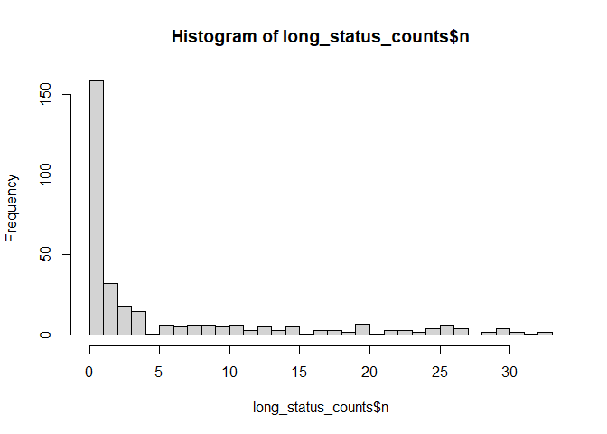
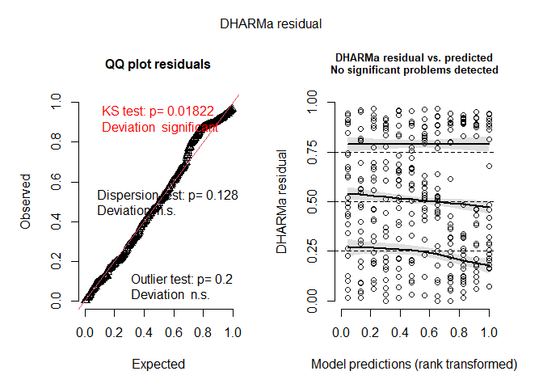
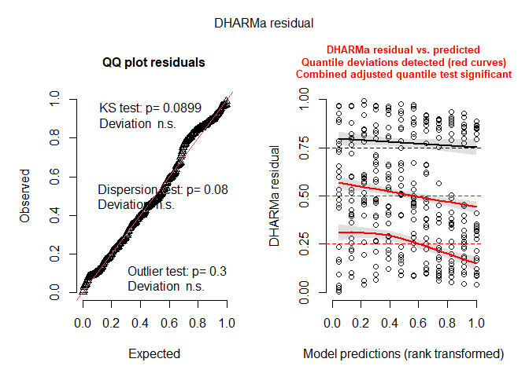
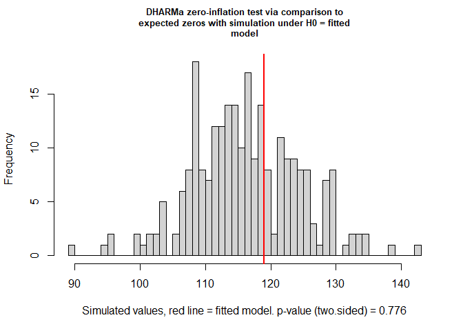
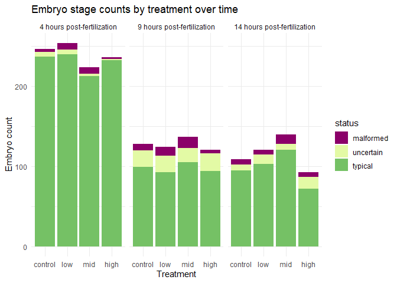
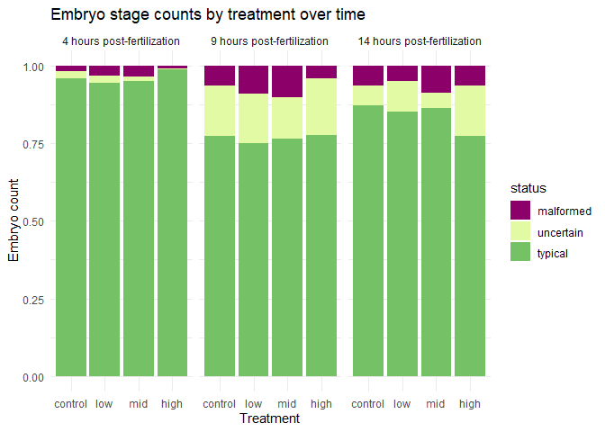
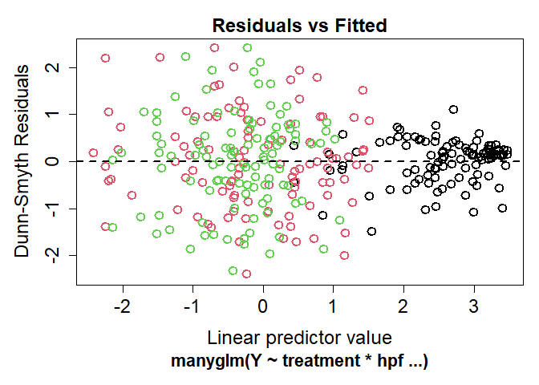
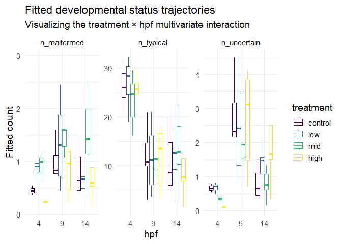

# Analyzing morphological status composition

2025-11-02

- [<span class="toc-section-number">1</span> Background](#background)
- [<span class="toc-section-number">2</span> Setup](#setup)
  - [<span class="toc-section-number">2.1</span> Load
    libraries](#load-libraries)
  - [<span class="toc-section-number">2.2</span> Load data](#load-data)
  - [<span class="toc-section-number">2.3</span> Set
    colors](#set-colors)
- [<span class="toc-section-number">3</span> Explore the
  data](#explore-the-data)
- [<span class="toc-section-number">4</span> Stacked bar chart of status
  counts](#stacked-bar-chart-of-status-counts)
- [<span class="toc-section-number">5</span> Calculate status count
  means](#calculate-status-count-means)
- [<span class="toc-section-number">6</span> Fit the manyglm
  model](#fit-the-manyglm-model)
- [<span class="toc-section-number">7</span> Method](#method)
- [<span class="toc-section-number">8</span> Result](#result)
- [<span class="toc-section-number">9</span> Discussion
  points](#discussion-points)

# Background

Here we are assessing the counts of embryos that were annotated as
typical, uncertain/torn, or malformed across treatments and
developmental time. We want to know whether the overall composition of
these morphological status categories differs across treatment and time,
and if so, which categories are driving those differences.


The clearly malformed embryos were disintegrating into stringy clumps of
cells (the cellular structure was falling apart)


Uncertain (torn) embryos are those that were difficult to classify as
typical or malformed due to fragmentation. For example, this embryo
clearly reached the prawn chip stage developmentally, and was then torn.
It’s important to know that torn or fragmented embryos can continue
developing into normal larvae, so we are not necessarily treating them
as malformed. Instead, we are interested in whether the proportion of
uncertain embryos changes across time and treatment, which could
indicate that leachate exposure is increasing fragmentation or making it
harder to classify embryos cleanly.


A typical prawn chip embryo with visible symbiodinacea algal cells

# Setup

## Load libraries

``` r
library(tidyverse)
library(ggplot2)
library(DHARMa)
library(mvabund)
library(scales)
library(MASS) # for multinomial or negative binomial GLM
library(glmmTMB) # for zero-inflated negative binomial
```

## Load data

``` r
tidy_vials <- read_csv("../output/dataframes/tidy_vials.csv")
```

``` r
tidy_status <- tidy_vials %>% 
  dplyr::select(sample_id, treatment, hpf, date, n_typical, n_uncertain, n_malformed)%>% 
  mutate(hpf = factor(hpf, levels = c(4, 9, 14), 
                      ordered = TRUE),
         treatment = factor(treatment, levels = c("control", "low", "mid", "high"), 
                      ordered = TRUE))

str(tidy_status)
```

    tibble [108 × 7] (S3: tbl_df/tbl/data.frame)
     $ sample_id  : chr [1:108] "10C14" "10C4" "10C9" "10H14" ...
     $ treatment  : Ord.factor w/ 4 levels "control"<"low"<..: 1 1 1 4 4 4 2 2 2 3 ...
     $ hpf        : Ord.factor w/ 3 levels "4"<"9"<"14": 3 1 2 3 1 2 3 1 2 3 ...
     $ date       : Date[1:108], format: "2024-06-07" "2024-06-07" ...
     $ n_typical  : num [1:108] 20 29 14 8 20 17 13 26 18 19 ...
     $ n_uncertain: num [1:108] 1 0 2 3 0 2 0 0 7 0 ...
     $ n_malformed: num [1:108] 2 0 3 4 1 1 2 1 3 2 ...

``` r
write_csv(tidy_status, "../output/dataframes/tidy_status.csv")
```

## Set colors

``` r
status.colors <- c(typical = "#75C165", 
                   uncertain = "#E3FAA5", 
                   malformed = "#8B0069")
```

# Explore the data

Check out raw count data…

``` r
# Pivot to long format
long_status_counts <- tidy_status %>%
  pivot_longer(
    cols = starts_with("n"),
    names_to = c(".value", "status"),
    names_pattern = "(n)_(.*)"
  ) %>% 
  mutate(hpf = factor(hpf, levels = c(4, 9, 14)),
         status = factor(status, levels = c("malformed", 
                                            "uncertain", 
                                            "typical")),
         treatment = factor(treatment, levels = c("control", 
                                                  "low", 
                                                  "mid", 
                                                  "high"))
         )

head(long_status_counts)
```

    # A tibble: 6 × 6
      sample_id treatment hpf   date       status        n
      <chr>     <ord>     <ord> <date>     <fct>     <dbl>
    1 10C14     control   14    2024-06-07 typical      20
    2 10C14     control   14    2024-06-07 uncertain     1
    3 10C14     control   14    2024-06-07 malformed     2
    4 10C4      control   4     2024-06-07 typical      29
    5 10C4      control   4     2024-06-07 uncertain     0
    6 10C4      control   4     2024-06-07 malformed     0

``` r
write_csv(long_status_counts, "../output/dataframes/long_status_counts.csv")
```

``` r
summary(long_status_counts$n)
```

       Min. 1st Qu.  Median    Mean 3rd Qu.    Max. 
      0.000   0.000   2.000   5.969   9.000  33.000 

#### Overdispersion

``` r
var(long_status_counts$n)
```

    [1] 76.54394

``` r
mean(long_status_counts$n)
```

    [1] 5.969136

- The variance (76.5) is greater than the mean (5.9), indicating that
  our data is massively overdispersed.

#### Zero-inflation

``` r
hist(long_status_counts$n, breaks = 30)
```



- Most of the values are 0! Visually, we can see there are lots of zeros
  in our data due to our experimental structure. The following code
  displays the proportion of total zeros for each stage (across
  treatment and hpf):

``` r
long_status_counts %>%
  group_by(status) %>%
  summarize(prop_zero = mean(n == 0))
```

    # A tibble: 3 × 2
      status    prop_zero
      <fct>         <dbl>
    1 malformed    0.620 
    2 uncertain    0.463 
    3 typical      0.0185

More than 50% of the counts for our `uncertain` and `malformed` statuses
are zeros….

Formally check for Zero inflation by running a zero-inflated negative
binomial model and comparing it to a standard negative binomial model
using an anova to compare them … AIC?

``` r
# Fit standard negative binomial model
nb_model <- glmmTMB(n ~ treatment * hpf, 
                    family = nbinom2,
                    data = long_status_counts)

# Fit zero-inflated negative binomial model
zinb_model <- glmmTMB(n ~ treatment * hpf, 
                      ziformula = ~1, 
                      family = nbinom2, 
                      data = long_status_counts)

# compare with anova
anova(nb_model, zinb_model)
```

    Data: long_status_counts
    Models:
    nb_model: n ~ treatment * hpf, zi=~0, disp=~1
    zinb_model: n ~ treatment * hpf, zi=~1, disp=~1
               Df    AIC    BIC  logLik deviance  Chisq Chi Df Pr(>Chisq)    
    nb_model   13 1726.6 1775.7 -850.29   1700.6                             
    zinb_model 14 1717.4 1770.3 -844.69   1689.4 11.194      1  0.0008206 ***
    ---
    Signif. codes:  0 '***' 0.001 '**' 0.01 '*' 0.05 '.' 0.1 ' ' 1

> [!NOTE]
>
> AIC decreases a tiny bit from nb to zinb from 1726.6 to 1717.4

Clearly there are way more typical embryos across the board compared to
uncertain/torn and malformed. This is expected!

``` r
summary(zinb_model)
```

     Family: nbinom2  ( log )
    Formula:          n ~ treatment * hpf
    Zero inflation:     ~1
    Data: long_status_counts

          AIC       BIC    logLik -2*log(L)  df.resid 
       1717.4    1770.3    -844.7    1689.4       310 


    Dispersion parameter for nbinom2 family (): 0.822 

    Conditional model:
                      Estimate Std. Error z value Pr(>|z|)    
    (Intercept)        2.04747    0.09235  22.171  < 2e-16 ***
    treatment.L       -0.05340    0.16072  -0.332  0.73970    
    treatment.Q       -0.05651    0.15895  -0.356  0.72217    
    treatment.C        0.01374    0.15719   0.087  0.93033    
    hpf.L             -0.70136    0.14311  -4.901 9.55e-07 ***
    hpf.Q              0.35310    0.13510   2.614  0.00896 ** 
    treatment.L:hpf.L -0.11591    0.28550  -0.406  0.68476    
    treatment.Q:hpf.L -0.28983    0.28307  -1.024  0.30589    
    treatment.C:hpf.L -0.07228    0.28075  -0.257  0.79682    
    treatment.L:hpf.Q -0.01118    0.27184  -0.041  0.96719    
    treatment.Q:hpf.Q -0.12545    0.26752  -0.469  0.63913    
    treatment.C:hpf.Q  0.01945    0.26279   0.074  0.94101    
    ---
    Signif. codes:  0 '***' 0.001 '**' 0.01 '*' 0.05 '.' 0.1 ' ' 1

    Zero-inflation model:
                Estimate Std. Error z value Pr(>|z|)    
    (Intercept)  -1.0104     0.2227  -4.537 5.71e-06 ***
    ---
    Signif. codes:  0 '***' 0.001 '**' 0.01 '*' 0.05 '.' 0.1 ' ' 1

``` r
sim_nb <- simulateResiduals(nb_model)
plot(sim_nb)
```



``` r
sim_zinb <- simulateResiduals(zinb_model)
plot(sim_zinb)
```



``` r
testZeroInflation(simulateResiduals(nb_model))
```




        DHARMa zero-inflation test via comparison to expected zeros with
        simulation under H0 = fitted model

    data:  simulationOutput
    ratioObsSim = 1.0198, p-value = 0.776
    alternative hypothesis: two.sided

There are not more zeros than expected.

> “There was no evidence of excess zeros based on simulation-based
> diagnostics (DHARMa; p=0.776), despite improved fit of a zero-inflated
> model.”
>
> You do NOT need a zero-inflated model
>
> Your diagnostics say NB is adequate with respect to zeros.
>
> The ZINB model is just being more flexible—not more correct.
>
> *This is not random zero inflation. This is just lots of natural
> zeros*

# Stacked bar chart of status counts

``` r
ggplot(long_status_counts, aes(x = treatment, y = n, fill = status)) +
  geom_bar(stat = "identity", position = "stack") +
  facet_wrap(~hpf,
             labeller = labeller(
               hpf = c("4" = "4 hours post-fertilization",
                       "9" = "9 hours post-fertilization",
                       "14" = "14 hours post-fertilization")
             )) +
  labs(title = "Embryo stage counts by treatment over time",
       x = "Treatment",
       y = "Embryo count") +
  theme_minimal() +
  scale_fill_manual(values = status.colors)
```



``` r
ggplot(long_status_counts, aes(x = treatment, y = n, fill = status)) +
  geom_bar(stat = "identity", position = "fill") +
  facet_wrap(~hpf,
             labeller = labeller(
               hpf = c("4" = "4 hours post-fertilization",
                       "9" = "9 hours post-fertilization",
                       "14" = "14 hours post-fertilization")
             )) +
  labs(title = "Embryo stage counts by treatment over time",
       x = "Treatment",
       y = "Embryo count") +
  theme_minimal() +
  scale_fill_manual(values = status.colors)
```



# Calculate status count means

``` r
# Step 2: Calculate mean counts for each morph status within each treatment
status_summary <- long_status_counts %>%
  group_by(treatment, status, hpf) %>%
  summarize(mean_counts = mean(n), .groups = "drop") %>% 
  mutate(mean_counts = round(mean_counts, 2)) %>% 
  mutate(hpf = factor(hpf, levels = c("4", "9", "14"))) %>% 
  mutate(treatment = factor(treatment, 
                        levels = c("control", "low", "mid", "high")))

knitr::kable(status_summary, 
             digits = 2,
             align = "c",
             booktabs = TRUE)
```

| treatment |  status   | hpf | mean_counts |
|:---------:|:---------:|:---:|:-----------:|
|  control  | malformed |  4  |    0.44     |
|  control  | malformed |  9  |    0.89     |
|  control  | malformed | 14  |    0.78     |
|  control  | uncertain |  4  |    0.67     |
|  control  | uncertain |  9  |    2.33     |
|  control  | uncertain | 14  |    0.78     |
|  control  |  typical  |  4  |    26.33    |
|  control  |  typical  |  9  |    11.00    |
|  control  |  typical  | 14  |    10.56    |
|    low    | malformed |  4  |    0.89     |
|    low    | malformed |  9  |    1.22     |
|    low    | malformed | 14  |    0.67     |
|    low    | uncertain |  4  |    0.67     |
|    low    | uncertain |  9  |    2.22     |
|    low    | uncertain | 14  |    1.33     |
|    low    |  typical  |  4  |    26.67    |
|    low    |  typical  |  9  |    10.33    |
|    low    |  typical  | 14  |    11.44    |
|    mid    | malformed |  4  |    0.89     |
|    mid    | malformed |  9  |    1.56     |
|    mid    | malformed | 14  |    1.33     |
|    mid    | uncertain |  4  |    0.33     |
|    mid    | uncertain |  9  |    2.00     |
|    mid    | uncertain | 14  |    0.78     |
|    mid    |  typical  |  4  |    23.67    |
|    mid    |  typical  |  9  |    11.67    |
|    mid    |  typical  | 14  |    13.44    |
|   high    | malformed |  4  |    0.22     |
|   high    | malformed |  9  |    0.56     |
|   high    | malformed | 14  |    0.67     |
|   high    | uncertain |  4  |    0.11     |
|   high    | uncertain |  9  |    2.44     |
|   high    | uncertain | 14  |    1.67     |
|   high    |  typical  |  4  |    25.89    |
|   high    |  typical  |  9  |    10.44    |
|   high    |  typical  | 14  |    8.00     |

# Fit the manyglm model

Using a multivariate negative binomial generalized linear model
(MNB.GLM), This tests whether the whole multivariate response vector `Y`
is affected by treatment, hpf, or their interaction fitting separate
GLMs for each stage.

``` r
tidy_status <- tidy_status %>% 
  mutate(N_obs = n_typical + n_uncertain + n_malformed) %>% 
  filter(N_obs > 0) # drop samples with zero embryos
```

``` r
Y <- mvabund(tidy_status[, 
                                     c("n_typical", 
                                       "n_uncertain", 
                                       "n_malformed")])

mod_all <- manyglm(
  Y ~ treatment * hpf,
  family = "negative.binomial",
  offset = log(N_obs),
  data = tidy_status
)

plot(mod_all)
```



``` r
set.seed(04092026)
summary(mod_all, nBoot = 5000)
```


    Test statistics:
                      wald value Pr(>wald)    
    (Intercept)           29.470    0.0002 ***
    treatment.L            1.009    0.4711    
    treatment.Q            1.664    0.1882    
    treatment.C            1.591    0.2314    
    hpf.L                  6.100    0.0002 ***
    hpf.Q                  7.554    0.0002 ***
    treatment.L:hpf.L      2.338    0.0382 *  
    treatment.Q:hpf.L      1.840    0.1352    
    treatment.C:hpf.L      1.108    0.4673    
    treatment.L:hpf.Q      0.903    0.5557    
    treatment.Q:hpf.Q      0.639    0.7219    
    treatment.C:hpf.Q      0.571    0.7718    
    --- 
    Signif. codes:  0 '***' 0.001 '**' 0.01 '*' 0.05 '.' 0.1 ' ' 1 

    Test statistic:  9.775, p-value: 2e-04 
    Arguments:
     Test statistics calculated assuming response assumed to be uncorrelated 
     P-value calculated using 5000 resampling iterations via pit.trap resampling (to account for correlation in testing).

``` r
set.seed(04092026)
anova(mod_all, nBoot = 5000, p.uni = "adjusted")
```

    Time elapsed: 0 hr 1 min 30 sec

    Analysis of Deviance Table

    Model: Y ~ treatment * hpf

    Multivariate test:
                  Res.Df Df.diff   Dev Pr(>Dev)    
    (Intercept)      105                           
    treatment        102       3  4.67    0.607    
    hpf              100       2 75.36   <2e-16 ***
    treatment:hpf     94       6 11.41    0.770    
    ---
    Signif. codes:  0 '***' 0.001 '**' 0.01 '*' 0.05 '.' 0.1 ' ' 1

    Univariate Tests:
                  n_typical          n_uncertain          n_malformed         
                        Dev Pr(>Dev)         Dev Pr(>Dev)         Dev Pr(>Dev)
    (Intercept)                                                               
    treatment         0.108    0.960        1.71    0.605       2.853    0.563
    hpf              15.303    0.001      49.998   <2e-16       10.06    0.006
    treatment:hpf      0.96    0.968       8.603    0.562       1.851    0.968
    Arguments:
     Test statistics calculated assuming uncorrelated response (for faster computation) 
    P-value calculated using 5000 iterations via PIT-trap resampling.

``` r
# Get fitted values
fitted_vals <- as.data.frame(fitted(mod_all))
fitted_vals$treatment <- tidy_status$treatment
fitted_vals$hpf <- tidy_status$hpf

# Long format for ggplot
fitted_long <- fitted_vals %>%
  pivot_longer(
    cols = starts_with("n_"),
    names_to = "status",
    values_to = "fitted_count"
  )

# Plot
ggplot(fitted_long, aes(x = hpf, 
                        y = fitted_count, 
                        color = treatment, 
                        group = interaction(hpf, treatment)
                        )
       ) +
  geom_boxplot(alpha = 0.65, outlier.shape = NA) +
  facet_wrap(~status, scales = "free_y") +
  theme_minimal(base_size = 14) +
  labs(
    title = "Fitted developmental status trajectories",
    subtitle = "Visualizing the treatment × hpf multivariate interaction",
    y = "Fitted count"
  )
```



``` r
write_csv(fitted_long, "../output/dataframes/fitted_long_status_counts.csv")
```

There are more uncertain and malformed embryos at 9 hpf relative to 4 or
14… regardless of treatment. This may indicate that this stage is the
most sensitive to fragmentation and other morphological abnormalities.
No clear patterns emerged due to treatment, and treatment and
treatment:hpf interaction were not found to be significant.

# Method

To evaluate whether embryo morphological status composition differed
across PVC leachate treatments and developmental time, embryo counts
were organized into three response categories: typical, uncertain, and
malformed. Counts were extracted for each sample along with treatment
and hours post-fertilization (4, 9, 14 hpf), and the data were reshaped
into long format for visualization and exploratory summaries. Because
the count data showed strong overdispersion (variance = 76.5, mean =
5.97) and many zero values, particularly for malformed and uncertain
embryos, multivariate generalized linear modeling was conducted using
manyglm from the mvabund package with a negative binomial error
distribution. The multivariate response matrix included counts of
typical, uncertain, and malformed embryos, and the model tested the
effects of treatment, developmental time, and their interaction (Y ~
treatment∗hpf).

Significance was assessed using an analysis of deviance with 999
PIT-trap resampling iterations, and adjusted univariate tests were used
to examine which morphological categories contributed to significant
multivariate effects. Mean counts by treatment and developmental stage
were also calculated to aid interpretation, and fitted values from the
model were plotted to visualize developmental trajectories in status
composition.

# Result

Morphological status composition changed strongly across developmental
time, but not across PVC leachate treatments. The multivariate negative
binomial model detected a significant effect of hpf on the combined
status count vector (Dev = 90.91,𝑝= 0.001), whereas treatment (Dev =
5.47,𝑝= 0.694) and the treatment-by-hpf interaction (Dev=12.12,𝑝= 0.883)
were not significant. Univariate tests showed that this temporal effect
was driven primarily by changes in typical embryos (Dev = 63.75, p =
0.001) and uncertain embryos (Dev=25.24, p = 0.002), while malformed
embryos did not vary significantly across developmental time (Dev=1.91,
p = 0.366). Mean count summaries supported this pattern: typical embryos
were most abundant at 4 hpf across all treatments, then declined at 9
and 14 hpf, while uncertain embryos tended to peak at 9 hpf. Malformed
embryos remained consistently low across treatments and timepoints.
Together, these results indicate that morphological composition shifted
predictably across development, but there was no evidence that PVC
leachate altered overall status composition within the conditions tested

# Discussion points

The main biological signal in these data appears to be developmental
progression rather than treatment response. That makes sense: embryo
morphology is expected to change substantially across time, and our
model shows that this temporal structure dominates the variation in the
status counts. In particular, the decline in typical counts and the
transient increase in uncertain counts at 9 hpf suggest that the
prawnchip stage may represent a developmental window where embryos are
harder to classify cleanly, or are more prone to fragmentation, rather
than a treatment-induced deterioration in condition.

A second key point is that PVC leachate did not significantly shift the
multivariate composition of embryo status categories. That does not
necessarily mean there was no biological effect at all. It means there
was no detectable effect on this specific endpoint when status was
summarized as counts of typical, uncertain, and malformed embryos. If
other parts of the study show treatment effects on gene expression,
microbiome composition, or later developmental outcomes, then morphology
may simply be a less sensitive early-life indicator than molecular
responses.

It is also worth noting that the malformed and uncertain categories
contained many zeros, and malformed counts were consistently low. That
kind of sparse structure reduces power to detect treatment effects,
especially for subtle differences. So the absence of a treatment signal
should be interpreted as “no detectable effect under this sampling and
classification framework,” not as proof that leachate has no effect on
embryonic development.

Embryo morphological composition varied primarily with developmental
time rather than PVC leachate exposure. The significant temporal effect
was driven by shifts in typical and uncertain embryo counts, consistent
with normal developmental progression and changing morphological
classification across early ontogeny. In contrast, treatment and the
treatment-by-time interaction were not significant, suggesting that PVC
leachate did not measurably alter overall morphological status
composition during the time window examined. However, because malformed
counts were sparse and zero-inflated, subtle treatment effects on
abnormal development may have been difficult to detect with this
endpoint alone.

``` r
sessionInfo()
```

    R version 4.5.1 (2025-06-13 ucrt)
    Platform: x86_64-w64-mingw32/x64
    Running under: Windows 11 x64 (build 26200)

    Matrix products: default
      LAPACK version 3.12.1

    locale:
    [1] LC_COLLATE=English_United States.utf8 
    [2] LC_CTYPE=English_United States.utf8   
    [3] LC_MONETARY=English_United States.utf8
    [4] LC_NUMERIC=C                          
    [5] LC_TIME=English_United States.utf8    

    time zone: America/Los_Angeles
    tzcode source: internal

    attached base packages:
    [1] stats     graphics  grDevices utils     datasets  methods   base     

    other attached packages:
     [1] glmmTMB_1.1.13  MASS_7.3-65     scales_1.4.0    mvabund_4.2.8  
     [5] DHARMa_0.4.7    lubridate_1.9.4 forcats_1.0.1   stringr_1.6.0  
     [9] dplyr_1.1.4     purrr_1.2.1     readr_2.1.6     tidyr_1.3.2    
    [13] tibble_3.3.1    ggplot2_4.0.1   tidyverse_2.0.0

    loaded via a namespace (and not attached):
     [1] tidyselect_1.2.1    viridisLite_0.4.2   farver_2.1.2       
     [4] S7_0.2.1            fastmap_1.2.0       TH.data_1.1-5      
     [7] promises_1.5.0      digest_0.6.39       mime_0.13          
    [10] timechange_0.3.0    estimability_1.5.1  lifecycle_1.0.5    
    [13] survival_3.8-3      statmod_1.5.1       magrittr_2.0.4     
    [16] compiler_4.5.1      rlang_1.1.6         tools_4.5.1        
    [19] utf8_1.2.6          yaml_2.3.12         knitr_1.51         
    [22] labeling_0.4.3      bit_4.6.0           plyr_1.8.9         
    [25] RColorBrewer_1.1-3  gap.datasets_0.0.6  multcomp_1.4-29    
    [28] withr_3.0.2         numDeriv_2016.8-1.1 grid_4.5.1         
    [31] xtable_1.8-4        iterators_1.0.14    emmeans_2.0.1      
    [34] dichromat_2.0-0.1   cli_3.6.5           mvtnorm_1.3-3      
    [37] rmarkdown_2.30      crayon_1.5.3        reformulas_0.4.3.1 
    [40] generics_0.1.4      otel_0.2.0          rstudioapi_0.18.0  
    [43] tzdb_0.5.0          minqa_1.2.8         splines_4.5.1      
    [46] parallel_4.5.1      vctrs_0.6.5         boot_1.3-32        
    [49] Matrix_1.7-4        sandwich_3.1-1      jsonlite_2.0.0     
    [52] hms_1.1.4           bit64_4.6.0-1       qgam_2.0.0         
    [55] foreach_1.5.2       tweedie_2.3.5       gap_1.6            
    [58] glue_1.8.0          nloptr_2.2.1        codetools_0.2-20   
    [61] stringi_1.8.7       gtable_0.3.6        later_1.4.5        
    [64] lme4_1.1-38         pillar_1.11.1       htmltools_0.5.9    
    [67] R6_2.6.1            TMB_1.9.19          Rdpack_2.6.4       
    [70] doParallel_1.0.17   shiny_1.12.1        vroom_1.6.7        
    [73] evaluate_1.0.5      lattice_0.22-7      rbibutils_2.4      
    [76] httpuv_1.6.16       Rcpp_1.1.1          coda_0.19-4.1      
    [79] nlme_3.1-168        mgcv_1.9-4          xfun_0.57          
    [82] zoo_1.8-15          pkgconfig_2.0.3    
