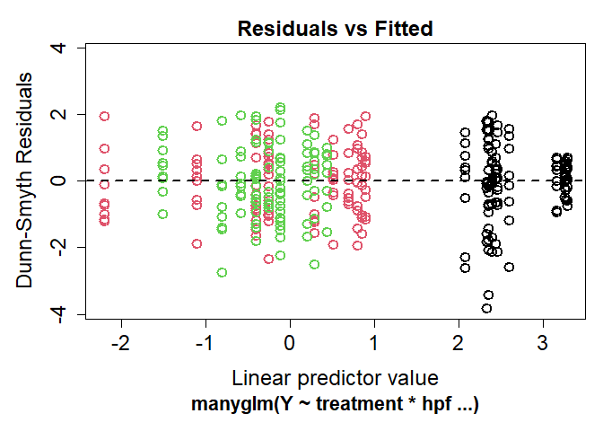
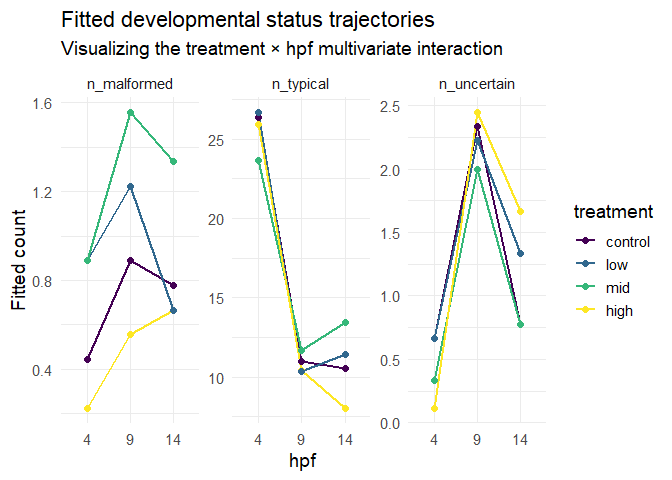
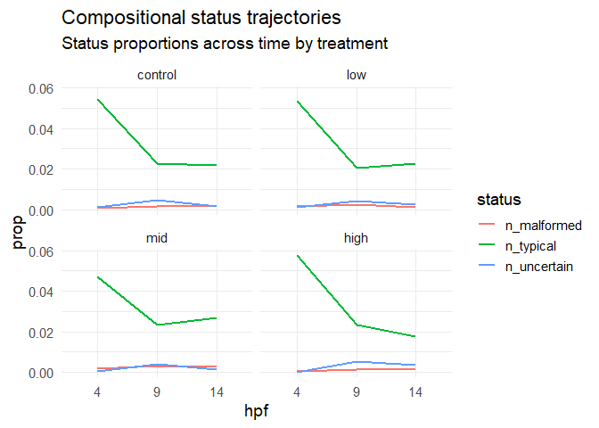

# Analyzing morphological status composition

2025-11-02

- [<span class="toc-section-number">1</span> Background](#background)
- [<span class="toc-section-number">2</span> Setup](#setup)
  - [<span class="toc-section-number">2.1</span> Install
    packages](#install-packages)
  - [<span class="toc-section-number">2.2</span> Load data](#load-data)
  - [<span class="toc-section-number">2.3</span> Set
    colors](#set-colors)
- [<span class="toc-section-number">3</span> Explore the
  data](#explore-the-data)
- [<span class="toc-section-number">4</span> Stacked bar chart of status
  counts](#stacked-bar-chart-of-status-counts)
- [<span class="toc-section-number">5</span> Calculate status count
  means](#calculate-status-count-means)
  - [<span class="toc-section-number">5.1</span> Table: Status
    composition means](#table-status-composition-means)
- [<span class="toc-section-number">6</span> MVABUD/
  MANYGLM](#mvabud-manyglm)
- [<span class="toc-section-number">7</span> Method](#method)
- [<span class="toc-section-number">8</span> Result](#result)
- [<span class="toc-section-number">9</span> Discussion
  points](#discussion-points)

# Background

# Setup

## Install packages

``` r
library(tidyverse)
library(ggplot2)
library(DHARMa)
library(mvabund)
library(scales)
```

## Load data

``` r
tidy_vials <- read_csv("../output/dataframes/tidy_vials.csv")
```

``` r
tidy_status <- tidy_vials %>% 
  dplyr::select(sample_id, treatment, hpf, date, n_typical, n_uncertain, n_malformed)%>% 
  mutate(hpf = factor(hpf, levels = c(4, 9, 14), 
                      ordered = TRUE),
         treatment = factor(treatment, levels = c("control", "low", "mid", "high"), 
                      ordered = TRUE))

str(tidy_status)
```

    tibble [108 × 7] (S3: tbl_df/tbl/data.frame)
     $ sample_id  : chr [1:108] "10C14" "10C4" "10C9" "10H14" ...
     $ treatment  : Ord.factor w/ 4 levels "control"<"low"<..: 1 1 1 4 4 4 2 2 2 3 ...
     $ hpf        : Ord.factor w/ 3 levels "4"<"9"<"14": 3 1 2 3 1 2 3 1 2 3 ...
     $ date       : Date[1:108], format: "2024-06-07" "2024-06-07" ...
     $ n_typical  : num [1:108] 20 29 14 8 20 17 13 26 18 19 ...
     $ n_uncertain: num [1:108] 1 0 2 3 0 2 0 0 7 0 ...
     $ n_malformed: num [1:108] 2 0 3 4 1 1 2 1 3 2 ...

``` r
write_csv(tidy_status, "../output/dataframes/tidy_status.csv")
```

## Set colors

``` r
status.colors <- c(typical = "#75C165", 
                   uncertain = "#E3FAA5", 
                   malformed = "#8B0069")
```

# Explore the data

Check out raw count data…

``` r
# Pivot to long format
long_status_counts <- tidy_status %>%
  pivot_longer(
    cols = starts_with("n"),
    names_to = c(".value", "status"),
    names_pattern = "(n)_(.*)"
  ) %>% 
  mutate(hpf = factor(hpf, levels = c(4, 9, 14), 
                      ordered = TRUE),
         status = factor(status, levels = c("malformed", "uncertain", "typical"), 
                      ordered = TRUE),
         treatment = factor(treatment, levels = c("control", "low", "mid", "high"), 
                      ordered = TRUE))

head(long_status_counts)
```

    # A tibble: 6 × 6
      sample_id treatment hpf   date       status        n
      <chr>     <ord>     <ord> <date>     <ord>     <dbl>
    1 10C14     control   14    2024-06-07 typical      20
    2 10C14     control   14    2024-06-07 uncertain     1
    3 10C14     control   14    2024-06-07 malformed     2
    4 10C4      control   4     2024-06-07 typical      29
    5 10C4      control   4     2024-06-07 uncertain     0
    6 10C4      control   4     2024-06-07 malformed     0

``` r
summary(long_status_counts$n)
```

       Min. 1st Qu.  Median    Mean 3rd Qu.    Max. 
      0.000   0.000   2.000   5.969   9.000  33.000 

#### Overdispersion

``` r
var(long_status_counts$n)
```

    [1] 76.54394

``` r
mean(long_status_counts$n)
```

    [1] 5.969136

- The variance (76.5) is greater than the mean (5.9), indicating that
  our data is massively overdispersed.

#### Zero-inflation

``` r
hist(long_status_counts$n, breaks = 30)
```


- Most of the values are 0! Visually, we can see there are lots of zeros
  in our data due to our experimental structure. The following code
  displays the proportion of total zeros for each stage (across
  treatment and hpf):

``` r
long_status_counts %>%
  group_by(status) %>%
  summarize(prop_zero = mean(n == 0))
```

    # A tibble: 3 × 2
      status    prop_zero
      <ord>         <dbl>
    1 malformed    0.620 
    2 uncertain    0.463 
    3 typical      0.0185

More than 50% of the counts for our `uncertain` and `malformed` statuses
are zeros…. Our data is zero-inflated in two out of the three statuses
we are testing.

# Stacked bar chart of status counts

``` r
ggplot(long_status_counts, aes(x = treatment, y = n, fill = status)) +
  geom_bar(stat = "identity", position = "stack") +
  facet_wrap(~hpf,
             labeller = labeller(
               hpf = c("4" = "4 hours post-fertilization",
                       "9" = "9 hours post-fertilization",
                       "14" = "14 hours post-fertilization")
             )) +
  labs(title = "Embryo stage counts by treatment over time",
       x = "Treatment",
       y = "Embryo count") +
  theme_minimal() +
  scale_fill_manual(values = status.colors)
```


# Calculate status count means

``` r
# Step 2: Calculate mean proportions for each stage within each treatment
status_summary <- long_status_counts %>%
  group_by(treatment, status, hpf) %>%
  summarize(mean_counts = mean(n), .groups = "drop") %>% 
  mutate(mean_counts = round(mean_counts, 2)) %>% 
  mutate(hpf = factor(hpf, levels = c("4", "9", "14"))) %>% 
  mutate(treatment = factor(treatment, 
                        levels = c("control", "low", "mid", "high")))

knitr::kable(status_summary, 
             digits = 2,
             align = "c",
             booktabs = TRUE)
```

| treatment |  status   | hpf | mean_counts |
|:---------:|:---------:|:---:|:-----------:|
|  control  | malformed |  4  |    0.44     |
|  control  | malformed |  9  |    0.89     |
|  control  | malformed | 14  |    0.78     |
|  control  | uncertain |  4  |    0.67     |
|  control  | uncertain |  9  |    2.33     |
|  control  | uncertain | 14  |    0.78     |
|  control  |  typical  |  4  |    26.33    |
|  control  |  typical  |  9  |    11.00    |
|  control  |  typical  | 14  |    10.56    |
|    low    | malformed |  4  |    0.89     |
|    low    | malformed |  9  |    1.22     |
|    low    | malformed | 14  |    0.67     |
|    low    | uncertain |  4  |    0.67     |
|    low    | uncertain |  9  |    2.22     |
|    low    | uncertain | 14  |    1.33     |
|    low    |  typical  |  4  |    26.67    |
|    low    |  typical  |  9  |    10.33    |
|    low    |  typical  | 14  |    11.44    |
|    mid    | malformed |  4  |    0.89     |
|    mid    | malformed |  9  |    1.56     |
|    mid    | malformed | 14  |    1.33     |
|    mid    | uncertain |  4  |    0.33     |
|    mid    | uncertain |  9  |    2.00     |
|    mid    | uncertain | 14  |    0.78     |
|    mid    |  typical  |  4  |    23.67    |
|    mid    |  typical  |  9  |    11.67    |
|    mid    |  typical  | 14  |    13.44    |
|   high    | malformed |  4  |    0.22     |
|   high    | malformed |  9  |    0.56     |
|   high    | malformed | 14  |    0.67     |
|   high    | uncertain |  4  |    0.11     |
|   high    | uncertain |  9  |    2.44     |
|   high    | uncertain | 14  |    1.67     |
|   high    |  typical  |  4  |    25.89    |
|   high    |  typical  |  9  |    10.44    |
|   high    |  typical  | 14  |    8.00     |

## Table: Status composition means

``` r
table_status <- status_summary %>%
  pivot_wider(
    names_from  = c(treatment, hpf),
    values_from = mean_counts,
    values_fill = 0,
    # column names like "4 hpf - control"
    names_glue  = "{hpf} hpf - {treatment}"
  ) %>%
  dplyr::select(status, 
                `4 hpf - control`, `4 hpf - low`, `4 hpf - mid`, `4 hpf - high`,
                `9 hpf - control`, `9 hpf - low`, `9 hpf - mid`, `9 hpf - high`,
                `14 hpf - control`, `14 hpf - low`, `14 hpf - mid`, `14 hpf - high`) %>%
  arrange(status) %>%
  # turn to % (numeric) for nice formatting
  mutate(across(-status, ~ round(.x, 1))) %>%
  rename(Status = status) 


knitr::kable(table_status, 
             align = "l",
             booktabs = TRUE)
```

| Status | 4 hpf - control | 4 hpf - low | 4 hpf - mid | 4 hpf - high | 9 hpf - control | 9 hpf - low | 9 hpf - mid | 9 hpf - high | 14 hpf - control | 14 hpf - low | 14 hpf - mid | 14 hpf - high |
|:---|:---|:---|:---|:---|:---|:---|:---|:---|:---|:---|:---|:---|
| malformed | 0.4 | 0.9 | 0.9 | 0.2 | 0.9 | 1.2 | 1.6 | 0.6 | 0.8 | 0.7 | 1.3 | 0.7 |
| uncertain | 0.7 | 0.7 | 0.3 | 0.1 | 2.3 | 2.2 | 2.0 | 2.4 | 0.8 | 1.3 | 0.8 | 1.7 |
| typical | 26.3 | 26.7 | 23.7 | 25.9 | 11.0 | 10.3 | 11.7 | 10.4 | 10.6 | 11.4 | 13.4 | 8.0 |

``` r
library(sjPlot)

sjPlot::tab_df(
  table_status,
  title         = "Mean status composition (counts of embryos) by treatment and developmental time (hpf)",
  show.rownames = FALSE,
  digits        = 1
)
```

|  |  |  |  |  |  |  |  |  |  |  |  |  |
|:--:|:--:|:--:|:--:|:--:|:--:|----|----|----|----|----|----|----|
| Status | X4.hpf...control | X4.hpf...low | X4.hpf...mid | X4.hpf...high | X9.hpf...control | X9.hpf...low | X9.hpf...mid | X9.hpf...high | X14.hpf...control | X14.hpf...low | X14.hpf...mid | X14.hpf...high |
| malformed | 0.4 | 0.9 | 0.9 | 0.2 | 0.9 | 1.2 | 1.6 | 0.6 | 0.8 | 0.7 | 1.3 | 0.7 |
| uncertain | 0.7 | 0.7 | 0.3 | 0.1 | 2.3 | 2.2 | 2.0 | 2.4 | 0.8 | 1.3 | 0.8 | 1.7 |
| typical | 26.3 | 26.7 | 23.7 | 25.9 | 11.0 | 10.3 | 11.7 | 10.4 | 10.6 | 11.4 | 13.4 | 8.0 |

Mean status composition (counts of embryos) by treatment and
developmental time (hpf)

``` r
library(stargazer)

stargazer::stargazer(
  table_status,
  type      = "html",  # or "latex" if knitting to PDF
  summary   = FALSE,
  rownames  = FALSE,
  digits    = 1,
  title     = "Mean status composition (counts of embryos) by treatment and developmental time (hpf)",
  out       = "../output/tables/table_status_counts.doc"  # optional
)
```


    <table style="text-align:center"><caption><strong>Mean status composition (counts of embryos) by treatment and developmental time (hpf)</strong></caption>
    <tr><td colspan="13" style="border-bottom: 1px solid black"></td></tr><tr><td style="text-align:left">Status</td><td>4 hpf - control</td><td>4 hpf - low</td><td>4 hpf - mid</td><td>4 hpf - high</td><td>9 hpf - control</td><td>9 hpf - low</td><td>9 hpf - mid</td><td>9 hpf - high</td><td>14 hpf - control</td><td>14 hpf - low</td><td>14 hpf - mid</td><td>14 hpf - high</td></tr>
    <tr><td colspan="13" style="border-bottom: 1px solid black"></td></tr><tr><td style="text-align:left">1</td><td>0.4</td><td>0.9</td><td>0.9</td><td>0.2</td><td>0.9</td><td>1.2</td><td>1.6</td><td>0.6</td><td>0.8</td><td>0.7</td><td>1.3</td><td>0.7</td></tr>
    <tr><td style="text-align:left">2</td><td>0.7</td><td>0.7</td><td>0.3</td><td>0.1</td><td>2.3</td><td>2.2</td><td>2</td><td>2.4</td><td>0.8</td><td>1.3</td><td>0.8</td><td>1.7</td></tr>
    <tr><td style="text-align:left">3</td><td>26.3</td><td>26.7</td><td>23.7</td><td>25.9</td><td>11</td><td>10.3</td><td>11.7</td><td>10.4</td><td>10.6</td><td>11.4</td><td>13.4</td><td>8</td></tr>
    <tr><td colspan="13" style="border-bottom: 1px solid black"></td></tr></table>

# MVABUD/ MANYGLM

This tests whether the whole multivariate response vector `Y` is
affected by treatment, hpf, or their interaction.

``` r
Y <- mvabund(tidy_status[, 
                                     c("n_typical", 
                                       "n_uncertain", 
                                       "n_malformed")])

mod_all <- manyglm(
  Y ~ treatment * hpf,
  family = "negative.binomial",
  data = tidy_status
)

anova(mod_all, p.uni = "adjusted")
```

    Time elapsed: 0 hr 0 min 15 sec

    Analysis of Deviance Table

    Model: Y ~ treatment * hpf

    Multivariate test:
                  Res.Df Df.diff   Dev Pr(>Dev)    
    (Intercept)      107                           
    treatment        104       3  5.47    0.701    
    hpf              102       2 90.91    0.001 ***
    treatment:hpf     96       6 12.12    0.886    
    ---
    Signif. codes:  0 '***' 0.001 '**' 0.01 '*' 0.05 '.' 0.1 ' ' 1

    Univariate Tests:
                  n_typical          n_uncertain          n_malformed         
                        Dev Pr(>Dev)         Dev Pr(>Dev)         Dev Pr(>Dev)
    (Intercept)                                                               
    treatment         0.372    0.949       0.858    0.949       4.238    0.470
    hpf              63.751    0.001      25.242    0.001       1.914    0.387
    treatment:hpf     4.689    0.870       6.143    0.854       1.292    0.982
    Arguments:
     Test statistics calculated assuming uncorrelated response (for faster computation) 
    P-value calculated using 999 iterations via PIT-trap resampling.

``` r
plot(mod_all)
```



``` r
# Get fitted values
fitted_vals <- as.data.frame(fitted(mod_all))
fitted_vals$treatment <- tidy_status$treatment
fitted_vals$hpf <- tidy_status$hpf

# Long format for ggplot
fitted_long <- fitted_vals %>%
  pivot_longer(
    cols = starts_with("n_"),
    names_to = "status",
    values_to = "fitted_count"
  )

# Plot
ggplot(fitted_long,
       aes(x = hpf, y = fitted_count, color = treatment, group = treatment)) +
  geom_line(linewidth = 1) +
  geom_point(size = 2) +
  facet_wrap(~ status, scales = "free_y") +
  theme_minimal(base_size = 14) +
  labs(
    title = "Fitted developmental status trajectories",
    subtitle = "Visualizing the treatment × hpf multivariate interaction",
    y = "Fitted count"
  )
```



There are more uncertain and malformed embryos in the prawnchip stage
relative to other stages, regardless of treatment. This may indicate
that this stage is the most sensitive to fragmentation and other
morphological abnormalities. No clear patterns emerged due to treatment,
and treatment and treatment:hpf interaction were not found to be
significant.

``` r
fitted_prop <- fitted_long %>%
  group_by(treatment) %>%
  mutate(total = sum(fitted_count),
         prop = fitted_count / total)

ggplot(fitted_prop,
       aes(x = hpf, y = prop, color = status)) +
  geom_line(aes(group = status), linewidth = 1) +
  facet_wrap(~ treatment) +
  theme_minimal(base_size = 14) +
  labs(
    title = "Compositional status trajectories",
    subtitle = "Status proportions across time by treatment"
  )
```



# Method

To evaluate whether embryo morphological status composition differed
across PVC leachate treatments and developmental time, embryo counts
were organized into three response categories: typical, uncertain, and
malformed. Counts were extracted for each sample along with treatment
and hours post-fertilization (4, 9, 14 hpf), and the data were reshaped
into long format for visualization and exploratory summaries. Because
the count data showed strong overdispersion (variance = 76.5, mean =
5.97) and many zero values, particularly for malformed and uncertain
embryos, multivariate generalized linear modeling was conducted using
manyglm from the mvabund package with a negative binomial error
distribution. The multivariate response matrix included counts of
typical, uncertain, and malformed embryos, and the model tested the
effects of treatment, developmental time, and their interaction (Y ~
treatment∗hpf).

Significance was assessed using an analysis of deviance with 999
PIT-trap resampling iterations, and adjusted univariate tests were used
to examine which morphological categories contributed to significant
multivariate effects. Mean counts by treatment and developmental stage
were also calculated to aid interpretation, and fitted values from the
model were plotted to visualize developmental trajectories in status
composition.

# Result

Morphological status composition changed strongly across developmental
time, but not across PVC leachate treatments. The multivariate negative
binomial model detected a significant effect of hpf on the combined
status count vector (Dev = 90.91,𝑝= 0.001), whereas treatment (Dev =
5.47,𝑝= 0.694) and the treatment-by-hpf interaction (Dev=12.12,𝑝= 0.883)
were not significant. Univariate tests showed that this temporal effect
was driven primarily by changes in typical embryos (Dev = 63.75, p =
0.001) and uncertain embryos (Dev=25.24, p = 0.002), while malformed
embryos did not vary significantly across developmental time (Dev=1.91,
p = 0.366). Mean count summaries supported this pattern: typical embryos
were most abundant at 4 hpf across all treatments, then declined at 9
and 14 hpf, while uncertain embryos tended to peak at 9 hpf. Malformed
embryos remained consistently low across treatments and timepoints.
Together, these results indicate that morphological composition shifted
predictably across development, but there was no evidence that PVC
leachate altered overall status composition within the conditions tested

# Discussion points

The main biological signal in these data appears to be developmental
progression rather than treatment response. That makes sense: embryo
morphology is expected to change substantially across time, and our
model shows that this temporal structure dominates the variation in the
status counts. In particular, the decline in typical counts and the
transient increase in uncertain counts at 9 hpf suggest that the
prawnchip stage may represent a developmental window where embryos are
harder to classify cleanly, or are more prone to fragmentation, rather
than a treatment-induced deterioration in condition.

A second key point is that PVC leachate did not significantly shift the
multivariate composition of embryo status categories. That does not
necessarily mean there was no biological effect at all. It means there
was no detectable effect on this specific endpoint when status was
summarized as counts of typical, uncertain, and malformed embryos. If
other parts of the study show treatment effects on gene expression,
microbiome composition, or later developmental outcomes, then morphology
may simply be a less sensitive early-life indicator than molecular
responses.

It is also worth noting that the malformed and uncertain categories
contained many zeros, and malformed counts were consistently low. That
kind of sparse structure reduces power to detect treatment effects,
especially for subtle differences. So the absence of a treatment signal
should be interpreted as “no detectable effect under this sampling and
classification framework,” not as proof that leachate has no effect on
embryonic development.

Embryo morphological composition varied primarily with developmental
time rather than PVC leachate exposure. The significant temporal effect
was driven by shifts in typical and uncertain embryo counts, consistent
with normal developmental progression and changing morphological
classification across early ontogeny. In contrast, treatment and the
treatment-by-time interaction were not significant, suggesting that PVC
leachate did not measurably alter overall morphological status
composition during the time window examined. However, because malformed
counts were sparse and zero-inflated, subtle treatment effects on
abnormal development may have been difficult to detect with this
endpoint alone.

``` r
sessionInfo()
```

    R version 4.5.1 (2025-06-13 ucrt)
    Platform: x86_64-w64-mingw32/x64
    Running under: Windows 11 x64 (build 26200)

    Matrix products: default
      LAPACK version 3.12.1

    locale:
    [1] LC_COLLATE=English_United States.utf8 
    [2] LC_CTYPE=English_United States.utf8   
    [3] LC_MONETARY=English_United States.utf8
    [4] LC_NUMERIC=C                          
    [5] LC_TIME=English_United States.utf8    

    time zone: America/Los_Angeles
    tzcode source: internal

    attached base packages:
    [1] stats     graphics  grDevices utils     datasets  methods   base     

    other attached packages:
     [1] stargazer_5.2.3 sjPlot_2.9.0    scales_1.4.0    mvabund_4.2.8  
     [5] DHARMa_0.4.7    lubridate_1.9.4 forcats_1.0.1   stringr_1.6.0  
     [9] dplyr_1.1.4     purrr_1.2.1     readr_2.1.6     tidyr_1.3.2    
    [13] tibble_3.3.1    ggplot2_4.0.1   tidyverse_2.0.0

    loaded via a namespace (and not attached):
     [1] gtable_0.3.6       xfun_0.54          insight_1.4.4      lattice_0.22-7    
     [5] tzdb_0.5.0         vctrs_0.6.5        tools_4.5.1        Rdpack_2.6.4      
     [9] generics_0.1.4     parallel_4.5.1     pkgconfig_2.0.3    Matrix_1.7-4      
    [13] RColorBrewer_1.1-3 S7_0.2.1           lifecycle_1.0.5    compiler_4.5.1    
    [17] farver_2.1.2       sjmisc_2.8.11      statmod_1.5.1      htmltools_0.5.9   
    [21] yaml_2.3.12        pillar_1.11.1      nloptr_2.2.1       crayon_1.5.3      
    [25] MASS_7.3-65        reformulas_0.4.3.1 boot_1.3-32        nlme_3.1-168      
    [29] sjlabelled_1.2.0   tidyselect_1.2.1   digest_0.6.39      stringi_1.8.7     
    [33] labeling_0.4.3     splines_4.5.1      fastmap_1.2.0      grid_4.5.1        
    [37] cli_3.6.5          magrittr_2.0.4     dichromat_2.0-0.1  utf8_1.2.6        
    [41] withr_3.0.2        bit64_4.6.0-1      tweedie_2.3.5      timechange_0.3.0  
    [45] rmarkdown_2.30     bit_4.6.0          otel_0.2.0         lme4_1.1-38       
    [49] hms_1.1.4          evaluate_1.0.5     knitr_1.51         rbibutils_2.4     
    [53] viridisLite_0.4.2  mgcv_1.9-4         rlang_1.1.6        Rcpp_1.1.1        
    [57] glue_1.8.0         rstudioapi_0.18.0  vroom_1.6.7        minqa_1.2.8       
    [61] jsonlite_2.0.0     R6_2.6.1          
