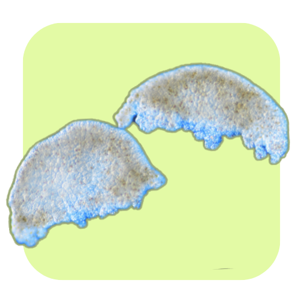

```{r setup, include=FALSE}
knitr::opts_chunk$set(
  echo = TRUE, # Display code chunks
  eval = TRUE, # Evaluate code chunks
  warning = FALSE, # Hide warnings
  message = FALSE, # Hide messages
  comment = "" # Prevents appending '##' to beginning of lines in code output)
 )        
```

# Background

Here we are assessing the counts of embryos that were annotated as typical, uncertain/torn, or malformed across treatments and developmental time. We want to know whether the overall composition of these morphological status categories differs across treatment and time, and if so, which categories are driving those differences.

uncertain/torn embryos are those that were difficult to classify as typical or malformed due to fragmentation. It's important to know tat torn or fragmented embryos can continue developing into normal larvae, so we are not necessarily treating them as malformed. Instead, we are interested in whether the proportion of uncertain embryos changes across time and treatment, which could indicate that leachate exposure is increasing fragmentation or making it harder to classify embryos cleanly.

{fig-alt="a malformed embryo kind of looks like strung out lumpy playdough"}

{fig-alt="a torn embryo looks like pita bread broken in half, communion style"}

{fig-alt="A typical embryo in the between prawn chip and early gastrula phase, like a pancake"}

# Setup

## Load libraries

```{r load-libraries}
library(tidyverse)
library(ggplot2)
library(DHARMa)
library(mvabund)
library(scales)
library(MASS) # for multinomial or negative binomial GLM
library(glmmTMB) # for zero-inflated negative binomial
```

## Load data

```{r load-tidy}
tidy_vials <- read_csv("../output/dataframes/tidy_vials.csv")
```

```{r mutate-factors}
tidy_status <- tidy_vials %>% 
  dplyr::select(sample_id, treatment, hpf, date, n_typical, n_uncertain, n_malformed)%>% 
  mutate(hpf = factor(hpf, levels = c(4, 9, 14), 
                      ordered = TRUE),
         treatment = factor(treatment, levels = c("control", "low", "mid", "high"), 
                      ordered = TRUE))

str(tidy_status)
```

```{r write-tidy eval=FALSE}
write_csv(tidy_status, "../output/dataframes/tidy_status.csv")
```

## Set colors

```{r set-colors}
status.colors <- c(typical = "#75C165", 
                   uncertain = "#E3FAA5", 
                   malformed = "#8B0069")
```

# Explore the data

Check out raw count data...

```{r pivot-long}
# Pivot to long format
long_status_counts <- tidy_status %>%
  pivot_longer(
    cols = starts_with("n"),
    names_to = c(".value", "status"),
    names_pattern = "(n)_(.*)"
  ) %>% 
  mutate(hpf = factor(hpf, levels = c(4, 9, 14)),
         status = factor(status, levels = c("malformed", 
                                            "uncertain", 
                                            "typical")),
         treatment = factor(treatment, levels = c("control", 
                                                  "low", 
                                                  "mid", 
                                                  "high"))
         )

head(long_status_counts)
```

```{r write-long, eval=FALSE}
write_csv(long_status_counts, "../output/dataframes/long_status_counts.csv")
```

```{r summary-long}
summary(long_status_counts$n)
```

#### Overdispersion

```{r overdispersion}
var(long_status_counts$n)
mean(long_status_counts$n)
```

-   The variance (76.5) is greater than the mean (5.9), indicating that our data is massively overdispersed.

#### Zero-inflation

```{r hist-zi}
hist(long_status_counts$n, breaks = 30)
```

-   Most of the values are 0! Visually, we can see there are lots of zeros in our data due to our experimental structure. The following code displays the proportion of total zeros for each stage (across treatment and hpf):

```{r zero-summary}
long_status_counts %>%
  group_by(status) %>%
  summarize(prop_zero = mean(n == 0))
```

More than 50% of the counts for our `uncertain` and `malformed` statuses are zeros....

Formally check for Zero inflation by running a zero-inflated negative binomial model and comparing it to a standard negative binomial model using an anova to compare them ... AIC?

```{r nb-vs-zinb}
# Fit standard negative binomial model
nb_model <- glmmTMB(n ~ treatment * hpf, 
                    family = nbinom2,
                    data = long_status_counts)

# Fit zero-inflated negative binomial model
zinb_model <- glmmTMB(n ~ treatment * hpf, 
                      ziformula = ~1, 
                      family = nbinom2, 
                      data = long_status_counts)

# compare with anova
anova(nb_model, zinb_model)
```

::: callout-note
AIC decreases a tiny bit from nb to zinb from 1726.6 to 1717.4
:::

Clearly there are way more typical embryos across the board compared to uncertain/torn and malformed. This is expected!

```{r summary-zinb}
summary(zinb_model)
```

```{r residuals-nb}
sim_nb <- simulateResiduals(nb_model)
plot(sim_nb)
```

```{r residuals-zinb}
sim_zinb <- simulateResiduals(zinb_model)
plot(sim_zinb)
```

```{r test-zero-inflation}
testZeroInflation(simulateResiduals(nb_model))
```

There are not more zeros than expected.

> “There was no evidence of excess zeros based on simulation-based diagnostics (DHARMa; p=0.776), despite improved fit of a zero-inflated model.”
>
> You do NOT need a zero-inflated model
>
> Your diagnostics say NB is adequate with respect to zeros.
>
> The ZINB model is just being more flexible—not more correct.
>
> *This is not random zero inflation. This is just lots of natural zeros*

# Stacked bar chart of status counts

```{r plot-counts-stacked}
ggplot(long_status_counts, aes(x = treatment, y = n, fill = status)) +
  geom_bar(stat = "identity", position = "stack") +
  facet_wrap(~hpf,
             labeller = labeller(
               hpf = c("4" = "4 hours post-fertilization",
                       "9" = "9 hours post-fertilization",
                       "14" = "14 hours post-fertilization")
             )) +
  labs(title = "Embryo stage counts by treatment over time",
       x = "Treatment",
       y = "Embryo count") +
  theme_minimal() +
  scale_fill_manual(values = status.colors)
```

# Calculate status count means

```{r}
# Step 2: Calculate mean counts for each morph status within each treatment
status_summary <- long_status_counts %>%
  group_by(treatment, status, hpf) %>%
  summarize(mean_counts = mean(n), .groups = "drop") %>% 
  mutate(mean_counts = round(mean_counts, 2)) %>% 
  mutate(hpf = factor(hpf, levels = c("4", "9", "14"))) %>% 
  mutate(treatment = factor(treatment, 
                        levels = c("control", "low", "mid", "high")))

knitr::kable(status_summary, 
             digits = 2,
             align = "c",
             booktabs = TRUE)
```

# Fit the manyglm model

Using a multivariate negative binomial generalized linear model (MNB.GLM), This tests whether the whole multivariate response vector `Y` is affected by treatment, hpf, or their interaction fitting separate GLMs for each stage.

```{r N_obs}
tidy_status <- tidy_status %>% 
  mutate(N_obs = n_typical + n_uncertain + n_malformed) %>% 
  filter(N_obs > 0) # drop samples with zero embryos
```

```{r}
Y <- mvabund(tidy_status[, 
                                     c("n_typical", 
                                       "n_uncertain", 
                                       "n_malformed")])

mod_all <- manyglm(
  Y ~ treatment * hpf,
  family = "negative.binomial",
  offset = log(N_obs),
  data = tidy_status
)

plot(mod_all)
```

```{r summary-mod}
set.seed(04092026)
summary(mod_all, nBoot = 5000)
```

```{r anova-mod}
set.seed(04092026)
anova(mod_all, nBoot = 5000, p.uni = "adjusted")
```

```{r}
# Get fitted values
fitted_vals <- as.data.frame(fitted(mod_all))
fitted_vals$treatment <- tidy_status$treatment
fitted_vals$hpf <- tidy_status$hpf

# Long format for ggplot
fitted_long <- fitted_vals %>%
  pivot_longer(
    cols = starts_with("n_"),
    names_to = "status",
    values_to = "fitted_count"
  )

# Plot
ggplot(fitted_long, aes(x = hpf, 
                        y = fitted_count, 
                        color = treatment, 
                        group = interaction(hpf, treatment)
                        )
       ) +
  geom_boxplot(alpha = 0.65, outlier.shape = NA) +
  facet_wrap(~status, scales = "free_y") +
  theme_minimal(base_size = 14) +
  labs(
    title = "Fitted developmental status trajectories",
    subtitle = "Visualizing the treatment × hpf multivariate interaction",
    y = "Fitted count"
  )
```

```{r}
write_csv(fitted_long, "../output/dataframes/fitted_long_status_counts.csv")
```

There are more uncertain and malformed embryos at 9 hpf relative to 4 or 14... regardless of treatment. This may indicate that this stage is the most sensitive to fragmentation and other morphological abnormalities. No clear patterns emerged due to treatment, and treatment and treatment:hpf interaction were not found to be significant.

# Method

To evaluate whether embryo morphological status composition differed across PVC leachate treatments and developmental time, embryo counts were organized into three response categories: typical, uncertain, and malformed. Counts were extracted for each sample along with treatment and hours post-fertilization (4, 9, 14 hpf), and the data were reshaped into long format for visualization and exploratory summaries. Because the count data showed strong overdispersion (variance = 76.5, mean = 5.97) and many zero values, particularly for malformed and uncertain embryos, multivariate generalized linear modeling was conducted using manyglm from the mvabund package with a negative binomial error distribution. The multivariate response matrix included counts of typical, uncertain, and malformed embryos, and the model tested the effects of treatment, developmental time, and their interaction (Y \~ treatment∗hpf).

Significance was assessed using an analysis of deviance with 999 PIT-trap resampling iterations, and adjusted univariate tests were used to examine which morphological categories contributed to significant multivariate effects. Mean counts by treatment and developmental stage were also calculated to aid interpretation, and fitted values from the model were plotted to visualize developmental trajectories in status composition.

# Result

Morphological status composition changed strongly across developmental time, but not across PVC leachate treatments. The multivariate negative binomial model detected a significant effect of hpf on the combined status count vector (Dev = 90.91,𝑝= 0.001), whereas treatment (Dev = 5.47,𝑝= 0.694) and the treatment-by-hpf interaction (Dev=12.12,𝑝= 0.883) were not significant. Univariate tests showed that this temporal effect was driven primarily by changes in typical embryos (Dev = 63.75, p = 0.001) and uncertain embryos (Dev=25.24, p = 0.002), while malformed embryos did not vary significantly across developmental time (Dev=1.91, p = 0.366). Mean count summaries supported this pattern: typical embryos were most abundant at 4 hpf across all treatments, then declined at 9 and 14 hpf, while uncertain embryos tended to peak at 9 hpf. Malformed embryos remained consistently low across treatments and timepoints. Together, these results indicate that morphological composition shifted predictably across development, but there was no evidence that PVC leachate altered overall status composition within the conditions tested

# Discussion points

The main biological signal in these data appears to be developmental progression rather than treatment response. That makes sense: embryo morphology is expected to change substantially across time, and our model shows that this temporal structure dominates the variation in the status counts. In particular, the decline in typical counts and the transient increase in uncertain counts at 9 hpf suggest that the prawnchip stage may represent a developmental window where embryos are harder to classify cleanly, or are more prone to fragmentation, rather than a treatment-induced deterioration in condition.

A second key point is that PVC leachate did not significantly shift the multivariate composition of embryo status categories. That does not necessarily mean there was no biological effect at all. It means there was no detectable effect on this specific endpoint when status was summarized as counts of typical, uncertain, and malformed embryos. If other parts of the study show treatment effects on gene expression, microbiome composition, or later developmental outcomes, then morphology may simply be a less sensitive early-life indicator than molecular responses.

It is also worth noting that the malformed and uncertain categories contained many zeros, and malformed counts were consistently low. That kind of sparse structure reduces power to detect treatment effects, especially for subtle differences. So the absence of a treatment signal should be interpreted as “no detectable effect under this sampling and classification framework,” not as proof that leachate has no effect on embryonic development.

Embryo morphological composition varied primarily with developmental time rather than PVC leachate exposure. The significant temporal effect was driven by shifts in typical and uncertain embryo counts, consistent with normal developmental progression and changing morphological classification across early ontogeny. In contrast, treatment and the treatment-by-time interaction were not significant, suggesting that PVC leachate did not measurably alter overall morphological status composition during the time window examined. However, because malformed counts were sparse and zero-inflated, subtle treatment effects on abnormal development may have been difficult to detect with this endpoint alone.

```{r}
sessionInfo()
```
