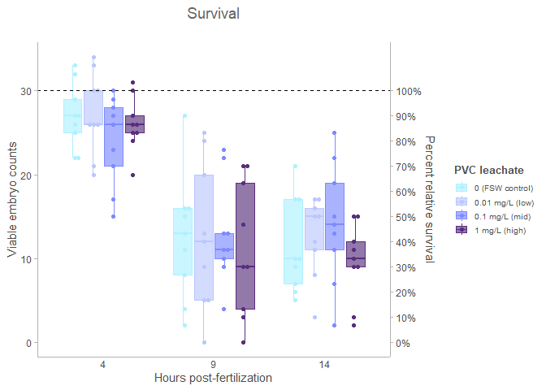
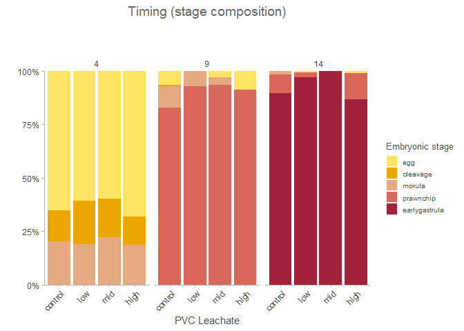
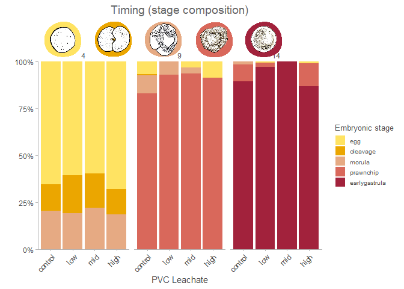
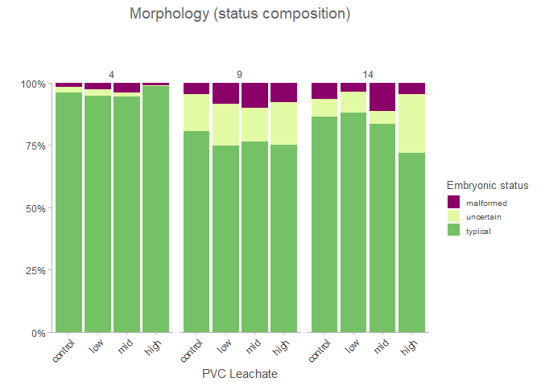
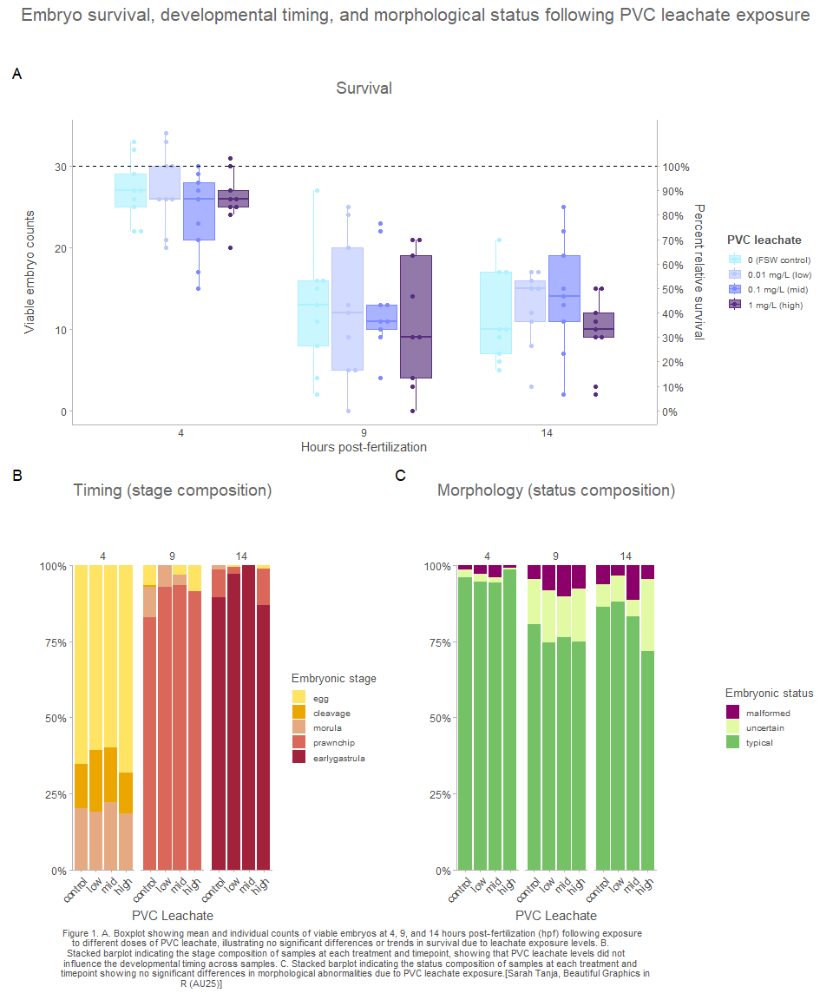
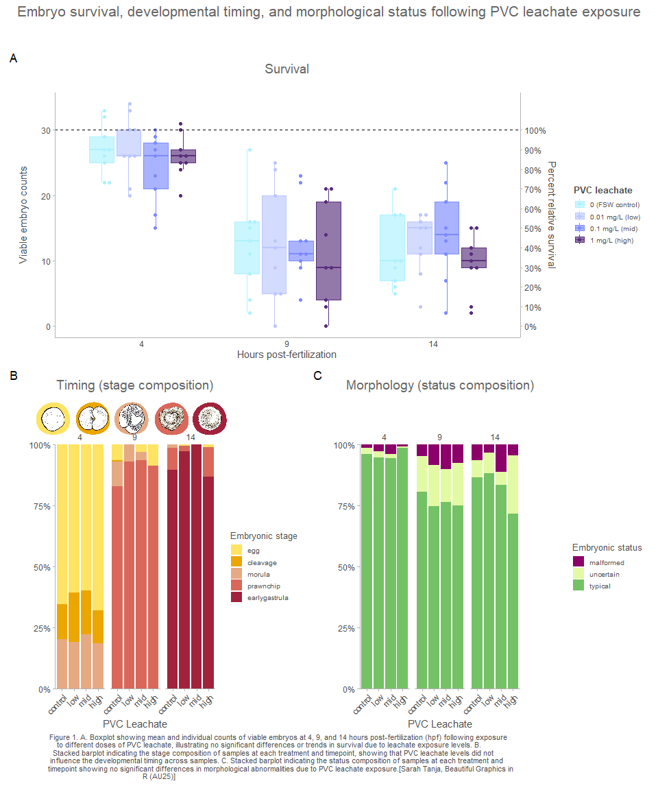

Final patched figure: Embryo survival, timing, and morphology
================
11/24/25

- <a href="#load-libraries" id="toc-load-libraries"><span
  class="toc-section-number">1</span> Load libraries</a>
- <a href="#load-in-data" id="toc-load-in-data"><span
  class="toc-section-number">2</span> Load in data</a>
  - <a href="#data-prep" id="toc-data-prep"><span
    class="toc-section-number">2.1</span> Data prep</a>
  - <a href="#custom-ggplot-theme" id="toc-custom-ggplot-theme"><span
    class="toc-section-number">2.2</span> Custom ggplot theme</a>
  - <a href="#set-colors" id="toc-set-colors"><span
    class="toc-section-number">2.3</span> Set colors</a>
    - <a href="#leachate" id="toc-leachate"><span
      class="toc-section-number">2.3.1</span> Leachate</a>
    - <a href="#stage" id="toc-stage"><span
      class="toc-section-number">2.3.2</span> Stage</a>
    - <a href="#spawn-night" id="toc-spawn-night"><span
      class="toc-section-number">2.3.3</span> Spawn night</a>
    - <a href="#status" id="toc-status"><span
      class="toc-section-number">2.3.4</span> Status</a>
- <a href="#survival-boxplot" id="toc-survival-boxplot"><span
  class="toc-section-number">3</span> Survival boxplot</a>
- <a href="#timing-barplot" id="toc-timing-barplot"><span
  class="toc-section-number">4</span> Timing barplot</a>
- <a href="#stacked-barplot" id="toc-stacked-barplot"><span
  class="toc-section-number">5</span> Stacked barplot</a>
  - <a href="#add-pretty-stage-icons" id="toc-add-pretty-stage-icons"><span
    class="toc-section-number">5.1</span> Add pretty stage icons</a>
- <a href="#abnormalities-barplot" id="toc-abnormalities-barplot"><span
  class="toc-section-number">6</span> Abnormalities barplot</a>
- <a href="#patchwork" id="toc-patchwork"><span
  class="toc-section-number">7</span> Patchwork</a>
  - <a href="#add-caption" id="toc-add-caption"><span
    class="toc-section-number">7.1</span> Add caption</a>
  - <a href="#patch-it-together" id="toc-patch-it-together"><span
    class="toc-section-number">7.2</span> Patch it together</a>
  - <a href="#add-pretty-embryo-icons-with-ggdraw"
    id="toc-add-pretty-embryo-icons-with-ggdraw"><span
    class="toc-section-number">7.3</span> Add pretty embryo icons with
    <code>ggdraw()</code></a>
- <a href="#save-figure" id="toc-save-figure"><span
  class="toc-section-number">8</span> Save figure</a>

# Load libraries

``` r
library(tidyverse)
library(ggplot2)
library(colorspace)
library(ggbeeswarm)
library(ggrepel)
library(scales)
library(ggtext)
library(ggsidekick)
library(patchwork)
library(cowplot) # for draw_image
```

# Load in data

``` r
tidy_vials <- read.csv("../output/tidy_vials.csv")
prop_summary <- read.csv("../output/prop_summary.csv")
status_summary <- read.csv("../output/status_summary.csv")
```

## Data prep

Set factor levels for treatment and hpf

``` r
treat_levels <- c("control", "low", "mid", "high")
hpf_levels   <- c(4, 9, 14)          # use numeric to match numeric hpf
map_leachate <- c(control = 0, low = 0.01, mid = 0.1, high = 1)

survival_df <- tidy_vials %>%
  mutate(
    # ordered factors
    treatment  = factor(treatment, levels = treat_levels, ordered = TRUE),
    hpf_factor = factor(hpf, levels = hpf_levels, ordered = TRUE),

    # numeric concentration mapped from treatment (safe + explicit)
    leachate_mgL = unname(map_leachate[as.character(treatment)])
  ) %>%
  dplyr::select(sample_id, treatment, hpf, hpf_factor, leachate_mgL, n_viable)

str(survival_df)
```

    'data.frame':   108 obs. of  6 variables:
     $ sample_id   : chr  "10C14" "10C4" "10C9" "10H14" ...
     $ treatment   : Ord.factor w/ 4 levels "control"<"low"<..: 1 1 1 4 4 4 2 2 2 3 ...
     $ hpf         : int  14 4 9 14 4 9 14 4 9 14 ...
     $ hpf_factor  : Ord.factor w/ 3 levels "4"<"9"<"14": 3 1 2 3 1 2 3 1 2 3 ...
     $ leachate_mgL: num  0 0 0 1 1 1 0.01 0.01 0.01 0.1 ...
     $ n_viable    : int  21 29 16 11 20 19 12 26 25 19 ...

## Custom ggplot theme

``` r
theme_sleek_axe <- function() {
  theme_sleek() +
    theme(
      panel.border = element_blank(),
      axis.line.x  = element_line(color = "grey70"),
      axis.line.y  = element_line(color = "grey70"),
      plot.title = element_text(
      size  = 14,
      color = "grey40",
      hjust = 0.5,    # center
      margin = margin(b = 20) # add space BELOW title
      ),      ,       
      plot.subtitle = element_text(
      size   = 10,       # smaller than title
      colour = "grey60", # lighter grey
      hjust  = 0.5 ),      # center
      margin = margin(b = 40) # add space BELOW title
      )
}
```

## Set colors

``` r
#colorspace::hclwizard()
```

### Leachate

Leachate options Ocean environmental watery tones blue-purple

``` r
leachate_0 <- c("#B0F4FA", "#75C165", "#A96C00", "#8B0069")
leachate_1 <- c("#D5ECC0", "#6ACFBA", "#399AC2", "#80146E")
leachate_2 <- c("#E4EBD6", "#8CC4AD", "#3E909F", "#4E4E7A")
leachate_3 <- c("#DAE6FF", "#BBC7FF", "#9CA9FF", "#7D8BFF")

leachate.colors <- c(control = "#AEF1FF", 
                low = "#BBC7FF",
                mid = "#7D8BFF", 
                high = "#592F7D")
```

### Stage

Earthy stony coral tones yellow-orange-red

``` r
stage_0 <- c("#DCC14F", "#D89500", "#C86600")
stage_1 <- c("#DCC14F", "#9F3D2F", "#000000")
stage_2 <- c("#A2223C", "#E6AA83",  "#D9685B")
stage_3 <- c("#D9685B", "#D89500",  "#9F3D2F")
stage_4 <- c("#FFE362", "#EBA600", "#8D5300")

stage.5.colors <- c(egg = "#FFE362",
                    cleavage = "#EBA600", 
                    morula = "#E6AA83",
                    prawnchip = "#D9685B", 
                    earlygastrula = "#A2223C")
```

### Spawn night

``` r
night_0 <- c("#FDE725", "#440154", "#21918C")
night_1 <- c("#FFCEF4", "#578B21", "#201158")
night_2 <- c("#E3FAA5", "#B16776", "#1E2440")

night.colors <- c(July_6th = "#E3FAA5", 
                  July_7th = "#578B21", 
                  July_8th = "#1E2440")
```

### Status

``` r
status.colors <- c(typical = "#75C165", 
                   uncertain = "#E3FAA5", 
                   malformed = "#8B0069")
```

# Survival boxplot

``` r
# labels for legend
labs_map <- c(control = "0 (FSW control)", low = "0.01 mg/L (low)",
              mid = "0.1 mg/L (mid)", high = "1 mg/L (high)")

survival <- ggplot(survival_df, aes(x = hpf_factor, y = n_viable, color = treatment, fill = treatment)) +
  geom_boxplot(alpha = 0.65, outlier.shape = NA) +
  geom_beeswarm(aes(group = interaction(hpf_factor, treatment)),
                dodge.width = 0.7, priority = "density", cex = 1.2) +
  scale_fill_manual(
    name   = "PVC leachate",
    values = leachate.colors,
    breaks = names(labs_map),
    labels = labs_map
  ) +
  scale_color_manual(
    name   = "PVC leachate",
    values = leachate.colors,
    breaks = names(labs_map),
    labels = labs_map
  ) +
  labs(
    x = "Hours post-fertilization", y = "Viable embryo counts",
    title = "Survival"
  ) +
  geom_hline(yintercept = 30, linetype = "dashed") +
  scale_y_continuous(
    limits = c(0, 34), breaks = c(0, 10, 20, 30),
    sec.axis = sec_axis(~ . / 30 * 100, name = "Percent relative survival",
                        breaks = seq(0, 100, 10),
                        labels = scales::label_number(accuracy = 1, suffix = "%"))
  ) +
  theme_sleek_axe() +
  theme(
    axis.ticks.x = element_blank(),
    panel.grid.minor = element_blank(),
    panel.grid.major = element_blank(),
    #legend.position = "top",
    legend.title = element_text(face = "bold"),
    legend.title.position = "top",
    plot.title = element_text(size = 14)
  )

survival
```



``` r
ggsave("../figs/embryo_survival_box.png", width = 8, height = 6, dpi = 600)
```

# Timing barplot

# Stacked barplot

``` r
prop_summary <- prop_summary %>% 
  mutate(
    treatment = factor(treatment, levels = treat_levels, ordered = TRUE),
    stage     = factor(stage, levels = c("egg", "cleavage", "morula", "prawnchip", "earlygastrula"), ordered = TRUE),
    hpf       = factor(hpf, levels = hpf_levels, ordered = TRUE)
  )
```

``` r
# Step 3: Plot
tick_map <- c(control = "control", low = "low",
              mid = "mid", high = "high")

timing <- prop_summary %>% 
ggplot(., aes(x = treatment, y = mean_prop*100, fill = stage)) +
  geom_bar(stat = "identity") +
  scale_fill_manual(values = stage.5.colors) +
  ggtitle("Timing (stage composition)")+
  labs(y = "", x = "PVC Leachate", fill = "Embryonic stage") +
  scale_x_discrete(
    breaks = names(tick_map),  # control, low, mid, high
    labels = tick_map          # pretty labels you defined
  )+
  scale_y_continuous(
    expand = c(0, 0),   # << bars start flush at y = 0
    labels = scales::label_number(accuracy = 1, suffix = "%")  
    )+
  facet_wrap(~ hpf)+
  theme_sleek_axe()+
  theme(
    plot.title = element_text(margin = margin(b = 40)),
    axis.text.x = element_text(angle = 45, hjust = 1, vjust = 1)
  )

timing
```



## Add pretty stage icons

``` r
timing_pretty <- ggdraw() +
  draw_plot(timing, 0, 0, 1, 1) +   # base plot fills the whole panel
  draw_image('svg/egg.png',         x = 0.08,  y = 0.79, width = 0.15, height = 0.15) +
  draw_image('svg/cleavage.png',    x = 0.205, y = 0.79, width = 0.15, height = 0.15) +
  draw_image('svg/morula.png',      x = 0.33,  y = 0.79, width = 0.15, height = 0.15) +
  draw_image('svg/prawnchip.png',   x = 0.455, y = 0.79, width = 0.15, height = 0.15) +
  draw_image('svg/earlygastrula.png',
                                   x = 0.58,  y = 0.79, width = 0.15, height = 0.15)
timing_pretty
```



``` r
ggsave("../figs/embryo_stage_stackedbar.png", width = 8, height = 6, dpi = 600)
```

# Abnormalities barplot

``` r
status_summary <- status_summary %>%
  mutate(status = factor(status, levels = c("malformed", "uncertain", "typical"), 
                       ordered = TRUE),
         treatment = factor(treatment, levels = treat_levels, ordered = TRUE),
         hpf       = factor(hpf, levels = hpf_levels, ordered = TRUE))

abnormality <- ggplot(status_summary, aes(x = treatment, y = mean_prop*100, fill = status))+
  geom_bar(stat = "identity")+
  scale_fill_manual(values = status.colors)+
  ggtitle("Morphology (status composition)")+
  labs(y = "", x = "PVC Leachate", fill = "Embryonic status")+
  scale_x_discrete(
    labels = tick_map          # pretty labels you defined
  )+
  scale_y_continuous(
    expand = c(0, 0),   # << bars start flush at y = 0
    labels = scales::label_number(accuracy = 1, suffix = "%")
  )+
  facet_wrap(~ hpf)+
  theme_sleek_axe()+
  theme(
    plot.title = element_text(margin = margin(b = 40)),
      axis.text.x = element_text(
      angle = 45,      # rotate 45°
      hjust = 1,       # horizontal justification
      vjust = 1        # tweak if you want
    ))

abnormality
```



``` r
ggsave("../figs/embryo_status_stackedbar.png", width = 8, height = 6, dpi = 600)
```

# Patchwork

## Add caption

``` r
cap_text <- paste(
  "Figure 1. A. Boxplot showing mean and individual counts of viable embryos at 4, 9, and 14 hours post-fertilization (hpf) following exposure to different doses of PVC leachate, illustrating no significant differences or trends in survival due to leachate exposure levels. B. Stacked barplot indicating the stage composition of samples at each treatment and timepoint, showing that PVC leachate levels did not influence the developmental timing across samples. C. Stacked barplot indicating the status composition of samples at each treatment and timepoint showing no significant differences in morphological abnormalities due to PVC leachate exposure."
)

# wrap to, say, 100 characters per line (tweak as needed)
cap_wrapped <- str_wrap(cap_text, width = 140)
```

## Patch it together

``` r
patch <- survival / (timing | abnormality)+
  plot_annotation(
    title = "Embryo survival, developmental timing, and morphological status following PVC leachate exposure",
    tag_levels = "A",
    caption = cap_wrapped,
    theme = theme_sleek_axe() &
      theme(
        plot.tag = element_text(size = 10, 
                                colour = "grey50"),
        plot.caption = element_text(size   = 8,
                                colour = "grey30",
                                hjust  = 0.22,
                                margin = margin(t = 0, r = 0, b = 5, l = 0)),
        plot.title = element_text(
          size   = 16,
          color  = "grey40",
          hjust  = 0.5,    # center
          margin = margin(b = 30) # add space BELOW title
        )
      )
  )

patch
```



## Add pretty embryo icons with `ggdraw()`

Add in embryos on top of the patchwork figure with ggdraw and
draw_image. Do this step last! When I tried to ggdraw on the Timing
subplot and then patch it together the aspect ration got very wonky.
Once you ggdraw a plot it becomes a raster image and patchwork can’t
handle that well. Definately add the fiddly little ggdraw icons at the
end!

``` r
patch_pretty <- ggdraw() +
  draw_plot(patch, 0, 0, 1, 1) +   # base plot fills the whole panel
  draw_image('svg/egg.png',         x = 0.05,  y = 0.44, width = 0.06, height = 0.06) +
  draw_image('svg/cleavage.png',    x = 0.11, y = 0.44, width = 0.06, height = 0.06) +
  draw_image('svg/morula.png',      x = 0.17,  y = 0.44, width = 0.06, height = 0.06) +
  draw_image('svg/prawnchip.png',   x = 0.23, y = 0.44, width = 0.06, height = 0.06) +
  draw_image('svg/earlygastrula.png', x = 0.29,  y = 0.44, width = 0.06, height = 0.06)

patch_pretty
```



# Save figure

``` r
ggsave("../figs/figure_survival_timing_morphology.png", width = 10, height = 12, dpi = 600)
```
