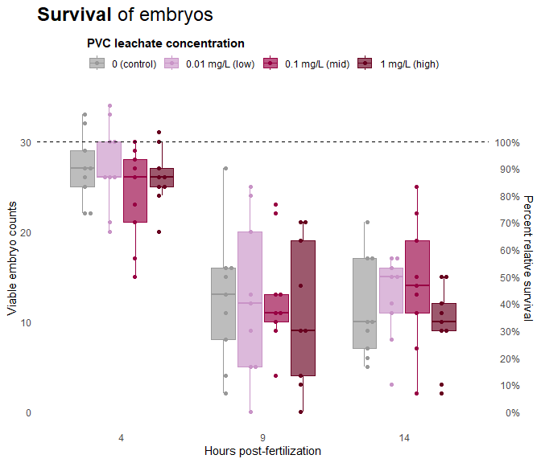
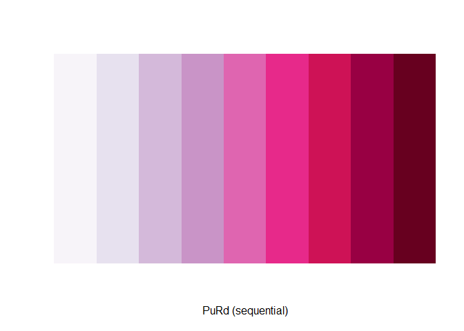
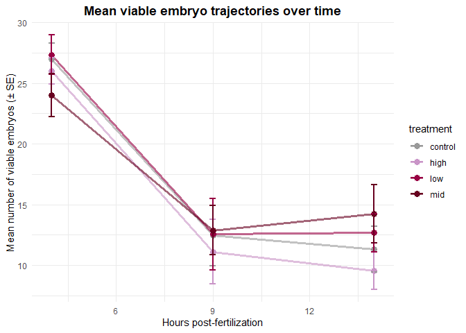
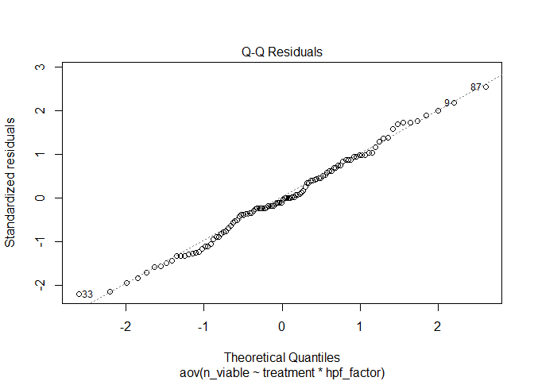
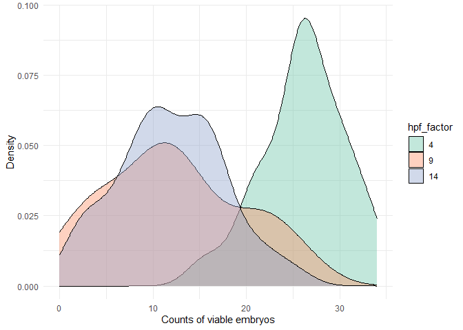

# Survival rates

2025-08-27

- [<span class="toc-section-number">1</span> Load
  libraries](#load-libraries)
- [<span class="toc-section-number">2</span> Load in
  data](#load-in-data)
  - [<span class="toc-section-number">2.1</span> Data prep](#data-prep)
- [<span class="toc-section-number">3</span> Visualize](#visualize)
  - [<span class="toc-section-number">3.1</span> Boxplot](#boxplot)
  - [<span class="toc-section-number">3.2</span> Line plot](#line-plot)
  - [<span class="toc-section-number">3.3</span> Relative
    survival](#relative-survival)
- [<span class="toc-section-number">4</span> Survival rates & embryo
  counts](#survival-rates--embryo-counts)
  - [<span class="toc-section-number">4.1</span> Table 1. Survival rates
    & counts](#table-1-survival-rates--counts)
- [<span class="toc-section-number">5</span> Two-way
  ANOVA](#two-way-anova)
  - [<span class="toc-section-number">5.1</span> Table 2. Two-way ANOVA
    results](#table-2-two-way-anova-results)
  - [<span class="toc-section-number">5.2</span> Normality](#normality)
    - [<span class="toc-section-number">5.2.1</span> Q-Q
      plot](#q-q-plot)
    - [<span class="toc-section-number">5.2.2</span> Shapiro-Wilk
      test](#shapiro-wilk-test)
  - [<span class="toc-section-number">5.3</span> Equal
    variance](#equal-variance)
    - [<span class="toc-section-number">5.3.1</span> Inspect
      outliers](#inspect-outliers)
    - [<span class="toc-section-number">5.3.2</span> Levene’s
      test](#levenes-test)
- [<span class="toc-section-number">6</span> emmeans](#emmeans)
  - [<span class="toc-section-number">6.1</span> Table 3. emmeans
    results](#table-3-emmeans-results)
- [<span class="toc-section-number">7</span> Summary](#summary)

# Load libraries

``` r
library(tidyverse)
library(emmeans)
library(ggplot2)
library(RColorBrewer)
library(viridis)
library(colorblindr)
library(colorspace)
library(ggbeeswarm)
library(ggrepel)
library(scales)
library(ggtext)
library(sjPlot)
library(stargazer)
library(broom)
library(dplyr)
```

# Load in data

``` r
tidy_vials <- read.csv("../output/tidy_vials.csv")
```

## Data prep

Set factor levels for treatment and hpf

``` r
treat_levels <- c("control", "low", "mid", "high")
hpf_levels   <- c(4, 9, 14)          # use numeric to match numeric hpf
map_leachate <- c(control = 0, low = 0.01, mid = 0.1, high = 1)

survival <- tidy_vials %>%
  mutate(
    # ordered factors
    treatment  = factor(treatment, levels = treat_levels, ordered = TRUE),
    hpf_factor = factor(hpf, levels = hpf_levels, ordered = TRUE),

    # numeric concentration mapped from treatment (safe + explicit)
    leachate_mgL = unname(map_leachate[as.character(treatment)])
  ) %>%
  dplyr::select(sample_id, treatment, hpf, hpf_factor, leachate_mgL, n_viable)

str(survival)
```

    'data.frame':   108 obs. of  6 variables:
     $ sample_id   : chr  "10C14" "10C4" "10C9" "10H14" ...
     $ treatment   : Ord.factor w/ 4 levels "control"<"low"<..: 1 1 1 4 4 4 2 2 2 3 ...
     $ hpf         : int  14 4 9 14 4 9 14 4 9 14 ...
     $ hpf_factor  : Ord.factor w/ 3 levels "4"<"9"<"14": 3 1 2 3 1 2 3 1 2 3 ...
     $ leachate_mgL: num  0 0 0 1 1 1 0.01 0.01 0.01 0.1 ...
     $ n_viable    : int  21 29 16 11 20 19 12 26 25 19 ...

# Visualize

## Boxplot

``` r
# labels for legend
labs_map <- c(control = "0 (control)", low = "0.01 mg/L (low)",
              mid = "0.1 mg/L (mid)", high = "1 mg/L (high)")

box <- ggplot(survival, aes(x = hpf_factor, y = n_viable, color = treatment, fill = treatment)) +
  geom_boxplot(alpha = 0.65, outlier.shape = NA) +
  geom_beeswarm(aes(group = interaction(hpf_factor, treatment)),
                dodge.width = 0.7, priority = "density", cex = 1.2) +
  scale_fill_manual(
    name   = "PVC leachate concentration",
    values = leachate_colors,
    breaks = names(labs_map),
    labels = labs_map
  ) +
  scale_color_manual(
    name   = "PVC leachate concentration",
    values = leachate_colors,
    breaks = names(labs_map),
    labels = labs_map
  ) +
  labs(
    x = "Hours post-fertilization", y = "Viable embryo counts",
    title = "**Survival** of embryos"
  ) +
  geom_hline(yintercept = 30, linetype = "dashed") +
  scale_y_continuous(
    limits = c(0, 34), breaks = c(0, 10, 20, 30),
    sec.axis = sec_axis(~ . / 30 * 100, name = "Percent relative survival",
                        breaks = seq(0, 100, 10),
                        labels = scales::label_number(accuracy = 1, suffix = "%"))
  ) +
  theme_minimal() +
  theme(
    axis.ticks.x = element_blank(),
    panel.grid.minor = element_blank(),
    panel.grid.major = element_blank(),
    legend.position = "top",
    legend.title = element_text(face = "bold"),
    legend.title.position = "top",
    plot.title = element_markdown(size = 18, face = "plain")
  )

box
```



Colorblind..

``` r
cvd_grid(box)
```



``` r
ggsave("../plots/viablecounts_survival_boxplot.png", width = 8, height = 6, dpi = 600)
```

## Line plot

``` r
mean_trajectories <- tidy_vials %>%
  group_by(treatment, hpf_factor) %>%
  summarise(
    mean_viable = mean(n_viable, na.rm = TRUE),
    se_viable = sd(n_viable, na.rm = TRUE) / sqrt(n()),
    .groups = "drop"
  )

line <- ggplot(mean_trajectories, aes(x = hpf_factor, y = mean_viable, 
                               color = treatment, group = treatment)) +
  geom_line(linewidth = 1.2, alpha = 0.6) +
  geom_point(size = 3) +
  geom_errorbar(aes(ymin = mean_viable - se_viable, 
                    ymax = mean_viable + se_viable),
                width = 0.2, linewidth = 0.8) +
  scale_color_manual(values = leachate_colors) +
  labs(
    title = "Mean viable embryo trajectories over time",
    x = "Hours post-fertilization",
    y = "Mean number of viable embryos (± SE)"
  ) +
  theme_minimal() +
  theme(
    legend.position = "right",
    plot.title = element_text(hjust = 0.5, face = "bold")
  )

line
```


Colorblind…

``` r
cvd_grid(line)
```


## Relative survival

- **Cross-sectional design**:  
  At each timepoint (4, 9, 14 hpf) you *sample a different subset* of
  embryos — i.e., you don’t track the same individuals over time. You
  have **counts of viable (surviving) embryos** per treatment ×
  timepoint combination. So, at each timepoint, you can measure
  *proportion surviving* relative to the **starting number of embryos**

Calculate the proportionate change from one time point to the next:

Relative survival to time hpf4 = (mean embryo count at hpf4)/(mean
\_eggs_per_vial) Relative survival to time hpf9 = (mean embryo count at
hpf9)/(mean \_eggs_per_vial). Relative survival to time hpf14 = (mean
embryo count at hpf14)/(mean \_eggs_per_vial).

We take our theoretical ‘starting point’ from the knowledge that a *M.
cap* bundle has 15+/- 5.1 eggs. In each vial we placed 2 bundles.

``` r
set.seed(123)  # for reproducibility

# Simulate eggs per bundle: 2 bundles per vial, 120 vials
n_vials <- 120
n_bundles <- 2 * n_vials

# Simulate egg counts per bundle
eggs_per_bundle <- rnorm(n_bundles, mean = 15, sd = 5.1)

# Optional: enforce only positive egg counts (truncated normal)
eggs_per_bundle <- pmax(round(eggs_per_bundle), 1)

# Group into vials: every two bundles go into one vial
eggs_per_vial <- rowSums(matrix(eggs_per_bundle, ncol = 2, byrow = TRUE))

# Summarize
mean_eggs_per_vial <- mean(eggs_per_vial)
sd_eggs_per_vial <- sd(eggs_per_vial)

# Output
mean_eggs_per_vial
```

    [1] 30

``` r
sd_eggs_per_vial
```

    [1] 6.446939

> [!NOTE]
>
> Here we use mean total embryos = 30, SD = 6.4 as a starting point, our
> 100%, that we used to compare all our counts to for relative survival

``` r
survival <- survival %>%
  mutate(relative_survival = n_viable / 30)

survival_summary <- survival %>%
  group_by(treatment, hpf) %>%
  summarise(
    mean_survival_rate = mean(relative_survival, na.rm = TRUE),
    sd_survival_rate   = sd(relative_survival, na.rm = TRUE),
    n             = n(),
    se_survival_rate   = sd_survival_rate / sqrt(n)  # optional: standard error
  )

survival_summary
```

    # A tibble: 12 × 6
    # Groups:   treatment [4]
       treatment   hpf mean_survival_rate sd_survival_rate     n se_survival_rate
       <ord>     <int>              <dbl>            <dbl> <int>            <dbl>
     1 control       4              0.9              0.129     9           0.0430
     2 control       9              0.415            0.249     9           0.0830
     3 control      14              0.378            0.188     9           0.0626
     4 low           4              0.911            0.162     9           0.0541
     5 low           9              0.419            0.295     9           0.0983
     6 low          14              0.422            0.157     9           0.0524
     7 mid           4              0.8              0.179     9           0.0596
     8 mid           9              0.430            0.202     9           0.0675
     9 mid          14              0.474            0.240     9           0.0799
    10 high          4              0.867            0.108     9           0.0360
    11 high          9              0.370            0.267     9           0.0891
    12 high         14              0.319            0.153     9           0.0510

``` r
ggplot(survival_summary, aes(x = hpf, y = mean_survival_rate, color = treatment, group = treatment)) +
  geom_line(linewidth = 1) +
  geom_point(size = 3) +
  geom_errorbar(aes(ymin = mean_survival_rate - se_survival_rate,
                    ymax = mean_survival_rate + se_survival_rate),
                width = 0.3) +
  scale_y_continuous(labels = scales::percent_format(accuracy = 1)) +
  labs(
    x = "Hours post-fertilization (hpf)",
    y = "Mean relative survival (±SE)",
    color = "Treatment",
    title = "Cumulative relative survival by treatment and time"
  ) +
  theme_minimal()
```



# Survival rates & embryo counts

``` r
# Calculate mean and SD for each hpf group
summary_data <- survival %>%
  group_by(hpf, treatment) %>%
  summarise(
    mean_embryo = mean(n_viable),
    sd_embryo = sd(n_viable),
    .groups = "drop"
  )

summary_data
```

    # A tibble: 12 × 4
         hpf treatment mean_embryo sd_embryo
       <int> <ord>           <dbl>     <dbl>
     1     4 control         27         3.87
     2     4 low             27.3       4.87
     3     4 mid             24         5.36
     4     4 high            26         3.24
     5     9 control         12.4       7.47
     6     9 low             12.6       8.85
     7     9 mid             12.9       6.07
     8     9 high            11.1       8.02
     9    14 control         11.3       5.63
    10    14 low             12.7       4.72
    11    14 mid             14.2       7.19
    12    14 high             9.56      4.59

``` r
survival_summary
```

    # A tibble: 12 × 6
    # Groups:   treatment [4]
       treatment   hpf mean_survival_rate sd_survival_rate     n se_survival_rate
       <ord>     <int>              <dbl>            <dbl> <int>            <dbl>
     1 control       4              0.9              0.129     9           0.0430
     2 control       9              0.415            0.249     9           0.0830
     3 control      14              0.378            0.188     9           0.0626
     4 low           4              0.911            0.162     9           0.0541
     5 low           9              0.419            0.295     9           0.0983
     6 low          14              0.422            0.157     9           0.0524
     7 mid           4              0.8              0.179     9           0.0596
     8 mid           9              0.430            0.202     9           0.0675
     9 mid          14              0.474            0.240     9           0.0799
    10 high          4              0.867            0.108     9           0.0360
    11 high          9              0.370            0.267     9           0.0891
    12 high         14              0.319            0.153     9           0.0510

## Table 1. Survival rates & counts

``` r
survival_data_summary <- survival_summary %>%
  left_join(summary_data) %>% 
  dplyr::select(hpf, treatment, mean_survival_rate, sd_survival_rate, mean_embryo, sd_embryo)

table_wide <- survival_data_summary %>%
  mutate(
    across(
      c(mean_embryo, sd_embryo),
      ~ round(.x, 1)
    )
  ) %>% 
  mutate(
    # keep factor for ordering
    hpf = factor(hpf, levels = c(4, 9, 14)),
    # create a LABEL column that is NOT a factor code
    hpf_label = paste0(as.character(hpf), " hpf"),
    treatment  = factor(treatment, levels = c("control", "low", "mid", "high")),
    cell = sprintf(
      "%.1f%% (%.1f ± %.1f)",
      mean_survival_rate * 100,
      mean_embryo,
      sd_embryo
    )
  ) %>%
  select(hpf, hpf_label, treatment, cell) %>%
  pivot_wider(
    names_from  = treatment,
    values_from = cell
  ) %>%
  arrange(hpf)
  

# Rename and drop numeric hpf column
table_wide_print <- table_wide %>%
  rename(
    `Hours post-fertilization` = hpf_label,  # character, not factor codes
    `Control (FSW)`           = control,
    `Low (0.01 mg/L)`         = low,
    `Mid (0.1 mg/L)`          = mid,
    `High (1 mg/L)`           = high
  ) %>% 
  dplyr::select(
    `Hours post-fertilization`,
    `Control (FSW)`,
    `Low (0.01 mg/L)`,
    `Mid (0.1 mg/L)`,
    `High (1 mg/L)`
  )

table_wide_print
```

    # A tibble: 3 × 5
      `Hours post-fertilization` `Control (FSW)`  `Low (0.01 mg/L)` `Mid (0.1 mg/L)`
      <chr>                      <chr>            <chr>             <chr>           
    1 4 hpf                      90.0% (27.0 ± 3… 91.1% (27.3 ± 4.… 80.0% (24.0 ± 5…
    2 9 hpf                      41.5% (12.4 ± 7… 41.9% (12.6 ± 8.… 43.0% (12.9 ± 6…
    3 14 hpf                     37.8% (11.3 ± 5… 42.2% (12.7 ± 4.… 47.4% (14.2 ± 7…
    # ℹ 1 more variable: `High (1 mg/L)` <chr>

We can generate the table in .doc format for copy and pasting into
Google Doc manuscript draft, or html format for viewing in browser.

``` r
sjPlot::tab_df(
  table_wide_print,
  title         = "Survival rate (%) and viable embryo counts (±sd) by treatment and developmental time",
  show.rownames = FALSE,          # rownames will be 4, 9, 14 (hpf)
  digits        = 1,
  file          = "../tables/table_survival_sjplot.doc"  # optional: save as HTML
)

stargazer::stargazer(
  table_wide_print,
  type        = "html",
  digits      = 1,
  summary = FALSE,
  rownames = FALSE,
  title       = "Relative survival rate (%) and viable embryo counts (±sd) by treatment and developmental time",
  out         = "../tables/table_survival_stargazer.doc"
)
```

# Two-way ANOVA

Are the mean numbers of total surviving viable embryos in each treatment
across time different from each other? This ignores only looks at
embryos with a status that is typical or uncertain and does not model
any random effects (ex. night of spawn)

``` r
anova_result <- aov(n_viable ~ treatment * hpf_factor, data = survival)
```

Summarize the ANOVA result

``` r
summary(anova_result)
```

                         Df Sum Sq Mean Sq F value Pr(>F)    
    treatment             3     58    19.2   0.523  0.668    
    hpf_factor            2   4696  2348.2  64.041 <2e-16 ***
    treatment:hpf_factor  6    126    21.0   0.572  0.752    
    Residuals            96   3520    36.7                   
    ---
    Signif. codes:  0 '***' 0.001 '**' 0.01 '*' 0.05 '.' 0.1 ' ' 1

## Table 2. Two-way ANOVA results

``` r
anova_tab <- broom::tidy(anova_result) %>%
  mutate(
    term = recode(
      term,
      "treatment"            = "PVC leachate treatment",
      "hpf_factor"           = "Developmental stage (hpf)",
      "treatment:hpf_factor" = "Treatment × stage",
      "Residuals"            = "Residuals"
    )
  ) %>%
  select(
    Term      = term,
    df        = df,
    `Sum Sq`  = sumsq,
    `Mean Sq` = meansq,
    `F value` = statistic,
    `Pr(>F)`  = p.value
  )

anova_tab
```

    # A tibble: 4 × 6
      Term                         df `Sum Sq` `Mean Sq` `F value`  `Pr(>F)`
      <chr>                     <dbl>    <dbl>     <dbl>     <dbl>     <dbl>
    1 PVC leachate treatment        3     57.5      19.2     0.523  6.68e- 1
    2 Developmental stage (hpf)     2   4696.     2348.     64.0    2.14e-18
    3 Treatment × stage             6    126.       21.0     0.572  7.52e- 1
    4 Residuals                    96   3520        36.7    NA     NA       

## Normality

For ANOVA, it’s **the residuals** (not the raw data) that should be
approximately normal.

### Q-Q plot

``` r
plot(anova_result, which = 2)  # QQ plot
```



### Shapiro-Wilk test

``` r
shapiro.test(residuals(anova_result))
```


        Shapiro-Wilk normality test

    data:  residuals(anova_result)
    W = 0.99098, p-value = 0.6959

``` r
survival %>%
  group_by(hpf) %>%
  summarise(shapiro_p = shapiro.test(n_viable)$p.value)
```

    # A tibble: 3 × 2
        hpf shapiro_p
      <int>     <dbl>
    1     4     0.466
    2     9     0.322
    3    14     0.732

> [!NOTE]
>
> Shapiro Wilk Test : If p \< 0.05 the sample does not come from a
> normal distribution. If p \> 0.05 the sample comes from a normal
> distribution. Here we see our count data for each hpf come from an
> approximately normal distribution.

Overlapping density plots

``` r
ggplot(survival, aes(x = n_viable, fill = hpf_factor, group = hpf_factor)) +
  geom_density(alpha = 0.4) +
  labs(x = "Counts of viable embryos", y = "Density") +
  scale_fill_brewer(palette = "Set2") +
  theme_minimal()
```



## Equal variance

``` r
plot(anova_result, which = 1)
```


✅ What looks good here The red line is nearly horizontal and centered
around 0. There’s no obvious curve or systematic trend. Variance within
each cluster of fitted values (≈ 8–15 and ≈ 25–27) looks roughly similar
— no funnel shape. Residuals are fairly symmetrically distributed
above/below zero. That means our data show no strong evidence of
heteroscedasticity (variance inequality). The ANOVA’s equal-variance
assumption looks reasonably met.

⚠️ Things to keep an eye on We have two main clusters of fitted values
(≈ 10–15 vs 25–27). That’s expected with our distinct mean embryo counts
at early (4hpf) vs later (9 & 14 hpf) development. Variances look
somewhat smaller in the higher-mean cluster, but not alarmingly so. A
few labeled points (33, 87, 9) are outliers

### Inspect outliers

``` r
survival[c(9, 33, 87), ]
```

       sample_id treatment hpf hpf_factor leachate_mgL n_viable relative_survival
    9       10L9       low   9          9         0.01       25         0.8333333
    33       3L9       low   9          9         0.01        0         0.0000000
    87       8C9   control   9          9         0.00       27         0.9000000

### Levene’s test

``` r
# Levene’s test (more robust)
library(car)
leveneTest(n_viable ~ treatment * hpf_factor, data = survival)
```

    Levene's Test for Homogeneity of Variance (center = median)
          Df F value Pr(>F)
    group 11  1.2543  0.263
          96               

# emmeans

> Within each developmental timepoint (4, 9, 14 hpf), do mean
> viable-embryo counts differ among treatments?

``` r
emmeans(anova_result, pairwise ~ treatment | hpf_factor)
```

    $emmeans
    hpf_factor = 4:
     treatment emmean   SE df lower.CL upper.CL
     control    27.00 2.02 96    22.99     31.0
     low        27.33 2.02 96    23.33     31.3
     mid        24.00 2.02 96    19.99     28.0
     high       26.00 2.02 96    21.99     30.0

    hpf_factor = 9:
     treatment emmean   SE df lower.CL upper.CL
     control    12.44 2.02 96     8.44     16.5
     low        12.56 2.02 96     8.55     16.6
     mid        12.89 2.02 96     8.88     16.9
     high       11.11 2.02 96     7.10     15.1

    hpf_factor = 14:
     treatment emmean   SE df lower.CL upper.CL
     control    11.33 2.02 96     7.33     15.3
     low        12.67 2.02 96     8.66     16.7
     mid        14.22 2.02 96    10.22     18.2
     high        9.56 2.02 96     5.55     13.6

    Confidence level used: 0.95 

    $contrasts
    hpf_factor = 4:
     contrast       estimate   SE df t.ratio p.value
     control - low    -0.333 2.85 96  -0.117  0.9994
     control - mid     3.000 2.85 96   1.051  0.7199
     control - high    1.000 2.85 96   0.350  0.9852
     low - mid         3.333 2.85 96   1.168  0.6486
     low - high        1.333 2.85 96   0.467  0.9661
     mid - high       -2.000 2.85 96  -0.701  0.8966

    hpf_factor = 9:
     contrast       estimate   SE df t.ratio p.value
     control - low    -0.111 2.85 96  -0.039  1.0000
     control - mid    -0.444 2.85 96  -0.156  0.9986
     control - high    1.333 2.85 96   0.467  0.9661
     low - mid        -0.333 2.85 96  -0.117  0.9994
     low - high        1.444 2.85 96   0.506  0.9575
     mid - high        1.778 2.85 96   0.623  0.9245

    hpf_factor = 14:
     contrast       estimate   SE df t.ratio p.value
     control - low    -1.333 2.85 96  -0.467  0.9661
     control - mid    -2.889 2.85 96  -1.012  0.7428
     control - high    1.778 2.85 96   0.623  0.9245
     low - mid        -1.556 2.85 96  -0.545  0.9477
     low - high        3.111 2.85 96   1.090  0.6965
     mid - high        4.667 2.85 96   1.635  0.3642

    P value adjustment: tukey method for comparing a family of 4 estimates 

| hpf | Treatment means (±SE) | Pattern | Tukey post-hoc contrasts |
|----|----|----|----|
| **4 hpf** | Means ≈ 24–27 | All treatments roughly equal; p \> 0.6 for every pair | → no difference |
| **9 hpf** | Means ≈ 11–13 | All treatments tightly clustered; p \> 0.9 | → no difference |
| **14 hpf** | Means ≈ 9.5–14 | Slight trend: mid \> low \> control \> high, but SE = 2 and all p \> 0.36 | → no significant difference |

> Across 4, 9, and 14 hpf: The treatment effect was consistently
> non-significant, even within each developmental stage window. .

## Table 3. emmeans results

# Summary

A two-way ANOVA revealed no significant effects of PVC leachate
treatment on embryo survival across any developmental stage (treatment:
F₍3,96₎ = 0.523, p = 0.668). As expected, developmental time (hpf)
strongly influenced the number of viable embryos (F₍2,96₎ = 64.04, p \<
0.0001), reflecting the typical decline in survival from 4 to 14 hours
post fertilization. However, the interaction between treatment and
developmental stage was not significant (F₍6,96₎ = 0.572, p = 0.752),
indicating that survival trajectories over time were parallel across
treatments.

Estimated marginal means showed comparable survival among treatments at
each hpf. At 4 hpf, mean viable counts ranged from 24–27 embryos ± 2 SE.
At 9 hpf, all treatments clustered tightly (11–13 embryos ± 2 SE), and
by 14 hpf, counts remained similar (10–14 embryos ± 2 SE).
Tukey-adjusted pairwise contrasts confirmed no significant differences
at any developmental stage (all adjusted p \> 0.36). Assumptions of
normality and equal variance were met (Shapiro–Wilk: p = 0.70 for
residuals; Levene’s test: F₍11,96₎ = 1.25, p = 0.263).

Overall, these findings indicate that acute exposure to PVC leachate
(0–1 mg L⁻¹) did not significantly affect embryo survival across early
developmental stages of Montipora capitata.

These results suggest that embryo survival is highly stage-dependent
(expected biologically), but PVC leachate concentrations up to 1 mg L⁻¹
did not depress viability within the first 14 hpf. This supports the
interpretation that:

Any potential effects of leachate may occur later, or emerge via
sublethal developmental delays rather than outright mortality.

``` r
sessionInfo()
```

    R version 4.5.1 (2025-06-13 ucrt)
    Platform: x86_64-w64-mingw32/x64
    Running under: Windows 11 x64 (build 26200)

    Matrix products: default
      LAPACK version 3.12.1

    locale:
    [1] LC_COLLATE=English_United States.utf8 
    [2] LC_CTYPE=English_United States.utf8   
    [3] LC_MONETARY=English_United States.utf8
    [4] LC_NUMERIC=C                          
    [5] LC_TIME=English_United States.utf8    

    time zone: America/Los_Angeles
    tzcode source: internal

    attached base packages:
    [1] stats     graphics  grDevices utils     datasets  methods   base     

    other attached packages:
     [1] car_3.1-3          carData_3.0-5      broom_1.0.10       stargazer_5.2.3   
     [5] sjPlot_2.9.0       ggtext_0.1.2       scales_1.4.0       ggrepel_0.9.6     
     [9] ggbeeswarm_0.7.2   colorblindr_0.1.0  colorspace_2.1-2   viridis_0.6.5     
    [13] viridisLite_0.4.2  RColorBrewer_1.1-3 emmeans_2.0.0      lubridate_1.9.4   
    [17] forcats_1.0.1      stringr_1.6.0      dplyr_1.1.4        purrr_1.2.0       
    [21] readr_2.1.6        tidyr_1.3.1        tibble_3.3.0       ggplot2_4.0.1     
    [25] tidyverse_2.0.0   

    loaded via a namespace (and not attached):
     [1] tidyselect_1.2.1   vipor_0.4.7        farver_2.1.2       S7_0.2.1          
     [5] fastmap_1.2.0      TH.data_1.1-5      digest_0.6.38      timechange_0.3.0  
     [9] estimability_1.5.1 lifecycle_1.0.4    survival_3.8-3     magrittr_2.0.4    
    [13] compiler_4.5.1     rlang_1.1.6        tools_4.5.1        utf8_1.2.6        
    [17] yaml_2.3.10        knitr_1.50         labeling_0.4.3     xml2_1.4.1        
    [21] abind_1.4-8        multcomp_1.4-29    withr_3.0.2        grid_4.5.1        
    [25] xtable_1.8-4       MASS_7.3-65        dichromat_2.0-0.1  cli_3.6.5         
    [29] mvtnorm_1.3-3      rmarkdown_2.30     ragg_1.5.0         generics_0.1.4    
    [33] rstudioapi_0.17.1  tzdb_0.5.0         commonmark_2.0.0   splines_4.5.1     
    [37] vctrs_0.6.5        Matrix_1.7-4       sandwich_3.1-1     jsonlite_2.0.0    
    [41] litedown_0.8       hms_1.1.4          Formula_1.2-5      beeswarm_0.4.0    
    [45] systemfonts_1.3.1  glue_1.8.0         codetools_0.2-20   cowplot_1.2.0     
    [49] stringi_1.8.7      gtable_0.3.6       pillar_1.11.1      htmltools_0.5.8.1 
    [53] R6_2.6.1           textshaping_1.0.4  evaluate_1.0.5     lattice_0.22-7    
    [57] markdown_2.0       backports_1.5.0    gridtext_0.1.5     Rcpp_1.1.0        
    [61] coda_0.19-4.1      gridExtra_2.3      xfun_0.54          zoo_1.8-14        
    [65] pkgconfig_2.0.3   
