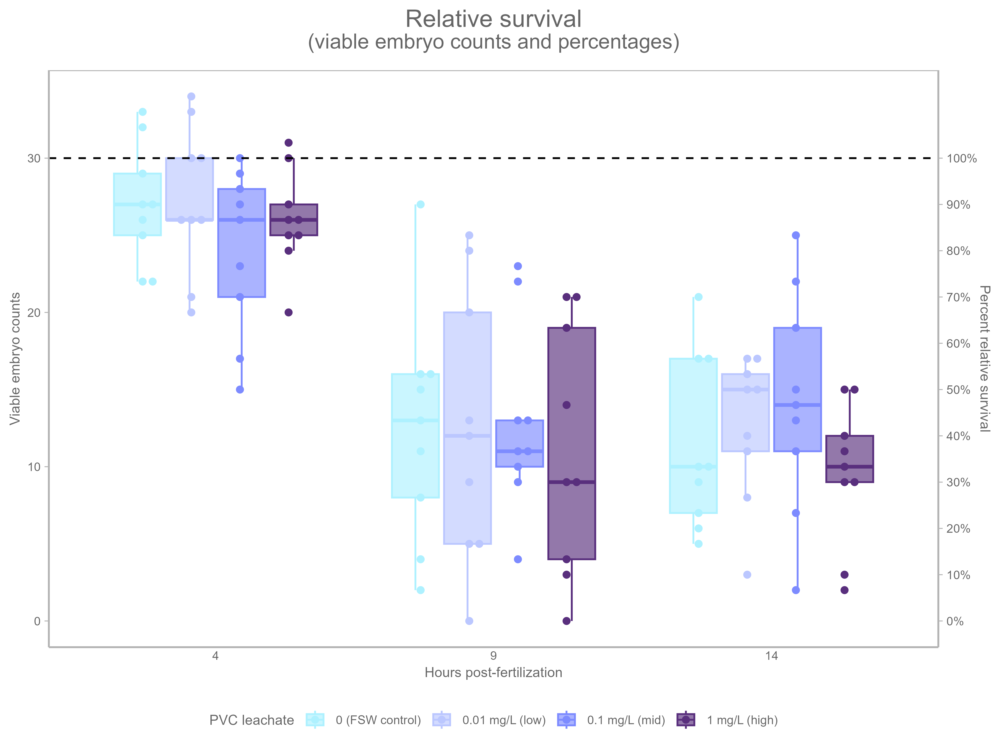
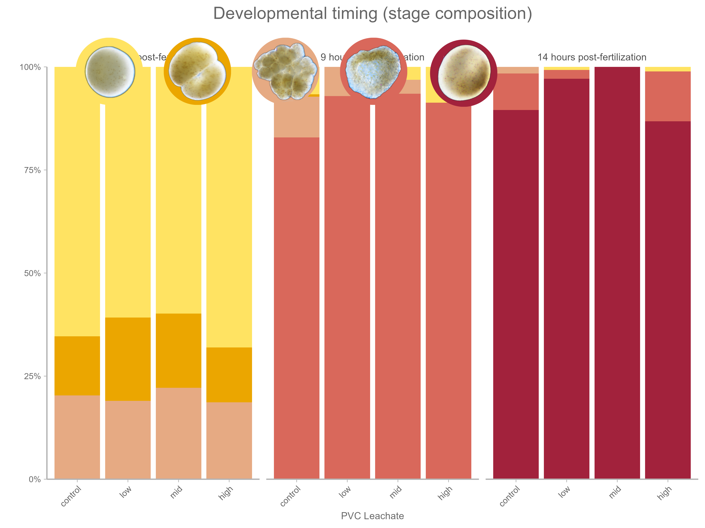
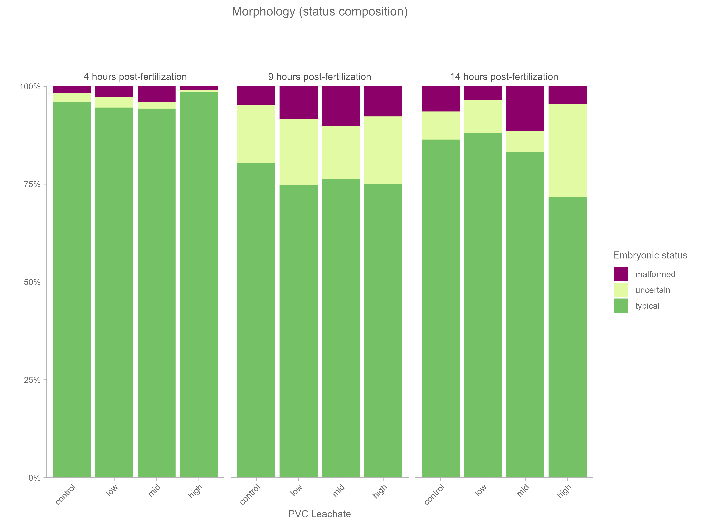

# Figures

Generated visualization outputs from the analysis scripts.

## Embryo Survival

## Developmental Stage Proportions

## Embryo Status Proportions

## Combined Figure: Survival, Timing & Morphology

