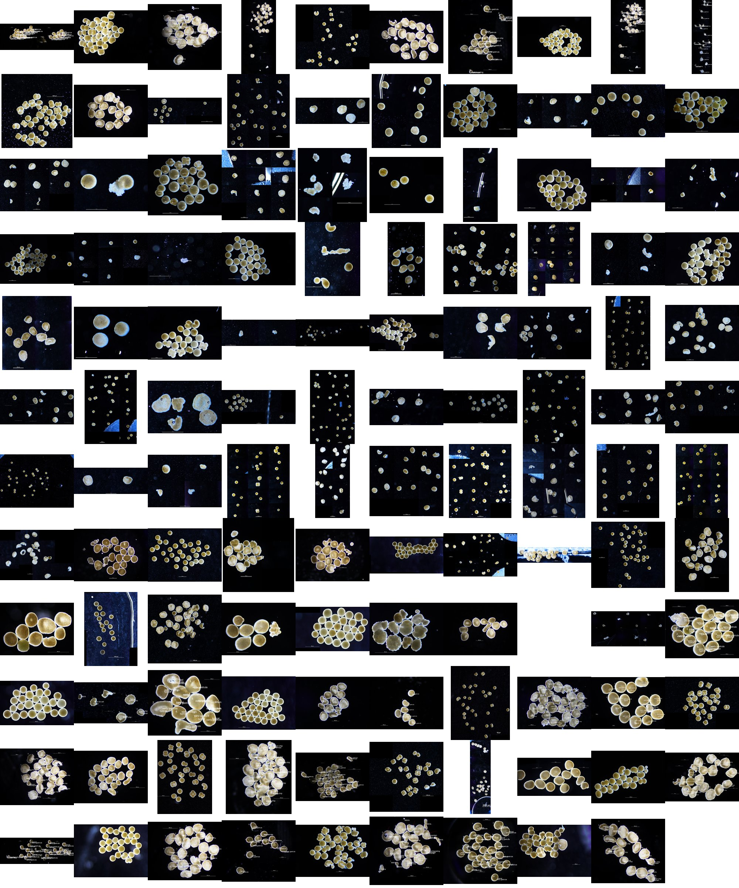

# Coral Embryo Microscopy Images

This directory contains microscopy images of *Montipora capitata* coral embryos from the PVC leachate exposure experiment.

## Directory Structure

The images are organized into 120 sample directories (plus an `art` directory for visualizations), following the naming convention:

```
{cross}{treatment}{hpf}
```

Where:
- **Cross**: 1-10 (parent colony crosses)
- **Treatment**: 
  - C (control)
  - L (low PVC leachate)
  - M (mid PVC leachate)
  - H (high PVC leachate)
- **HPF**: 4, 9, or 14 (hours post-fertilization)

Examples: `1C4`, `2L9`, `10H14`

## Image Types

Each sample directory may contain different versions of the microscopy images:

- `*_scale.jpg` - Images with scale bar
- `*_anno.jpg` - Annotated images with embryo classifications
- `*_stitch*.jpg` - Stitched composite images from multiple microscope fields
- `*_manualstitch.jpg` - Manually stitched images

## Image Collage

Below is a collage showing one representative image from each of the 120 sample directories (119 shown due to one oversized image):



The collage displays a 12×10 grid of thumbnail images (200×200 pixels each), organized alphabetically by sample name. Each thumbnail shows the developmental stage and condition of the coral embryos at the time of imaging.

## Related Data

- Raw annotation data: `/data/scope_annotation_data/`
- Processed tidy data: `/data/output/tidy_bros.csv` and `/data/output/tidy_vials.csv`
- Analysis code: `/code/` directory

## Usage

These images are used in the analysis pipeline to:
1. Annotate embryo developmental stages (egg, cleavage, morula, prawnchip, earlygastrula)
2. Classify embryo status (typical, uncertain, malformed)
3. Count total embryos per sample
4. Generate visualizations for survival and developmental timing analyses
