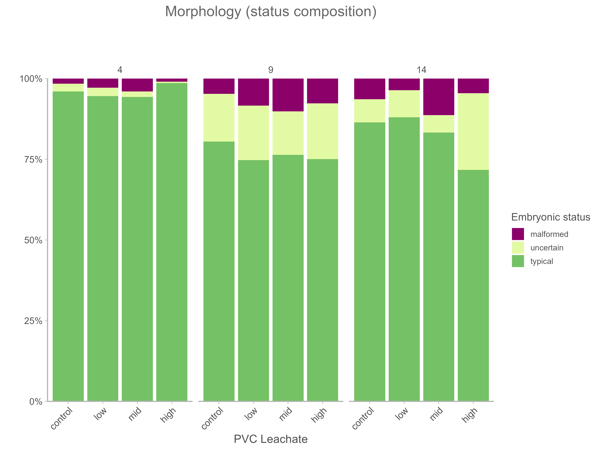
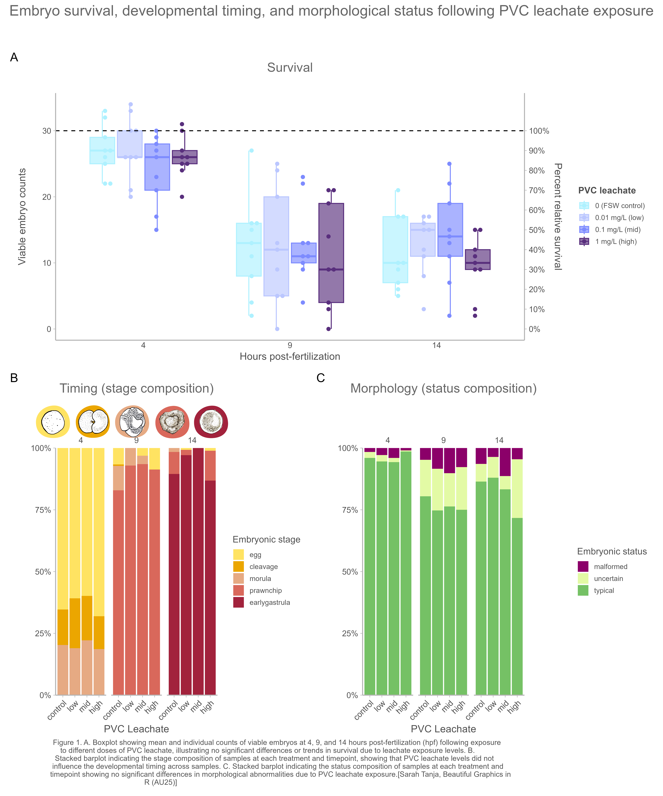

# Figures: Coral Embryo Analysis

This directory contains publication-quality figures generated from the analysis of *Montipora capitata* coral embryo survival, developmental timing, and morphological status following exposure to polyvinyl chloride (PVC) leachate.

## Figure Generation

All figures were generated using R and ggplot2 from the script:
- **Source**: `/code/06_figure.qmd`
- **Resolution**: 600 DPI (high-quality for publication)
- **Date Generated**: November 24, 2024

## Figures

### 1. Embryo Survival Box Plot

**File**: `embryo_survival_box.png`  
**Dimensions**: 8" × 6"  
**Description**: Boxplot showing mean and individual counts of viable embryos at 4, 9, and 14 hours post-fertilization (hpf) following exposure to different doses of PVC leachate. The plot illustrates no significant differences or trends in survival due to leachate exposure levels. Each box represents the interquartile range with individual data points overlaid using beeswarm plots. The dashed horizontal line at y=30 represents the initial target embryo count, with a secondary y-axis showing percent relative survival.

**Treatment levels**:
- Control: 0 mg/L (filtered seawater)
- Low: 0.01 mg/L PVC leachate
- Mid: 0.1 mg/L PVC leachate
- High: 1 mg/L PVC leachate

---

### 2. Embryo Stage Composition (Timing)

**File**: `embryo_stage_stackedbar.png`  
**Dimensions**: 8" × 6"  
**Description**: Stacked barplot indicating the developmental stage composition of samples at each treatment level and timepoint. The plot shows that PVC leachate levels did not influence developmental timing across samples. Each bar represents the proportional composition of five embryonic stages, with decorative stage icons displayed above the legend.

**Embryonic stages** (shown as proportions):
- **Egg** (yellow): Unfertilized or single-cell stage
- **Cleavage** (orange): Early cell division (2-8 cells)
- **Morula** (peach): Compact ball of cells (16+ cells)
- **Prawnchip** (coral): Flattened pre-gastrula stage
- **Early gastrula** (red): Beginning of tissue layer formation

**Facets**: Results shown separately for 4, 9, and 14 hours post-fertilization

---

### 3. Embryo Status Composition (Morphology)

**File**: `embryo_status_stackedbar.png`  
**Dimensions**: 8" × 6"  
**Description**: Stacked barplot indicating the morphological status composition of samples at each treatment and timepoint, showing no significant differences in morphological abnormalities due to PVC leachate exposure. Each bar represents the proportional composition of three status categories.

**Status categories**:
- **Typical** (green): Normal morphology consistent with healthy development
- **Uncertain** (yellow): Ambiguous or intermediate morphology
- **Malformed** (purple): Clear developmental abnormalities or irregularities

**Facets**: Results shown separately for 4, 9, and 14 hours post-fertilization

---

### 4. Combined Figure: Survival, Timing, and Morphology

**File**: `figure_survival_timing_morphology.png`  
**Dimensions**: 10" × 12"  
**Description**: Comprehensive multi-panel figure combining all three analyses (survival, developmental timing, and morphological status) into a single publication-ready figure. Created using the `patchwork` package for panel composition and `cowplot` for adding decorative embryo stage icons.

**Panel A (top)**: Embryo survival boxplot showing viable counts over time  
**Panel B (bottom left)**: Developmental stage composition across treatments and timepoints  
**Panel C (bottom right)**: Morphological status composition across treatments and timepoints

**Figure Caption**: "Embryo survival, developmental timing, and morphological status following PVC leachate exposure. A. Boxplot showing mean and individual counts of viable embryos at 4, 9, and 14 hours post-fertilization (hpf) following exposure to different doses of PVC leachate, illustrating no significant differences or trends in survival due to leachate exposure levels. B. Stacked barplot indicating the stage composition of samples at each treatment and timepoint, showing that PVC leachate levels did not influence the developmental timing across samples. C. Stacked barplot indicating the status composition of samples at each treatment and timepoint showing no significant differences in morphological abnormalities due to PVC leachate exposure."

---

## Color Schemes

### Treatment Colors (Ocean/Aquatic Theme)
- **Control**: Light cyan (#AEF1FF)
- **Low**: Light blue-purple (#BBC7FF)
- **Mid**: Medium blue-purple (#7D8BFF)
- **High**: Dark purple (#592F7D)

### Stage Colors (Coral/Earthy Theme)
- **Egg**: Bright yellow (#FFE362)
- **Cleavage**: Orange (#EBA600)
- **Morula**: Peach (#E6AA83)
- **Prawnchip**: Coral red (#D9685B)
- **Early gastrula**: Deep red (#A2223C)

### Status Colors
- **Typical**: Green (#75C165)
- **Uncertain**: Yellow-green (#E3FAA5)
- **Malformed**: Purple (#8B0069)

---

## Data Sources

Figures are generated from processed datasets in `/output/dataframes/`:
- `tidy_vials.csv`: Sample-level data (each row = one vial/sample)
- `prop_summary.csv`: Mean proportions of developmental stages by treatment and timepoint
- `status_summary.csv`: Mean proportions of morphological status by treatment and timepoint

---

## Statistical Analysis

These figures represent descriptive visualizations of the data. Full statistical analyses including:
- One-way ANOVA on embryo counts
- Generalized Linear Models (GLM) for survival rates
- Dirichlet regression for compositional data (stage and status proportions)
- Kaplan-Meier survival analysis

can be found in the respective analysis scripts in the `/code` directory.

---

## Usage

These figures are high-resolution (600 DPI) and suitable for:
- Scientific publications
- Conference presentations
- Academic posters
- Grant proposals

For modifications or regeneration of figures, edit and render `/code/06_figure.qmd`.

---

## Related Files

- **Analysis script**: `/code/06_figure.qmd`
- **SVG icons**: `/svg/*.png` (embryo stage illustrations)
- **Raw data**: `/data/scope_annotation_data/*.csv`
- **Processed data**: `/output/dataframes/`

---

*Generated as part of the coral-embryo-scope project*  
*Repository: [sarahtanja/coral-embryo-scope](https://github.com/sarahtanja/coral-embryo-scope)*
