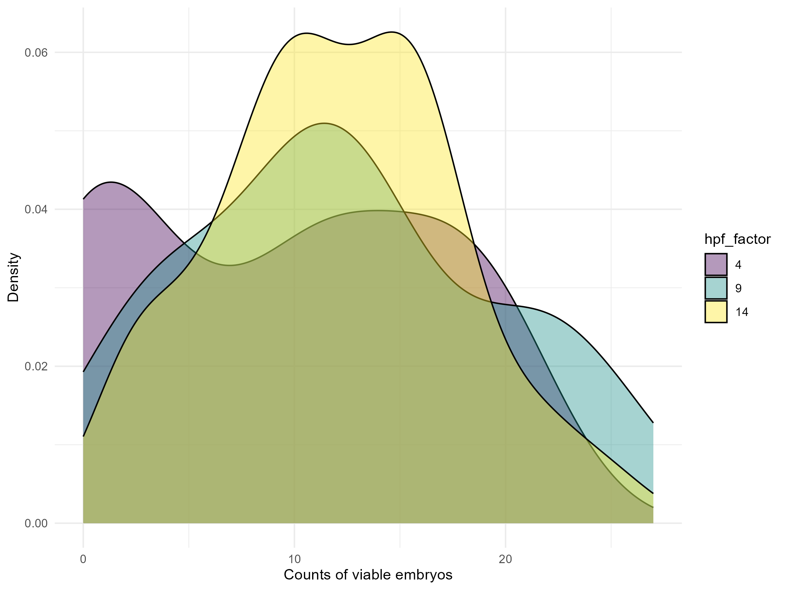
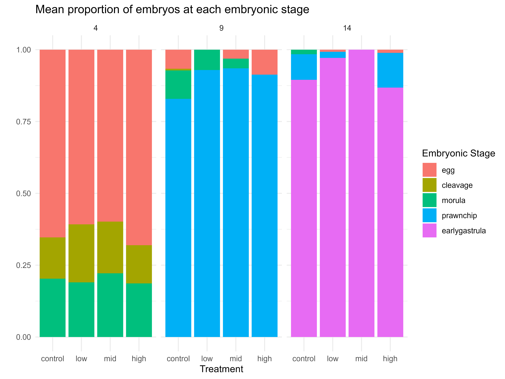

# Plots

This folder contains generated visualization outputs from the analysis scripts in the `/code` directory.

## Survival and Count Plots

### Counts Survival Boxplot
Boxplot of embryo survival counts across treatments and time points.

### Counts Viable Boxplot
Boxplot of viable embryo counts.

### Viable Counts Survival Boxplot
Boxplot of viable embryo survival counts.

## Distribution Plots

### Density Viable
Density plot showing the distribution of viable embryos.

## Proportion Plots

### Proportion Stage Stacked Bar
Stacked bar chart showing proportions of developmental stages (egg, cleavage, morula, prawnchip, gastrula) across treatments and time points.

### Proportion Stage × Status Stacked Bar
Stacked bar chart showing the interaction of developmental stage and embryo status proportions.

### Proportion Status Stacked Bar
Stacked bar chart of embryo status proportions (typical, uncertain, malformed).

---

*These plots are generated by the analysis scripts in the `/code` directory. See the main repository README for more details about the analysis workflow.*
